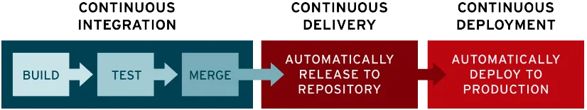

CI/CD는 Lionz 프로젝트를 진행하면서 필요성을 크게 느꼈다.

프로젝트를 진행하면서 변경사항이 생길 때마다 

1. 깃허브에 올림

2. jar 파일을 생성하여 도커 이미지를 만듬

3. 도커허브에 도커 이미지를 올리고 서버에서 다운 받음

2. 서버에서 재배포 진행

이러한 과정을 수작업으로 하나하나 진행해야 한다는 점이 매우매우 번거로웠다. 개발할 시간도 부족한데 수정사항이 한두줄만 있어도 43976941872984단계의 과정을 진행해야 한다는 점이 이게 맞나? 싶었다.

이러한 문제의 해결책은 **CI/CD 파이프라인**을 구축하는 것이었다.

## CI/CD란?

개발 공부를 하면서, "CI/CD"라는 용어를 자주 접했다.

**CI (Continuous Integration)** 이란, 지속적인 통합을 의미하며 빌드와 테스트를 자동화하는 것이다. 코드를 변경하면 변경사항을 자동으로 공유 레포지토리에 업데이트하게 된다.

**CD (Continuous Delivery, Continuous Deployment)** 란 지속적인 제공과 지속적인 배포를 의미한다. 지속적인 제공은 테스트 자동화와 코드 릴리즈를 묶은 것이고, 지속적인 배포는 변경사항 작성 후 배포를 자동화한 것이다.

따라서 CI/CD 파이프라인은 이러한 형식으로 이루어진다.

## 이게 왜 필요해요?

1. 우선 **편하다**. CI/CD가 없으면 개발자는 통합하고 배포하는 과정을 수작업으로 행해야 한다. 만약 분산 서버인 경우, 몇개몇십개를 직접 해야하는 경우도 생기게 된다. 

2. 최근 들어 개발은 혼자 하는 것이 아니라 공유 레포지토리를 두고 여러 개발자가 지속적으로 통합하면서 진행하게 되는데, CI/CD를 도입할 경우 테스트 자동화를 통한 **변경 사항의 충돌**과 **코드 문제**를 파악하여 신속하게 오류를 해결할 수 있다.

3. **애자일 협업에 유용하다.** 신속한 릴리즈와 피드백이 요구되는 애자일 협업에서, CI/CD를 활용하면 피드백을 수용하여 빠른 수정이 가능하게 된다.

정리하면 빠른 속도로, 코드 품질을 보장하며 개발이 가능하기 때문에 필수적인 요소로 자리 잡게 되었다.

## 무슨 툴이 있어요?

### Jenkins

CI/CD에 관심이 있는 개발자들은 무조건 한 번씩은 봤을 이 젠틀한 아저씨..

장점으론 다양한 플러그인이 존재하며 많은 사람들이 이용하여 레퍼런스가 많다는 점이 있다.

단점으로는 플러그인이 많은 만큼 구성하는 것이 복잡하고 어려우며, 별도의 서버가 필요하여 비용이 많이 필요하다는 점이 있다.

### Github Actions

젠킨스에 비하면 최신 기술인 깃허브 액션이다.

장점으론 모든게 Github 페이지에서 이루어지고, CI/CD를 구성하는 것이 쉽다는 점이 있다.

단점으로는 젠킨스에 비해 레퍼런스가 적은 편이고 public repository는 무료지만 private repository에 적용할 때는 비용이 부과된다.

## 참고자료

https://www.redhat.com/ko/topics/devops/what-is-ci-cd

https://seminet.co.kr/channel_micro.html?menu=content_sub&com_no=817&category=article&no=7775

