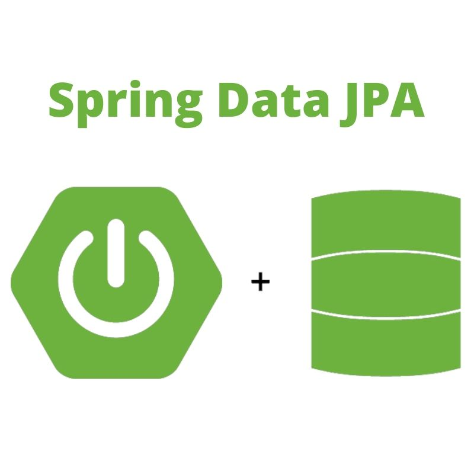
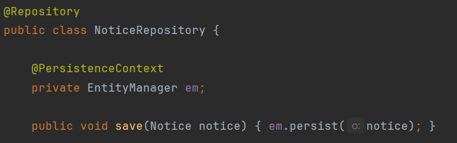
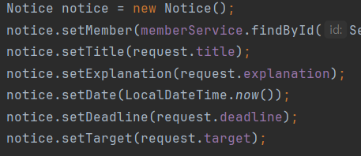
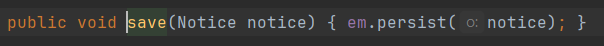

Springboot를 사용하여 API를 개발할 때, JPA라는 기술은 떼놓을 수 없을 것이다. 

그러나 JPA가 DB와 관련이 있다는 것 외에는 두루뭉실한 개념만 알고 있었기 때문에 더 자세히 알아보고자 글을 작성해보고자 한다.

누군가가 JPA가 뭐야? 했을 때 투머치토커가 되어 상대가 질릴 때까지 설명할 수 있도록 공부해보자~!

## JPA란

JPA는 간단히 말해 **자바의 ORM 표준 기술**이다.

> 💡 **ORM (Object Relationla Mapping)** 이란, 객체와 DB를 매핑해주는 프레임워크를 뜻한다.

이를 사용하면 SQL문을 개발자가 직접 작성하지 않아도 되고, JPA가 객체를 DB에 매핑하여 자동으로 적절한 SQL문을 작성해 DB에 날려준다.

## 동작원리

JPA는 Java 애플리케이션과 JDBC 사이에서 동작한다. 개발자가 애플리케이션에서 JPA를 호출하면 객체를 적절히 매핑하고 내부에서 JDBC를 호출한다.

따라서 JPA를 사용하면 개발자가 JDBC API를 직접 호출하지 않아도 된다.

> 💡 **JDBC**란 Java에서 제공하는 API로, DB와 상호작용하는 기능을 제공한다.

## 영속성 컨텍스트

왜 이름이 JPA(Java **Persistence** API)일까?

공지사항을 추가하는 코드의 일부분이다.

@PersistenceContext라는 애노테이션을 추가한 EntitiyManger를 생성하고, 거기서 'persist'라는 함수를 호출하여 객체를 저장한다.

용어를 차근차근 알아보자!

0. **엔터티(Entity)**

엔터티란 DB에 저장된 객체를 의미한다. 

이 코드에서 notice 객체는 엔티티가 아니다. just 객체 상태이다.

> 💡 영속성이란 **프로그램이 종료되어도 사라지지 않는 특성**이라고 생각하면 된다.

이 상태를 비영속 상태라고 부른다. 프로그램이 종료되면 notice 객체는 어느곳에도 저장되지 않고 사라지기 때문이다.

이 notice를 persist한 순간, 프로그램이 종료되어도 사라지지 않는, 저장된 객체가 되어 엔터티라고 부를 수 있게 된다.

이때부터 영속 상태가 되는 것이다.

1. **영속성 컨텍스트(Persistence Context)**

JPA는 DB를 변경할 때마다 JDBC를 호출하지 않는다.

사이에 **영속성 컨텍스트**라는 Entity를 영구저장할 수 있는 가상DB에 Entity를 쌓아둔다.

이 영속성 컨텍스트에 쌓아두다가 트랜잭션이 커밋될 때, 변경사항이 DB에 적용된다.

2. **엔티티 매니저 (EntityManger)**

엔티티 매니저는 이름 그대로, 엔티티를 관리하는 역할을 한다.

엔티티 매니저의 내부에 영속성 컨텍스트가 존재하기 때문에 EntityManger 객체를 만들어서 persist API를 호출해 데이터를 저장하는 것이다.

3. **왜 이렇게 복잡하게 하나요?**

우선 **캐시** 로써의 이점을 가진다. DB에 접근하는 것은 꽤나 많은 오버헤드를 요구한다.

그러나 영속성 컨텍스트가 존재하면, DB에 접근하지 않고 1차적으로 영속성 컨텍스트에 접근하여 해당 데이터가 있는지 확인한다.

**동일성 보장**의 이점도 가지고 있다. 같은 엔티티를 다른 객체에 저장해도 두 객체는 같다고 인정된다.

이 외에도 성능 면에서 여러 이점을 가지고 있기 때문에, 영속성 컨텍스트는 JPA의 중요한 기능 중 하나다.

