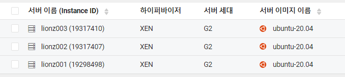
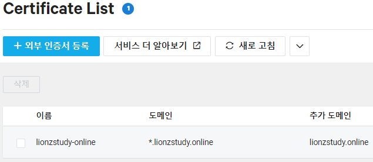
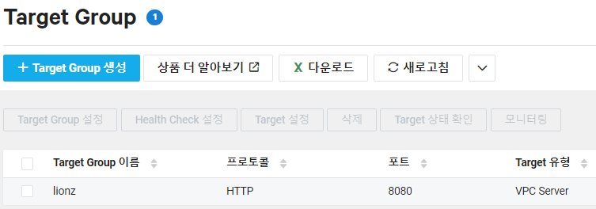
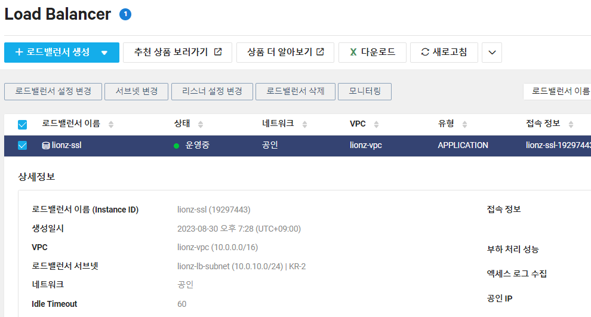

## 개요

전공 수업에서도 많이 언급되었고 백엔드에 대해 알아볼 때도 많이 마주한 개념이라서 꼭 공부해보고 싶었다

따로 시리즈를 만들 정도로 로드밸런싱을 어떻게 효율적으로 구현할지 많이 고민하고 찾아보았다

구현할 때의 고민과 해결 방안은 아래와 같다

1. **서버를 하나씩 각각 접속해서 배포를 진행해야 하는가?**

실무에서는 서버를 더 많이 둘 텐데, 같은 과정(pull & build & run)을 계속 반복하는 것이 맞는가에 대해 고민했다

또, 도커 이미지가 업데이트 되면 모든 서버에 각각 접속해서 pull & run을 실행해야 하는가에 대한 고민이 있었다

이에 대한 건 **Docker**를 적용해서 해결할 수 있었다

[Docker로 Spring Boot 배포하기](https://yelog.site/jar/)

위처럼 한 서버에 배포해두고 서버 이미지를 만들어서 실행시킬 수 있다고 한다

업데이트에 대해서는 **CI/CD 파이프라인**을 이용하여서 변경 사항이 감지될 때마다 자동으로 업데이트하고 배포해주는 방법이 있다곤 하는데, 너무 심화 과정이라 우선 로드 밸런싱에 집중하고자 더 공부하지 않았다

2. **서버 각각에 대해 Public IP & 도메인 & SSL 인증서 적용이 필요한가?**

우선 **Public IP**는 SSH에 접속하기 위해서 필요했다

Public IP 없이도 접속할 방법이 있긴 한 것 같았으나 너무 복잡해서 해보는 것은 어려웠다

**도메인 & SSL 인증서**는 처음엔 와일드카드 SSL 인증서를 발급해서 해결하고자 했다

[Let's Encrypt로 WildCard SSL 인증서 발급받기](https://yelog.site/SSL/)

적은 것과 같이 로드 밸런서를 메인 도메인으로, 서버들을 서브 도메인으로 설정하여서 하나의 SSL 인증서로 적용하고자 했다

즉, 모든 서버에 도메인과 SSL 인증서를 적용하려고 했던 것이다

그러나 후술할 내용처럼 클라우드 서비스에서 제공하는 로드 밸런서로 진행하니 굳이 내가 서버에 설정해주지 않아도 로드 밸런서가 알아서 서버를 HTTPS로 띄워주었다

처음 구상했던 방법에 비해는 많이 효율적이게 된 것 같으나.. 아직 많이 부족해서 조금 찝찝한 감이 있다

## LoadBalancing이란

로드 밸런싱은 서버에 들어오는 요청을 **여러 대의 서버로 분산해서 전송해 처리하는 것**을 의미한다

하나의 서버에 요청이 너무 많이 들어오면 과부하가 발생하여 속도가 느려지거나, 심하면 아예 먹통이 될 수 있기 때문이다

하나의 도로에 많은 차가 몰리면 도로가 막히기 때문에 목적지가 같은 여러 도로를 개통해서 교통정체 현상을 완화시키는 것과 같은 원리다

Client 입장에서 Server는 Load Balancer 하나만 보이게 되고 Load Balancer에게 요청을 보내면 내부에서 여러 Server로 분산해서 트래픽을 보내게 된다

이 때 Load Balancer가 어떤 Server로 트래픽을 보낼지 결정하는 알고리즘은 **Round-Robin**을 사용한다

## 적용 과정

### 서버 생성

우선 같은 서비스를 제공하는 서버를 세 개 만들었다

이 때, 트래픽 분산이 잘 되는지 확인하기 위해 home 경로(/)에 숫자를 다르게 해서 도커 이미지를 생성하였지만 이러한 경우가 아니라면 하나의 도커 이미지로 세 개의 서버에 배포를 진행하면 될 것 같다

### SSL 인증서

[Let's Encrypt로 WildCard SSL 인증서 발급받기](https://yelog.site/SSL/)에서 발급받은 인증서를 Certificate List에 등록해주었다

NCP에 등록해두면 Load Balancer를 생성할 때 HTTPS 설정에 적용할 수 있다 (AWS도 동일)

AWS에서는 자체적으로 무료 SSL 인증서를 발급해주는듯 하였는데, NCP는 그런건 없어서 외부 인증서를 등록하였다

### Target Group

타겟 그룹에 위에서 생성한 세 개의 서버를 묶어주었다

Springboot로 개발한 프로젝트이기 때문에 8080 포트로 설정했다

이 때, health check에는 유효한 페이지 주소를 작성해주어야 한다

따로 경로를 설정해주지 않아서 404가 나오는 페이지 주소를 적었더니 health check을 통과하지 못해서 에러가 났다

### Load Balancer

리스너에는 HTTP, HTTPS를 적어주었다

HTTPS를 설정하면 아까 Certificate List에서 등록한 인증서를 설정할 수 있다

그리고 DNS의 A 레코드에 접속정보의 주소를 적어준다

### 결과

성공적으로 번갈아가며 나온다

## 더 공부해보고 싶은 것

1. 우선 **CI/CD**에 대해서도 한 번 적용하고 공부해보고 싶다! 로드밸런싱에 대해 공부할 때 제일 크게 고민했던 부분의 해결책이 CI/CD였기 때문에 기회가 된다면? 한 번 해볼 것 같다

2. 클라우드의 LB 서비스를 이용하지 않고, 로드밸런서 역할을 하는 **NGINX 서버**를 구축해서 로드밸런싱을 구현해보고 싶다

3. 다음엔 우선 로드 밸런싱 결과에 대해 **k6**로 성능테스트를 해 볼 예정이다 