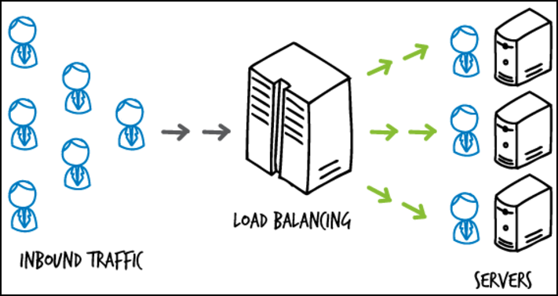
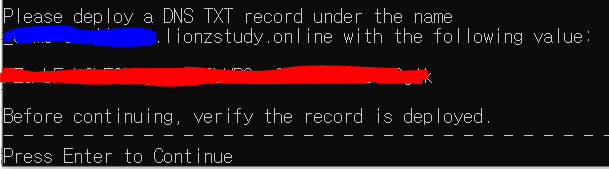
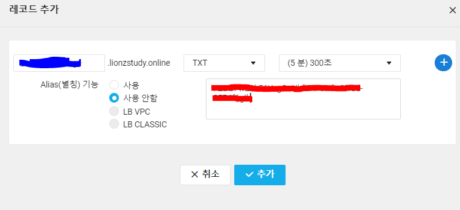
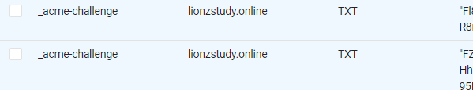

## 개요



로드 밸런싱을 구현하면서 여러 서버를 생성해서 관리해야 했다

예를 들어 위와 같은 로드밸런싱 환경에서는 총 4개의 서버를 생성해야 한다

이 때 한 서비스임에도 불구하고 각자 다른 도메인을 적용하고 서버 개수만큼 SSL 인증서를 발급받아야 하는지 의문이 생겼다 (예를 들어 loadbalancer.com, server1.com, server2.com, server3.com)

그러나 찾아 본 결과 서브도메인을 이용하면 된다는 사실을 공부할 수 있었다

> 로드밸런싱 Nginx 서버: study.com

> 애플리케이션 서버: server1.study.com, server2.study.com, server3.study.com

위처럼 서브도메인이란, 메인 도메인 앞에 수식어(?)가 붙는 도메인들을 의미한다

(내가 제일 좋아하는 기업인) 네이버의 도메인을 예로 들면 메인 페이지의 도메인은 naver.com이고 네이버 지도의 도메인은 map.naver.com, 네이버 블로그의 도메인은 blog.naver.com인 것처럼 뒤의 naver.com만 포함되어 있으면 모두 같은 호스트의 도메인으로 간주하게 된다

그리고 서브 도메인을 포함한 모든 도메인을 포함해 SSL 인증이 가능한 인증서를 **와일드카드 SSL 인증서**라고 한다

## WildCard SSL 발급

노트북이 window 환경이라서 일단 우분투 서버에 접속해서 진행하였다

```
apt install letsencrypt
apt install certbot
```

letsencrypt와 certbot을 설치한다

```
certbot certonly --manual -d *.example.com -d example.com --preferred-challenges dns
```

실행하면 이메일 주소를 물어보고 여러 동의를 구한다



이런 화면이 나왔을 때, 멈추고 DNS 설정을 해주어야 한다

**두번 나오는데 둘 다 등록해주어야 한다**




레코드 TXT 타입에 추가해준다

이 과정은 Let's encrypt 측에서 도메인 소유권을 확인하는 과정이다

이 과정을 여러번 반복했는데.. 확인 누른다고 바로 TXT 레코드에 뿅하고 생기는게 아니라 조금 기다려줘야 한다

검색하면 TXT 레코드에 정확히 반영이 되었는지 확인하는 방법이 나온다

인증서를 발급 받은 후에는

>/etc/letsencrypt/live/example.com

여기서 인증서 파일을 확인할 수 있다

pem 파일을 클라우드에 옮겨서 인증서를 저장하고 로드밸런싱으로 적용할 수 있다
