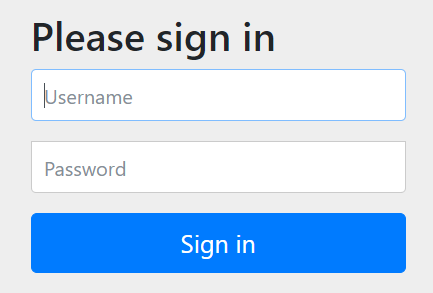
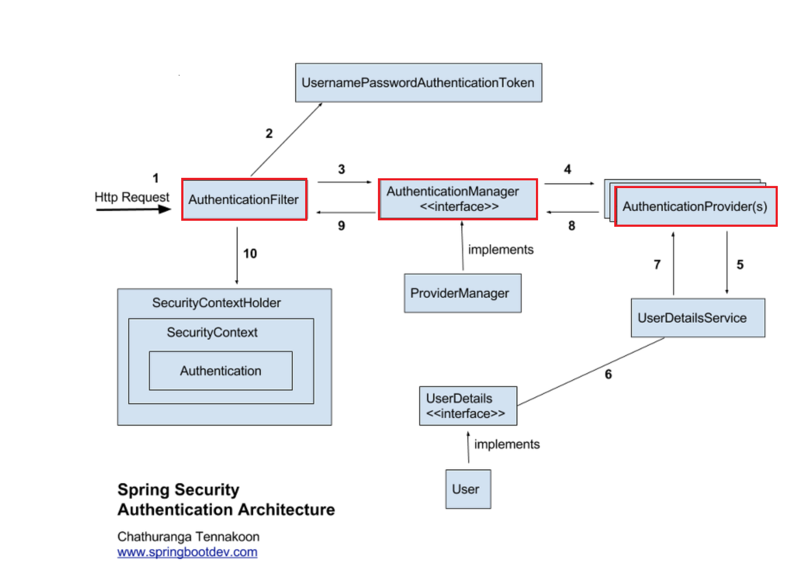

## SpirngSecurity


[공식문서](https://docs.spring.io/spring-security/reference/index.html)

스프링 시큐리티는 사용자 인증, 인가를 지원하고 여러 보안 공격으로부터 보호할 수 있도록 하는, 보안 프레임워크다.

즉, 보안을 포함한 사용자 관리를 지원해주는 역할을 한다.

### 스프링 시큐리티 쓰는 이유 스프링 시큐리티 안 쓰는 이유

구글에 스프링 시큐리티를 검색했을 때 예상 검색어에 쓰는 이유, 안 쓰는 이유가 상단에 떠서 읽어보았다.

**쓰는 이유**

```바퀴를 다시 발명하지 마라```

우선 '보안'이라는 중요한 파트를 직접 구현할 경우 구현하는데 걸리는 시간과 실패했을 때의 대가가 너무 크기 때문에, 이미 구현되어 있으며 다수의 사람이 사용함으로써 인증된 프레임워크를 쓰는 것이 개발의 효율성을 높이는 것이다.

**안 쓰는 이유**

주로 굳이 직접 구현할 수 있는데 프레임워크를 사용해 복잡성을 늘릴 필요가 있는가? 가 쟁점인듯 하다.

또, 쓰는 이유에서 말했듯이 보안이라는 중요한 파트에 대해 외부 프레임워크인 스프링 시큐리티의 내부동작도 모르는 상태로 과하게 의존하는 것이 문제점이다.


**제 결정은요..**


[출처](https://www.instagram.com/namsee.jpg/)

이미 완성도 높고, 전세계 사람들이 실시간으로도 계속 사용하며 검증 중인 프레임워크를 사용하지 않을 이유가 없다고 생각했다.

단점이 있더라도, 우선 학습하고 적용해보며 원리를 알아가는 것 자체에 의미를 두자

직접 Spring Security를 구현하면서 작동 원리를 공부해보장

## 구현

### 시작

build.gradle의 dependency에 스프링 시큐리티를 등록하면, 앞으로 들어오는 요청을 스프링 시큐리티에서 가로채서 검증한다.



이는 서버를 run 해보면 알 수 있다. 터미널에 password를 알려주고, 사이트에는 스프링 시큐리티가 제공하는 폼이 기본적으로 나오게 된다.



절차를 이해해보자

1. 유저가 ID/PWD를 포함해 로그인이나 회원가입 요청을 보낸다.
2. **AuthenticationFilter**에서 요청을 가로챈다.
3. 가로챈 요청을 기반으로 **UsernamePasswordAuthenticationToken**에서 인증용 객체를 생성해 반환한다.
4. 생성된 객체가 **AuthenticationManager**(의 구현체 **ProviderManager**)에게 넘겨진다.
5. ProviderManager은 **AuthenticationProvider(s)** 에게 인증을 요청한다.
6. AuthenticationProvider(s)는 **UserDetailsServeice**를 통해 실제 DB에 저장된 유저 객체(UserDetails)를 받아 비교하며 인증한다.
7. 인증이 성공적으로 마치면 Authentication을 반환해 AuthenticationFilter로 전달되고, 이 Authentication은 **SecurityContextHolder**에 저장된다.

결국 요청을 기반으로 한 인증용 객체의 정보와 DB에 저장된 유저 정보(이를 UserDetails라고 칭한다)를 비교하는 과정인 것이다.

이미 인증이 완료된 유저에 대해서는, SecurityContextHolder -> SecurityContext에서 Aunthentication 정보를 찾아 인가한다.