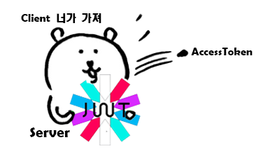

springsecurity와 jjwt의 버전이 업그레이드 되면서 많은 부분이 deprecated 되고 바뀌었다.

이전의 레퍼런스를 보면 막히는 부분이 정말 많을 정도로 구현법이 바뀐 거 같다.

이 글에서는 ```Spring Security 6.3.1```과 ```jjwt 0.12.5```를 사용하여 구현했다.

**파일트리**

```
📦project
 ┣ 📂api
 ┃ ┗ 📜MemberApiController.java
 ┣ 📂config
 ┃ ┗ 📜SecurityConfig.java
 ┣ 📂domain
 ┃ ┣ 📜Authority.java
 ┃ ┗ 📜Member.java
 ┣ 📂jwt
 ┃ ┣ 📜JwtTokenAuthFilter.java
 ┃ ┣ 📜JwtTokenProvider.java
 ┃ ┗ 📜TokenDto.java
 ┣ 📂repository
 ┃ ┗ 📜MemberRepository.java
 ┣ 📂service
 ┃ ┣ 📜MemberService.java
 ┃ ┗ 📜MyUserDetailsService.java
 ┗ 📜projectApplication.java
 ```
 ## 사전설정

```
	// SpringSecurity
	implementation 'org.springframework.boot:spring-boot-starter-security'
	testImplementation 'org.springframework.security:spring-security-test'

	// JWT
	implementation 'io.jsonwebtoken:jjwt-api:0.12.5'
	implementation 'io.jsonwebtoken:jjwt-impl:0.12.5'
	implementation 'io.jsonwebtoken:jjwt-jackson:0.12.5'
```

**build.gradle** 의존성

```
jwt:
  expiration_time: 1800000 # 1000 * 60 * 30 (30분)
  refresh-token-expiration: 1209600000 # 1000 * 60 * 60 * 24 * 14 (14일)
  secret: PUiOIFNgYSFaYhAOSP96dyucGtgyLL0JxB4FQm5YCwg=
```

**application.yml**에 토큰 만료 기간과 Secret Key 추가

expiration_time는 AccessToken의 만료 기간이고, refresh-token-expiration는 RefreshToken의 만료 기간이다. 이 두 토큰의 차이는 TokenDto에 후술되어 있다.

> 💡 랜덤한 Secret Key는 Linux/Git Bash에서의 ```openssl rand -base64 32```로 생성하거나 [링크](https://www.base64decode.org/)에서 원하는 문자열로 생성할 수 있다. <br> 추가적으로 이 키는 공개된 레포지토리에 올리면 보안 상의 위험이 있으며, 서버의 환경변수로 추가하고 관리하는 방법이 있다.

## UserDetails 구현

#### java.project.service.UserDetailsServivce

```
@Service
@Transactional
@RequiredArgsConstructor
public class MyUserDetailsService implements UserDetailsService {
    private final MemberRepository memberRepository;

    public UserDetails loadUserByUsername(String email) throws UsernameNotFoundException {
        Member member = memberRepository.findByEmail(email)
                .orElseThrow(() -> new UsernameNotFoundException("존재하지 않는 회원입니다."));

        return User.builder()
                .username(member.getEmail())
                .password(member.getPwd())
                .authorities(member.getAuthority().toString())
                .build();
    }
}
```

UserDetailsService를 상속받아 CustomUserDetailsService를 구현한다. 

이 서비스의 역할은 **검증해야 할 유저와 비교할, DB에 실제로 저장된 유저 정보(UserDetails)를 찾아서 전달하는 것**이다.

자세한 Spring Security의 동작 과정을 이해하고 싶다면 [여기](https://yelog.site/ssch1/)에서 볼 수 있다.

내가 정의한 User Model의 로그인 ID를 기반으로 실제 User 객체를 DB에서 받아오고, UserDetails 객체로 빌드하여 return 해주면 된다.


## JWT 구현

JWT를 사용하기 위해서는 필수적으로 **JwtTokenProvider**와 **JwtTokenAuthFilter**를 구현해야 한다.

**JwtTokenProvider**는 Jwt 토큰을 발급하는 역할을, **JwtTokenAuthFilter**는 토큰의 유효성을 확인하고 Security Context에 저장하여 인증된 사용자로 설정하는 역할을 수행한다.

### TokenDto

#### java.Project.jwt.TokenDto
```
@Builder
@Data
@AllArgsConstructor
public class TokenDTO {
    private String grantType;
    private String accessToken;
    private String refreshToken;
}
```

우선 Response로 넘길 TokenDTO를 정의해주자.

**GrantType**: 토큰의 인증 방식을 정의한다. 보통 Bearer 방식을 사용하며 이는 ```Authorization: Bearer {accessToken}``` 형식으로 요청의 헤더에 포함된다.

**AccessToken & RefreshToken**: JWT Token은 탈취되면 대처하기 어렵다는 위험이 있기에, 이를 보완하기 위해 토큰(AccessToken)의 유효기간을 짧게 설정했지만 사용자가 자주 재로그인해야 한다는 문제점이 있다. <br>
따라서 유효기간이 긴 RefreshToken을 추가로 발급한다. 클라이언트는 AccessToken이 만료되면 재로그인 과정 없이 RefreshToken을 사용하여 AccessToken의 재발급을 요청한다. <br>
이때, RefreshToken의 유효기간마저 만료됐다면 재로그인을 요청하는 것이다.

### JwtTokenProvider

#### java.Project.jwt.JwtTokenProvider
```
    private static final String AUTHORITIES_KEY = "auth";
    private static final String GRANT_TYPE = "Bearer";

    private SecretKey secretKey;
    @Value("${jwt.expiration_time}")
    private long accessExpTime;
    @Value("${jwt.refresh-token-expiration}")
    private long refreshExpTime;

    // yml에 저장된 secret을 기반으로, secretkey 생성
    public JwtTokenProvider(@Value("${jwt.secret}") String secret) {
        this.secretKey = Keys.hmacShaKeyFor(Decoders.BASE64.decode(secret));
    }

    public TokenDto GenerateTokenDto(Authentication authentication) {
        Date now = new Date();

        // Payload에 담을 정보
        Map<String, Object> claims = new HashMap<>();
        claims.put("sub", authentication.getName());
        claims.put("iss", now.toString());
        claims.put("auth", authentication.getAuthorities());

        return TokenDto.builder()
                .accessToken(createToken(claims, new Date(now.getTime() + accessExpTime)))
                .refreshToken(createToken(claims, new Date(now.getTime() + refreshExpTime)))
                .grantType(GRANT_TYPE)
                .build();
    }

    private String createToken(Map<String, Object> claims, Date expTime) {
        return Jwts.builder()
                .claims(claims)
                .issuedAt(new Date())
                .expiration(expTime)
                .signWith(secretKey)
                .compact();
    }

```

> 💡 JWT Token의 구조에 대해서는 [여기](https://yelog.site/sessioncookietoken/)에 정리되어 있다.

**GenerateTokenDto**는 유저의 인증 정보를 기반으로 **토큰을 발급하는 메서드**이다. 

이 코드에서 ```Claim```이란, Payload에 담길 조각들을 칭하는 용어이며 개발자가 원하는 정보를 넣을 수 있으나, 유저의 개인정보와 관련된 정보는 넣지 않는 것이 좋다. 

권장하는 요소로는 제목, 권한, 발행시간 등이 있다.

```
    public Authentication getAuthentication(String accessToken) {
        Claims claims = Jwts.parser()
                .verifyWith(secretKey)
                .build()
                .parseSignedClaims(accessToken)
                .getPayload();

        // Claim에서 유저 권한을 꺼내오는 작업
        Collection<? extends GrantedAuthority> authorities =
                Arrays.stream(claims.get(AUTHORITIES_KEY).toString().split(","))
                        .map(SimpleGrantedAuthority::new)
                        .collect(Collectors.toList());

        User principal = new User(claims.getSubject(), "", authorities);

        return new UsernamePasswordAuthenticationToken(principal, "", authorities);
    }

    public boolean validateToken(String token) {
        try {
            Jwts.parser()
                    .verifyWith(this.secretKey)
                    .build()
                    .parseSignedClaims(token);
            return true;
        } catch (JwtException | IllegalArgumentException e) {
            log.error("Invalid JWT token: {}", e.getMessage());
        }
        return false;
    }
```

**getAuthentication**는 토큰에서 인증 정보(Claim)를 추출하여 **Authentication 객체를 생성하는 메서드**다.

### JwtTokenAuthFilter

#### java.Project.jwt.JwtTokenAuthFilter
```
@RequiredArgsConstructor
@Slf4j
public class JwtTokenAuthFilter extends GenericFilterBean {
    private final static String HEADER = "Authorization";
    private final static String BEARER = "Bearer";

    private final JwtTokenProvider jwtTokenProvider;

    @Override
    public void doFilter(ServletRequest request, ServletResponse response, FilterChain filterChain)
            throws IOException, ServletException {
        String token = resolveToken((HttpServletRequest) request);

        if (token != null && jwtTokenProvider.validateToken(token)) {
            Authentication authentication = jwtTokenProvider.getAuthentication(token);
            SecurityContextHolder.getContext().setAuthentication(authentication);
        }
        filterChain.doFilter(request, response);
    }

    private String resolveToken(HttpServletRequest request) {
        String token = request.getHeader(HEADER);
        if (StringUtils.hasText(token) && token.startsWith(BEARER)) {
            return token.substring(BEARER.length() + 1);
        }
        return null;
    }
}
```

**doFilter**는 토큰의 유효성을 검사하고, getAuthentication를 호출해 인증 객체를 생성하여 SecurityContext에 인증 정보를 저장한다. 이 작업을 통해 Spring Security가 현재 요청을 한 유저가 누군지 식별하고 접근을 제어할 수 있게 된다.
마지막에 ```filterChain.doFilter(request, response)```는, 필터 검증의 다음 단계로 넘기는 메서드다.

**resolveToken**은 요청의 헤더에서 토큰을 꺼내 접두어(Bearer)를 제외하고 추출하는 메서드다.

 ## SecurityConfig

#### java.Project.config.SecurityConfig
 ```
@Configuration
@EnableWebSecurity
@RequiredArgsConstructor
public class SecurityConfig {

    @Bean
    public BCryptPasswordEncoder passwordEncoder() {
        return new BCryptPasswordEncoder();
    }

    @Bean
    public SecurityFilterChain filterChain(HttpSecurity http, JwtTokenProvider tokenProvider) throws Exception {
        return http
                .csrf(AbstractHttpConfigurer::disable)
                .httpBasic(AbstractHttpConfigurer::disable)
                .sessionManagement(c -> c.sessionCreationPolicy(SessionCreationPolicy.STATELESS))
                .exceptionHandling(c -> c.authenticationEntryPoint(new HttpStatusEntryPoint(HttpStatus.UNAUTHORIZED)))
                .authorizeHttpRequests(request -> request
                        .requestMatchers("/login", "/signup", "/error").permitAll()
                        .anyRequest().authenticated()
                )
                .addFilterBefore(new JwtTokenAuthFilter(tokenProvider), UsernamePasswordAuthenticationFilter.class)
                .build();
    }
}
```
Spring Security를 사용하기 위한 설정 파일이다.

**passwordEncoder**는 말 그대로 비밀번호를 암호화하여 DB에 저장하기 위해 사용되는 Bean이다.

**SecurityFilterChain**에서는 보안에 대한 설정을 정의하고 있다. 주요 설정을 살펴보자

```
csrf(AbstractHttpConfigurer::disable)
httpBasic(AbstractHttpConfigurer::disable)
```

JWT 기반의 API 통신을 구현하는 프로젝트이기에 csrf와 httpBasic은 비활성화한다.

```
sessionManagement(c -> c.sessionCreationPolicy(SessionCreationPolicy.STATELESS))
```

마찬가지로 JWT Token을 이용할 것이기 때문에 Session은 비활성화를 해준다.

```
.authorizeHttpRequests(request -> request
                        .requestMatchers("/login", "/signup", "/error").permitAll()
                        .anyRequest().authenticated()
                )
```

요청에 대한 인가 규칙을 정의한다. ```requestMatchers```로 특정 페이지의 권한을 설정할 수 있고 ```anyRequest```로 나머지 요청에 대한 권한을 설정할 수 있다.
여기서는 login, signup, error 페이지에 대해서는 로그인하지 않은 사용자도 접근할 수 있고 나머지 요청은 인증해야 접근할 수 있도록 설정했다.

```
.addFilterBefore(new JwtTokenAuthFilter(tokenProvider), UsernamePasswordAuthenticationFilter.class)
```

아까 구현한 JwtTokenAuthFilter를 FilterChain에 추가해주는 작업이다. 이 코드를 추가함으로써 UsernamePasswordAuthenticationFilter 전에 JwtTokenAuthFilter가 실행된다.

## UserService

### 회원가입

회원가입 로직 자체는 Spring Security 및 JWT와 연관없이 기존의 방식으로 진행하면 된다.

다만! User 객체 생성 및 DB에 비밀번호를 저장할 때 ```passwordEncoder.encode(request.getPwd())```로 암호화하여 저장하도록 하자.

### 로그인

#### java.project.service.MemberService
```
    @Transactional
    public TokenDto login(String email, String pwd) {
        UsernamePasswordAuthenticationToken authenticationToken =
                new UsernamePasswordAuthenticationToken(email, pwd);

        Authentication authentication = authenticationManagerBuilder.getObject().authenticate(authenticationToken);

        return jwtTokenProvider.GenerateTokenDto(authentication);
    }
```

**UsernamePasswordAuthenticationToken**: 유저가 입력한 ID/PWD를 기반으로 인증용 객체를 생성한다.

**Authentication**: ID/PWD의 유효성을 검사하고 인증을 수행하여 사용자의 인증 정보를 포함한 객체를 생성한다.

마지막으로, authentication 객체를 기반으로 토큰을 생성하여 반환한다.

## 후기

글 앞 부분에 적었듯이.. Spring Security와 jjwt의 구현 방법이 예전이랑 바뀌었고, 지금도 조금씩 바뀌고 있어서 어려움을 겪었다.

그래도 이번 기회로 새로운 기술을 어떻게 공부해야 할지 조금 감이 잡혔고.. 즐거웠다!

늘 무언가를 배우며 시야가 넓어지는 것을 체감하는 건 아주 큰 기쁨과 성취감으로 다가온다.

예전에 프로젝트를 진행할 때는 하나도 이해하지 못해서 큰 숙제로 남은 Spring Security였는데 이제 구조와 구현까지 완전한 내 것으로 흡수했다.

긴 여정을 끝낸 기분이다. 다음 여정은 Redis로 떠나보려고 한다. . .

## 참고

 https://suddiyo.tistory.com/entry/Spring-Spring-Security-JWT-%EB%A1%9C%EA%B7%B8%EC%9D%B8-%EA%B5%AC%ED%98%84%ED%95%98%EA%B8%B0-2

 https://sjh9708.tistory.com/170

 https://devocean.sk.com/blog/techBoardDetail.do?ID=165987&boardType=techBlog

 https://github.com/hantsy/spring-webmvc-jwt-sample/blob/master/src/main/java/com/example/demo/security/jwt/JwtTokenProvider.java