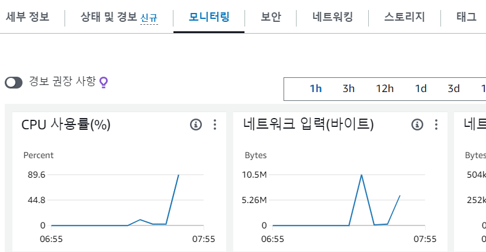

## 문제상황



프리티어 EC2에서 서버를 배포하고 사용하다 보면, 종종 위와 같이 CPU 사용률이 비정상적으로 올라가고 SSH가 먹통이 되는 경우가 있었다.

처음에는 일시적인 현상인줄 알고 서버를 재부팅해서 해결했지만 점점 빈도가 높아져 서버를 정상적으로 사용하는데 어려움을 겪었다.

## 원인

프리티어에서 사용 가능한 EC2 서버, t2.micro의 경우에는 **램이 작아서** 쉽게 터진다고 한다.

주로 새로운 패키지를 설치하거나, 서버를 빌드하거나, 런할 때, 서버를 오래 켜뒀을 때... 그냥 시시때때로 터졌다.

## 해결

**Swap 메모리**를 지정해주면 된다.

[AWS 공식 가이드](https://repost.aws/ko/knowledge-center/ec2-memory-swap-file)에도 적혀있는 방법인데, HDD의 일정 공간을 스왑 공간으로 지정해 램처럼 사용하는 방법이다.

가이드에는 128MB씩 32개, 4GB 정도를 지정해주고 있지만 그정도로 많이는 필요가 없어서 절반인 2GB를 지정했다.

```
// 스왑 파일 생성
$ sudo dd if=/dev/zero of=/swapfile bs=128M count=32

// 스왑 파일의 권한 업데이트
$ sudo chmod 600 /swapfile


// 스왑 영역 설정
$ sudo mkswap /swapfile

// 스왑 공간에 스왑 파일 추가
$ sudo swapon /swapfile

// 정상적으로 추가됐는지 확인
$ sudo swapon -s
```

여기까지 진행한 후에는 스왑 파일을 시작해야 한다.

```
$ sudo vi /etc/fstab
```

vi로 파일을 연 후, 파일의 맨 마지막에

```
/swapfile swap swap defaults 0 0
```

위의 한 줄을 추가해주면 된다.

## 결과

위 과정을 통해 스왑메모리 설정을 한 후에는 터지는 일이 없었다!
