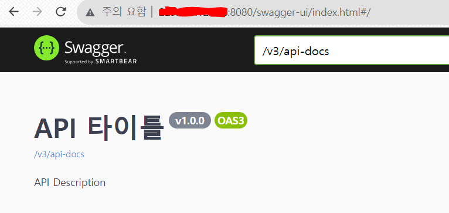

## 개요


> (application.yml 작성하고.. gradlew 권한 열고.. gradlew build...아 맞다 open-jdk17 설치하고.. 다시 gradlew build하고.. java -jar.. ) * 서버 개수 

Load Balancing을 적용하는 과정에서, 동일한 서비스를 제공하는 서버를 여러 개 만들어서 각각의 서버에 접속하여 직접 같은 세팅을 했다.

그 과정에서 번거로움을 느꼈고 현업에서는 절대 하지 않을 방식이라고 생각되어서 더 효율적인 방법을 찾아보았고 **Docker**를 사용하면 되겠다는 생각을 하게 되었다.

## Docker

[공식문서](https://docs.docker.com/get-started/overview/)에 따르면, 도커를 사용할 시 인프라와 애플리케이션을 분리할 수 있고 애플리케이션을 관리하는 것과 같은 방법으로 인프라를 관리할 수 있다고 한다

여기서 **인프라**를 애플리케이션을 제외한 서버 내의 운영체제, 설정 등으로 이해했다

따라서 도커를 사용함으로써 코드 작성과 실행(서비스 제공) 간의 지연을 줄일 수 있다

만약 도커를 사용하지 않고 3개의 서버를 생성해서 로드 밸런싱을 적용했다고 가정해보자

그럼 수정사항이 생길 때마다 모든 서버에 접속해서 git pull을 하고.. 빌드를 하고.. jar파일을 실행하고.. 아니면 설정 파일을 하나하나 수정하고 등등..

이 과정을 반복하지 않고 더 효율적으로 수행할 수 있도록 하는 것이 Docker의 역할이다

도커는 **이미지**와 **컨테이너**라는 개념이 있다

### Docker Image

도커 이미지란 애플리케이션과 그 애플리케이션을 실행하기 위해 필요한 **모든** 환경(설정 포함)을 묶어서 저장한 파일이다

이미지를 빌드할 때에는 빌드 단계에 필요한 명령어 순서, 환경 설정 등과 이미지를 실행하는 명령어를 **Dokcerfile**에 저장해서 실행한다

예를 들어 jar를 이미지로 만들고자 할 때는 Dockerfile에 ```./gradblew build```, ```java -jar```를 실행하는 명령어를 순서대로 적어주어야 한다

도커 이미지는 **읽기 전용** 파일이기 때문에 처음 빌드한 이후로 상태값이 변하지 않는다

따라서 에러가 발생하지 않을 때의 환경이 그대로 이미지로 박제된다

### Docker Container

도커 컨테이너는 실행 중인 이미지를 의미한다

실행 후 변경 사항(데이터베이스 변경, 서비스 추가 등등)은 컨테이너 안에 이미지와는 별도로 저장되어서 컨테이너를 삭제하면 함께 삭제된다

위의 예시처럼 jar를 이미지로 만들어서 실행하면 서버가 배포되어 있는 상황일 것이다

그 상태에서 데이터가 추가되면 이미지 안에 반영되는 것이 아니라 별도로 저장이 되고, 컨테이너가 삭제되면 함께 삭제된다

실제 서비스 중인 애플리케이션에서 이런 상황이 발생하면 최악이기 때문에 이미지+추가된 레이어로 또 이미지를 만들 수 있다

따라서 이미지는 레이어가 쌓인 형태로 볼 수 있다

### Docker hub

Docker 자체에서 Docker hub라는 저장소를 제공해서 이미지를 push&pull 할 수 있다

### Docker Compose

도커 컴포즈란 명령어 한 번으로 여러 컨테이너를 키고 끌 수 있는 서비스다

nginx 컨테이너, springboot 컨테이너, DB 컨테이너가 모두 각각 존재할 때 각각 컨테이너에 대해 run을 세 번 수행하는 것이 아니라 도커 컴포즈를 이용해 한 번에 킬 수 있다

## Springboot + Docker 실습

### Dockerfile 작성

jar 파일을 빌드하고, 빌드된 jar 파일이 있는 build/lib에 Dockerfile을 작성한다

```
// 버전 선언
FROM openjdk:17-oracle

// 파일 안에 있는 jar 파일 이름을 app.jar로 변경
ARG JAR_FILE=*.jar

COPY ${JAR_FILE} app.jar

// runserver
ENTRYPOINT ["java", "-jar", "app.jar"]
```

### Docker Image 생성 및 Docker hub에 push

**도커 허브에 접근하기 전, ```docker login```으로 로그인!**

Dockerfile이 있는 경로(build/lib)에서 명령어 실행

```docker build -t [도커 아이디]/[이미지 이름] .```

만들어진 이미지를 도커 허브에 업로드

```docker push [도커 아이디]/[이미지 이름]```

이후엔 ssh로 서버에 접속해서 도커를 설치하고 진행한다

마찬가지로 docker login 이후에 진행!

```docker pull [도커 아이디]/[이미지 이름]```

```docker run --name [컨테이너명] -d -p 8080:8080 [도커 아이디]/[이미지 이름] sleep infinity```

sleep infinity를 붙이면 콘솔 창을 닫아도 배포가 유지된다



짜잔~

다음에 로드 밸런싱을 적용할 때는 nginx 컨테이너도 생성해서 도커 컴포즈를 사용해 볼 예정이다


**참고**

https://aws.amazon.com/ko/docker/

https://docs.docker.com/

https://www.44bits.io/ko/post/why-should-i-use-docker-container

