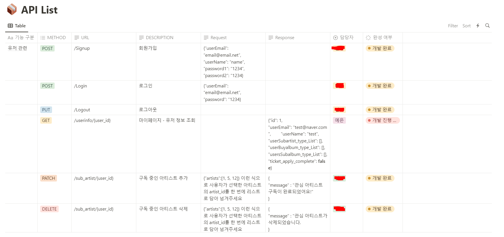

## 토큰형 음반 및 온라인 앨범 보관 플랫폼

최근, 아이돌 산업에서 실물 앨범은 처치 곤란이지만 앨범에 동봉되는 포토 카드, 팬 싸인회 응모권을 얻기 위해 팬들은 지속적으로 많으면 몇 백장의 앨범을 구매한다.

이러한 문제를 해결하기 위해, 실물 앨범이 아닌 **토큰형 음반**이라는 새로운 형태를 제시되었다.

앨범을 구매하면, 기존의 실물 앨범이 아닌 앨범을 구매했다는 인증으로 **토큰**을 발급해주고, 이 토큰을 온라인 서점, 유통사에 제시하면 원하는 굿즈를 받을 수 있다.

제가 제시한 아이디어는 아니지만 너무 기발하고 좋은 것 같다. 당시에 아이돌 팬이 굿즈를 제외한 실물 앨범을 기부하여서 각종 단체에서도 처치 곤란이라는 기사를 자주 봤고, NFT 토큰에 대한 관심이 커졌을 당시라서 적절한 주제 선정이었던 거 같다.

2022년 해커톤의 이야기라 기억이 안 나는 부분도 있지만, 최근에 나의 개발 생활을 돌아봤을 때 이 해커톤에서의 경험이 큰 배움을 준 것 같아서 뒤늦게라도 작성하게 되었다.

## 과정

API 명세서를 노션으로 만들고 담당자와 완성 여부를 작성하여 협업했다.

처음 API 설계와 역할 분배를 체계적으로 진행해서 개발 단계에서는 큰 문제가 없었다. 앨범, 아티스트, 사용자 등 테이블이 여러 연관 관계가 있어서 복잡했으나! 처음에 설계를 잘 해서 이와 관련된 문제가 더 발생하진 않은 거 같다. 사실 후술할 문제로 API 개발에서 크게 활약을 못 해서 내가 모르는 사정이 더 있을 수 있다.

나는 API 개발보다는 배포에서 더 큰 비중을 맡았다. 이 때 당시에 Django와 Docker를 사용해서 배포했는데, 외부 DB가 아닌 장고 내부의 sqlite를 사용해서 재배포할 때마다 데이터가 사라지는 문제가 있었다.

지금 다시 개발하면 컨테이너를 유지하거나 외부 DB를 사용하는 등의 방법으로 데이터를 유지하도록 공부해볼 거 같다. 덕꾸 당시에는 sqlite를 백업해놨다가 재배포시 덮어 씌우는 방식으로 해결했다.  

프론트엔드와의 연동 과정에서 로그인 정보를 넘기는 방법을 몰라서 결국 로그인 기능을 완성하지 못 하고 제출했다.

그럼에도 해커톤에서 **강남언니상을 받을 수 있었다.**

## 소통의 중요성

이 해커톤 경험에서 가장 크게 느낀 것은 **소통**이 중요하다는 점인 것 같다.

이 때의 경험이 인상 깊어서 이후 나의 프로그래밍 생활에서 큰 영향을 주었다. 

1. **다른 파트와의 소통**

백엔드뿐만 아니라, 프론트엔드와도 소통 문제가 있었다. Swagger를 사용한 API 문서 자동화 방법을 학습하지 못 해서 수동으로 작성해서 API를 교환했는데, 이게 가독성이 좋지 않아서 프론트엔드가 API를 이해하고 사용하는데 문제가 있었다. 

작성하는 백엔드도 수정사항이 생길 때마다 수동으로 업데이트해야 해서 힘들었다.

이 문제점이 크게 와닿아서 11기 운영진을 할 때는 10기 참여자에게 Swagger의 존재와 사용법에 대해 알려주었다.

[[Django] Swagger로 API 문서를 만들어 봅시다](https://yelog.site/swagger/)

2. **백엔드 간의 소통**

각자 맡은 API 파트가 있는데, 소통 문제인지 내가 맡은 파트를 개발하고 깃에 PUSH 하려고 하니 누군가가 이미 개발해놓았다. 위의 노션 API 명세서에도 내 이름이 다른 사람의 이름으로 바뀌어 있었다.. 그러나 이미 개발이 되었으니까 넘어가고, 배포를 맡아서 내 역할을 다 하고자 했다.

그러나 해커톤 당일에 프론트엔드와 연동하는 과정에서 여러 문제점을 겪게 되었다. 각종 에러가 발생하고 프론트엔드의 수정 사항도 있었는데, 코드의 함수 이름과 변수 이름이 통일되지 않아 코드를 작성한 사람만 해결할 수 있었다. 

따라서 여러 파트를 맡아서 개발한 사람이 에러 해결 독박을 쓰게 되어서 협업의 의미를 못 살리게 되었다. 나를 포함한 다른 사람들은 돕고자 코드를 열어보아도, 이해하기가 힘들어서 아무 일도 맡지 못 했다. 

**결론**

이런 문제를 겪고 나니 **코드 가독성**과 **소통**에 큰 관심을 가지는 개발자가 되어야 겠다고 생각했다.

더 다양한 환경 (기업, 대규모 프로젝트 등) 에서 협업을 진행하면 내 코드를 수많은 사람이 읽고 이해해야 할텐데, 코드를 백엔드를 학습하지 않은 사람이 읽어도 알아볼 수 있을 정도로 가독성이 좋게 작성하는 방법을 공부해야겠다고 생각했다.

**개발자의 네이밍 센스** 문제도 몸소 체험할 수 있는 경험이었다. 왜 한국어 그대로 변수명을 작성하지 말라는 것인지, 왜 변수명 규칙이 있는 것인지 완전히 이해할 수 있었다. 

이제 막 프로그래밍 공부를 시작한 사람들끼리 모여 개발을 진행하느라 여러 불협화음이 있었으나 수상한 것이 정말 팀원들에게 감사하고 근 3년동안 제일 기뻤던 순간 중에 하나였다. 

