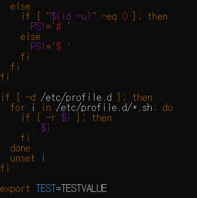
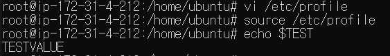
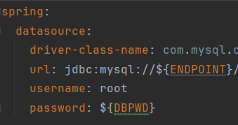

application.yml을 Git Repository에 업로드할 때, .gitignore에 ```*.yml```을 추가하여 아예 업로드하지 않거나 ```%{변수_이름}```으로 작성하고 서버에 환경변수를 추가하여 민감한 정보를 관리할 수 있다.

이제까지는 전자의 방법으로 관리하였는데 가끔 yml 파일을 분실하여 팀원에게 요청하며 불편함을 느꼈다.

따라서 후자의 방법으로 관리하기 위해, 서버에서 환경변수를 설정하는 방법을 알아보자.

## 방법

1. **./bashrc**: **특정 사용자**만 접근할 수 있는 환경변수. 대화형 쉘 세션이 시작될 때마다 실행되는 스크립트

2. **/etc/profile**: **모든 사용자**가 접근할 수 있는 환경변수. 로그인 세션에서 처음 시작될 때 실행되는 스크립트

두 방법의 적용 방법은 거의 동일하며, 어느 파일에 환경변수를 작성하는가 정도의 차이만 있다.

## 적용


1. 두 방법 중, 원하는 파일의 맨 마지막에 ```export <name>=<value>```를 작성한다. <br> 이때, /etc/profile을 수정하고자 하면 ```sudo su``` 명령어로 root 권한을 얻자. 


2. 저장 후, 쉘에 ```source <파일명>```을 입력한다. 파일 변경사항을 즉시 적용하는 명령어다.



3. ```echo $<name>```으로 정상적으로 적용됐는지 확인한다.



4. 스프링 기준, ```${name}```으로 환경변수를 사용할 수 있다.