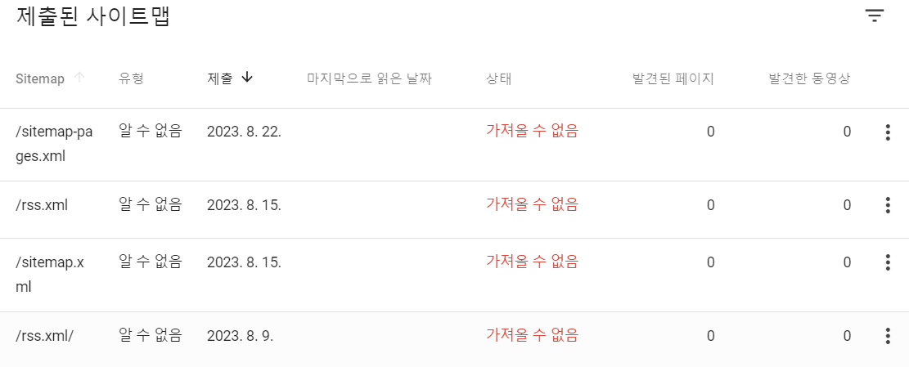
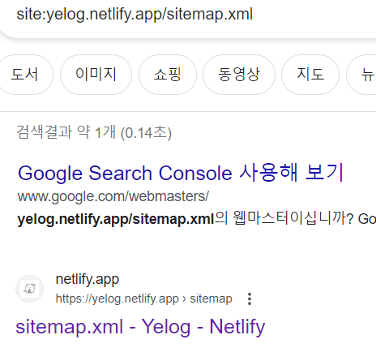
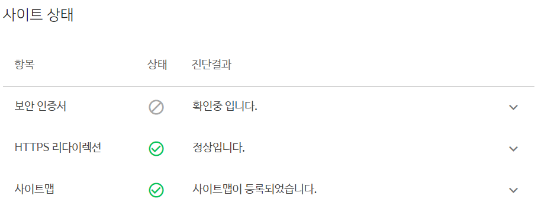
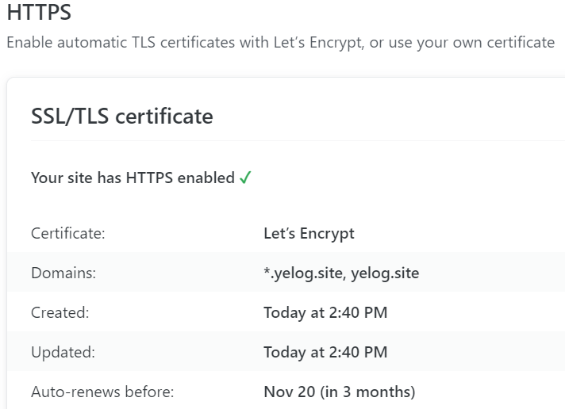
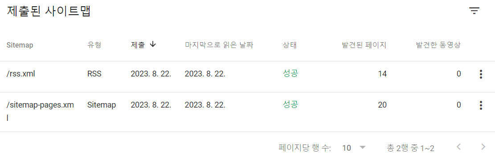
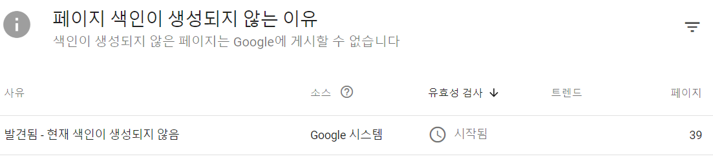

## 문제 상황

Gatsby 블로그를 구글 서치 콘솔에 등록하는 과정에서, 위 사진처럼 Sitemap이 정상적으로 등록되지 않았다

서치해서 여러 자료를 찾아보고 모두 적용해보았으나 해결이 되지 않았다 ㅜㅜ

따라해 본 방법들은 아래와 같다(=**삽질 과정**)

1. /sitemap.xml을 삭제하고 //sitemap.xml 또는 /sitemap.xml/로 재등록하기

: //sitemap.xml은 /sitemap.xml과 동일하게 변경되어 등록되어 의미 없는 것 같았으며 /sitemap.xml/은 올바른 xml 링크가 아니었다

2. /sitemap.xml 링크 색인 생성 요청

: sitemap.xml 자체가 링크에 검색될 뿐 안의 내용이 sitemap으로 등록되는 로직은 아닌 것 같았으며 등록한 이후로 제출된 사이트맵에 변동이 없었다

3. 기다리기

: sitemap 처리가 오래 걸리고 길게는 세 달이 걸려서 성공된 사례도 있다고 보았다

모든 방법을 해보고 도저히 다른 방법을 못 찾겠어서 기다렸는데 한 달이 지나고 나니 기다려서는 영원히 안 될 것 같다는 생각이 들었다.

대부분, Gatsby와 Netlify를 사용한 것에 대한 해결책이 아니라 티스토리 등 나와 다른 환경에서의 해결 방법이었기 때문에 더욱 찜찜했던 것 같다

## 해결 과정

구글만 안되나 싶어서 네이버에도 검색 등록을 해놓았는데, 여기는 정상적으로 적용이 되었나 접속했다

여기서 사이트 상태에 보안 인증서가 적용되지 않고 있는 것을 보고 힌트를 얻었다

netlify에 도메인을 따로 등록하지 않고 기본으로 제공하는 netlify.app을 사용 중이었는데 HTTPS는 적용되지만 보안 인증서는 적용이 안 됐나보다

당연히 보안 인증서가 적용이 되어 있는 줄 알았는데 아니었다..

Netlify에서 보안 인증서를 적용하는 방법을 찾아보니 도메인을 구매해서 적용하면 Let's Encrypt로 보안 인증서를 적용해준다

**도메인 구매 후 Netlify에 적용하고, 보안 인증서까지 받으니 정상적으로 등록이 됐다**

구글 서치 콘솔에도 새로운 도메인으로 등록했다

이 초록색 성공을 얼마나 보고 싶었는지..

결론은 **보안 인증서**가 적용이 안되어서 구글 내부에서 걸러진듯 하다

## 일주일 후 추가

위의 글을 작성하고 일주일이 지난 8/28..

sitemap에 있는 색인들이 생성이 안돼서 애타는 마음으로 기다리다가 오늘 보니 위처럼 페이지 색인이 생성되지 않는 이유 이런게 떴다

검색해보니까 유효성 검사 신청하면 며칠 내로 된다고 한다

최종 느낀점으로는 시간을 정말정말 오래 잡고 느긋하게 기다려야 하는 것 같다

전세계 구글 처리량을 생각해보면 납득할 수 있다 .. 내가 기다릴게 구글쨩

