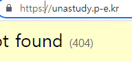

**막히면 언제든지 저한테 갠톡 주세요**

## 네이버 클라우드 회원가입 & 크레딧 지급

https://www.ncloud.com/


회원가입 크레딧 받으시고 [여기](https://www.notion.so/likelion/f01fa063e31740c5b61b840163a698b0?pvs=4)를 참고해서 멋사 크레딧도 추가해주세요

**반드시 마이페이지 - 크레딧 및 할인 관리에서 크레딧이 추가됐는지 확인하시고 진행하시길 바랍니다**

## 새로운 서버 생성


콘솔에 접근하고 Services - Server로 들어가서 서버 생성을 해줍니다


서버 이미지는 Ubuntu, base로 선택해주세요!


base로 선택하는 이유는 Micro 타입이 base에서만 사용이 가능하기 때문인데.. 

어차피 크레딧 있어서 상관없다 싶으신 분들은 자유롭게 선택해 주세용

저는 base, Micro 환경에서 진행하겠습니다

(해커톤 진행할 때는 Micro로도 충분할 거예요)

 


VPC랑 Subnet도 만들어서 설정해주고


서버 설정 해줍니다

공인IP 할당해주세요

인증키도 생성해서 잘 저장해놓으시고 ACG도 잘 선택하시고.. 서버 만드세여


짜잔

상태가 초록불이 될 때까지 기다리세요

## 장고 프로젝트 설정

기다리면서 프로젝트를 설정합시다


가상환경 실행하고 manage.py가 있는 폴더로 이동해서

0. ```pip install gunicorn``` 배포할 때 필요한 라이브러리를 설치합니다

1. 터미널에 ```pip freeze > requirements.txt``` 를 입력해서 설치된 라이브러리를 txt 파일로 출력합니다

2. ```Dockerfile```을 생성하고 아래 내용을 입력해주세요

```
FROM python:3
WORKDIR /usr/src/app

COPY requirements.txt ./
RUN pip install -r requirements.txt

COPY . .

EXPOSE 8000

CMD ["gunicorn", "--bind", "0.0.0.0:8000", "[프로젝트 이름].wsgi:application"]
```

3. settings.py에 ```ALLOWED_HOSTS = ['*']``` 추가

원래 허용하고 싶은 안전한 IP 주소만 추가해야 하지만 저는 귀찮으니까 다 열겠습니다

4. ```git push```

## 서버 포트 허용

이제까지 로컬에서 runserver 할 때는 8080 포트였지만 

서버 배포 과정에서는 8000.. 80... 443 등등.. 여러 포트를 사용합니다

열어줘야 합니다


현재 서버에 연결된 ACG 설정에 들어가서 Inbound에 이렇게 추가해줍니다

저는 안전불감증이라 그냥 다 열었는데.. 불안하시면 사용하는 포트만 여세요

## 서버 접근


여기 들어가서 서버 생성 과정에서 다운 받은 key(pem 파일)을 넣고 관리자 이름이랑 비밀번호를 확인해주세요

아래부터 window는 git bash, mac은 터미널을 새 창으로 하나 켜서 진행합시당

cd 명령어로 서버 생성 과정에서 다운 받은 key(pem 파일)이 있는 경로로 이동해주세요


```ssh -i [pem 파일] [관리자 이름]@[공인 IP]```

아까 확인한 초기 비밀번호를 입력하고 접근합니다

앞으로 접근할 일이 많으므로 ```passwd``` 명령어로 비밀번호 변경 ㄱㄱ

## 패키지 설치

```
sudo apt update
```
apt 업데이트 해주고

```
sudo apt install git 
sudo apt install -y docker.io
```
git이랑 docker 설치

(-y는 yes/no 선택하는 부분을 전부 yes로 하겠다는 옵션입니당)
```
git clone [프로젝트 링크]
```
프로젝트 레포 클론까지 받아줍니당

## 배포

Dockerfile이 있는 경로로 이동해서 진행합니다

```docker build -t [프로젝트 이름] .```으로 이미지를 만들어 줍니다


```docker run --name [컨테이너 이름] -d -p 8000:8000 [프로젝트 이름]```으로 컨테이너를 만들고 이미지를 실행합니다


짜잔

```docker ps -a```로 실행 중인 컨테이너를 확인할 수 있습니다


공인IP:8000으로 들어가서 배포가 잘 됐는지 확인하세요

## 배포 중단&업데이트

만약 프로젝트를 업데이트 해야 한다면.. 다시 build -> run 해야 합니다

1. 컨테이너 중단: ```docker stop [컨테이너 이름]```
2. 컨테이너 삭제: ```docker rm [컨테이너 이름]```
3. 이미지 삭제: ```docker rmi [이미지 이름]```

하고 다시 build -> run ㄱㄱ

귀찮지만 다른 방법은 더 귀찮더라고요

## 도메인 설정

[내도메인](https://xn--220b31d95hq8o.xn--3e0b707e/)에서 로그인하고 도메인을 받습니다


고급설정 - A에 공인IP를 입력합니다

\+ 누르고 www 추가해서도 하나 적어주세요

1. nginx 설치: ```sudo apt install -y nginx```
2. ```vi /etc/nginx/sites-enable/[프로젝트 이름]```
3. 아래 내용 입력
```
server {
    listen 80;
    server_name : [도메인]

    location / {
        include proxy_params;
        proxy_pass http://[공인IP]:8000;
    }
}
```
i 누르고 편집 상태로 들어가서 작성 후, esc 누르고 ```:wq``` 입력하시면 됩니당

4. ```sudo rm /etc/nginx/sites-enable/default```
5. ```sudo systemctl restart nginx```

## HTTPS 설정

http는 보안 인증이 안 되어 있기 때문에 프론트랑 통신할 때 에러가 발생합니다

보안 인증서를 받아서 https로 바꿔봅시다..

1. ```apt install snapd```
2. ```snap install certbot --classic```
3. ```apt install -y python3-certbot-nginx```
4. ```sudo certbot --nginx```

처음에 이메일 물어보고


어떤 도메인인지도 물어보고

No redirect / Redirect 선택하는 부분은 맘대로.. 저는 redirect 했습니다

인증서는 3개월마다 갱신해야 합니다 



짜잔

https://unastudy.p-e.kr/

디도스 공격하지마세여 ㅜ