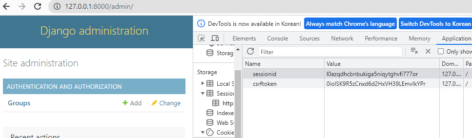
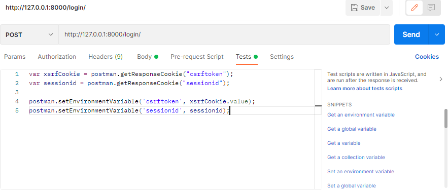
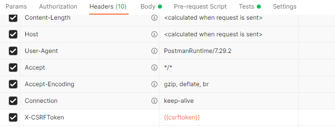

**글 내용에 질문이 있으면 언제든지 연락 주세요 (저 심심해요)**

## 개요
API 개발을 하다보면, 현재 로그인한 사용자의 정보를 불러오는 과정이 필요합니다

웹에서 테스트를 할 때와는 다르게 Postman에서는 로그인 시도시 1. CSRF 에러가 나고 2. 로그인 유지가 되지 않습니다

Postman에서 CSRF 에러를 해결하고 로그인을 유지하는 방법을 알아봅시당

## Session & Cookie

세션은 서버(장고 내부)에 저장하는 정보, 쿠키는 로컬(사용자 컴퓨터)에 저장하는 정보로 이해하고 넘어갑시다

각각 세션, 쿠키에 유저를 검증할 수 있는 값(=session id)을 저장합니다

로그인을 수행하며 아이디, 비밀번호 검증이 되면 서버가 session id를 발급해서 로컬에게 건네줍니다

로컬은 session id를 쿠키로 저장해서 request를 보낼 때마다 session id를 실어서 보냅니다 

서버에서는 받은 session id를 이용하여 어느 유저의 request인지 알게 됩니당

## CSRF

csrftoken은 제 3자가 특정 유저인 척 request를 보내는 공격인, CSRF 공격을 방어하기 위한 보안 목적으로 발급됩니다

session id와 유사한 방식으로 작동합니다



**로그인 후 sessionid와 csrftoken이 저장되어 있는 것을 확인할 수 있습니다**

Postman에서는 쿠키가 저장되지 않기 때문에 csrf 오류가 발생하고, 로그인이 유지되지 않습니다 ㅠ_ㅠ

## 해결방법

Postman에서도 sessionid와 csrftoken을 쿠키에 저장해줍시다


```
var csrf_token = postman.getResponseCookie("csrftoken").value;
postman.clearGlobalVariable("csrftoken")
postman.setGlobalVariable("csrftoken", csrf_token)
pm.environment.get("variable_key");

var sessionid = postman.getResponseCookie("sessionid");
postman.setEnvironmentVariable('sessionid', sessionid);
```
Tests에 위 코드를 작성하고


Header에 key를 X-CSRFToken, value를 {{csrftoken}}으로 추가합니다

포스트맨이 알아서 request의 쿠키 및 헤더에 sessionid와 csrftoken을 실어서 전송합니당

**다른 계정으로 테스트하기 위해 signup, login을 다시 수행해야 할 경우 Send 밑에 Cookie 버튼을 누르고 sessionid와 csrftoken을 삭제해주어야 합니다**