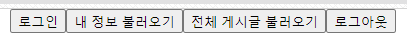
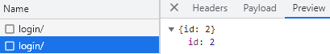
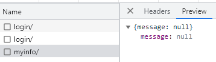
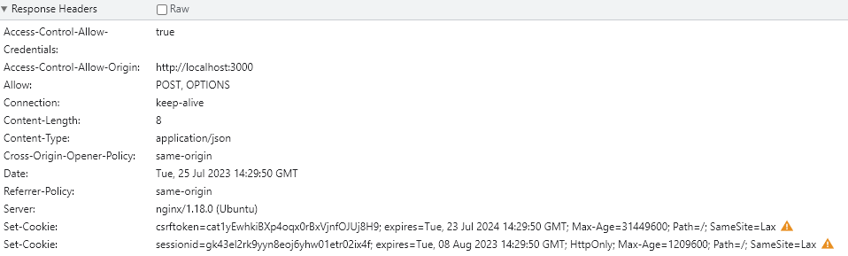
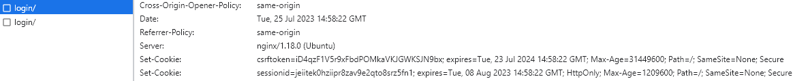
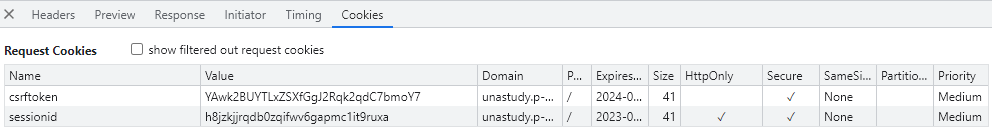
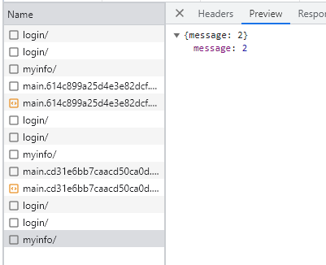

## 개요

멋쟁이 사자처럼 10기 인하대 해커톤..

멋쟁이 사자처럼 10기 중앙 해커톤....

멋쟁이 사자처럼 11기 인하대 해커톤......

세 번동안 로그인 유지를 나도 실패하고 남도 실패하는 걸 보고 오기가 생겨서 해결해 본 로그인 유지!!!

[Session & Cookie란 무엇인가](/Postman-Test/)

로그인을 JWT로 구현한다면 다른 방법으로 (어쩌면 더 쉽게??) 유지할 수 있겠지만 날 무릎 꿇린 Session에게 복수하기 위해 Session으로 진행 ㅡㅡ 캭

## 문제 상황

**Back-End** 코드에서 CORS 설정했고

**Front-End**
```js
function login() {
  axios.post('https://unastudy.p-e.kr/login/', {userID: "admin", password: "admin"});
  console.log()
}

function myinfo() {
  const response = axios.get('https://unastudy.p-e.kr/myinfo/');

  console.log(response)
}

function posts() {
  const response = axios.get('https://unastudy.p-e.kr/postAPI/');

  console.log(response)
}

function logout() {
  axios.get('https://unastudy.p-e.kr/logout/', {withCredentials: true})
}
```



Axios 속성 공부해서 테스트용 프론트도 만들었다



로그인은 성공해서 유저 아이디도 잘 받아오는데



현재 로그인 중인 사용자의 정보를 반환하는 myinfo를 실행해보면 로그인 유지가 안 되어있다..



로그인 요청의 응답 헤더를 보면 Set-Cookie 부분에 

**This attempt to set a cookie via a Set-Cookie header was blocked because it had the "SameSite=Lax" attribute but came from a cross-site response which was not the response to a top-level navigation.**

경고문이 뜨면서 정상적으로 작동되지 않고 있었다

## SameSite

**SameSite**란 CSRF(크로스 사이트 요청 위조) 공격을 방지하기 위해 보안 목적으로 쿠키에 설정할 수 있는 속성이다

naver.com이 모든 쿠키를 허용한다면, 이상한 yelog.p-e.kr 같은 도메인에서 불량한 목적으로 Set-Cookie를 마구 보내서 공격할 수 있을 것이다

따라서 map.**naver.com** <-> blog.**naver.com** 처럼 같은 도메인 내에서만 쿠키를 주고 받을 수 있도록 설정하게 된다

속성에는 아래 세 가지 설정이 가능하다

- Strict: 무조건 같은 도메인의 쿠키만 허용
- Lax: 기본적으론 같은 도메인의 쿠키만 허용하지만, 몇가지 예외가 존재
- None: 제한 없음

크롬에서는 보안적인 이유로 SameSite의 기본 설정값을 Lax로 제한해서 위와 같은 문제 상황이 발생하게 된 것이다

## 해결

쿠키의 SameSite를 None으로 변경해서 전송하자!

**[Back-End] settings.py**

```python
# Cookie samesite 에러 해결
SESSION_COOKIE_SAMESITE = 'None'
CSRF_COOKIE_SAMESITE = 'None'
SESSION_COOKIE_SECURE = True
CSRF_COOKIE_SECURE = True
```

SameSite 옵션을 None으로 설정하려면 Secure 옵션이 반드시 붙어있어야 한다

**[Front-End]**

```
axios.defaults.withCredentials = true;
```

프론트 단에서도 withCredentials 설정을 해야 쿠키가 정상적으로 작동한다



다시 로그인 요청의 응답 헤더를 보면 노란색 세모가 사라져있다




myinfo 요청 쿠키에도 예쁘게 들어갔고 응답도 정상적으로 받을 수 있다

짱! 

## 여담

작년엔 악명 높은 CORS도 해결했는데 눈에 띄는 에러없이 로그인 유지가 안돼서 정말 답답했다

힘들게 개발 다 하고 연동하는 마지막 단계에서 무너진 거라서 더 낙담했다

그 상처가 너무 깊게 남아서 그런가 올 해 운영진 활동 시작하면서 제일 많이 한 다짐이 **꼭 로그인 해결해서 11기 알려줘야지** 였고 실제로 인하대 해커톤 초반 쯤에 공부했다 

널리 알리진 못 했지만....

느낀 점은.. 개발자 도구를 꼼꼼히 보자................

해결하고보니 추가한 코드는 몇 줄 없어서 허무했다

그래도 해결 과정에서 많은 걸 공부한 거 같다....................................

여담이 길어졌지만 개발 환경도 다르고 허접하게 구현한 프론트 환경에서 테스트한 것이기 때문에 저와는 또 다른 에러가 발생할 수 있습니다..................................................... 


