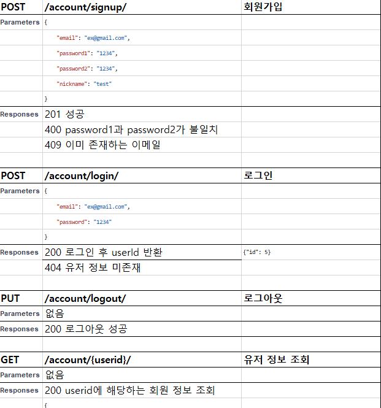
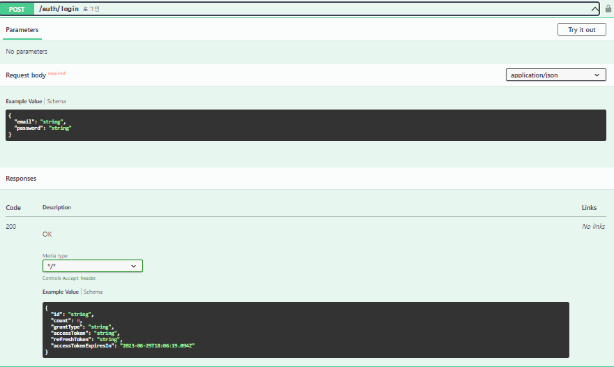
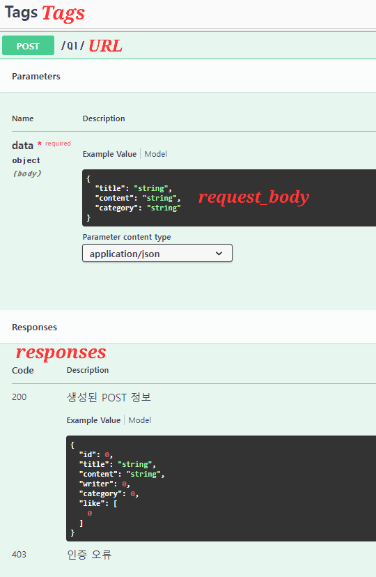

## 개요

API를 개발하면 프론트엔드와 JSON으로 소통하게 됩니다

이 때.. 무슨 기능은 어떤 URL인지, Request에 어떤 파라미터가 들어가는지, Response로는 무슨 정보를 줄 것인지 프론트엔드에게 알려주어야 합니다


(tmi)저는 작년 해커톤 때 엑셀에 작성해서 수기로 줬는데 일단 제가 수동으로 수정해야 하기 때문에 매우매우 귀찮았습니다.........


Swagger를 사용하면 API 문서를 자동으로 동기화할 수 있고 사이트 내에서 테스트도 가능합니다!

Swagger는 개발하면서 작성해도 되고 개발 완성 후에 추가해주셔도 되고 자유롭게 작성하시길 바랍니다


## 라이브러리 설치 및 세팅
```bash
pip install drf-yasg -U
```

./{project_name}/settings.py
```python
INSTALLED_APPS = [
    ...
    'drf_yasg',
    ...
]
```
Swagger 관련 라이브러리를 설치하고 settings.py의 INSTALLED_APPS에 추가합니다

## Swagger 페이지 url 설정
/{project_name}/urls.py
```
...
from django.urls import path, re_path
...

# Swagger 설정
from rest_framework.permissions import AllowAny
from drf_yasg.views import get_schema_view
from drf_yasg import openapi
```

```
schema_view = get_schema_view(
    openapi.Info(
        title = "Swagger 타이틀 작성",
        default_version = "v1",
        description = "Swagger를 사용한 API 문서입니다",
    ),
    public=True,
    permission_classes=(AllowAny,),
)
```
```
urlpatterns = [
    ...

    # Swagger url
    re_path(r'^swagger(?P<format>\.json|\.yaml)$', schema_view.without_ui(cache_timeout=0), name='schema-json'),
    re_path(r'^swagger/$', schema_view.with_ui('swagger', cache_timeout=0), name='schema-swagger-ui'),
]
```
여기까지 수정해주셨다면 runserver 후 http://127.0.0.1:8000/swagger/ 에 접근하셨을 때 swagger 페이지를 확인할 수 있습니다

## Swagger 세부 설정

/{app_name}/views.py
```python
class Q1(APIView):
    @swagger_auto_schema(
            tags = ['tags: 큰 주제'],
            request_body=openapi.Schema(
                type=openapi.TYPE_OBJECT, 
                properties={
                    'title': openapi.Schema(type=openapi.TYPE_STRING, description="제목"),
                    'content': openapi.Schema(type=openapi.TYPE_STRING, description="내용"),
                    'category': openapi.Schema(type=openapi.TYPE_STRING, description="카테고리 이름")
                }
            ),
            responses = {
                200: openapi.Response('생성된 POST 정보', PostSerializer),
                403: '인증 오류'
            }
        )
        def post(self, request):
```
함수에 ```@swagger_auto_schema``` 데코레이터를 달아서 swagger의 세부 내용을 설정해줄 수 있습니다




Swagger 설정하는 법은 제가 작성한 방법 외에도 정말 다양하기 때문에 [공식문서](https://drf-yasg.readthedocs.io/en/stable/drf_yasg.html#module-drf_yasg.openapi) 또는 구글링으로 학습하고 작성해보세요!

## 로그인 설정

원래 Swagger에서는 인증 후 Postman처럼 직접 테스트가 가능하지만..!

저는 장고 인증법을 모르겠읍니다...

추후 추가할게용