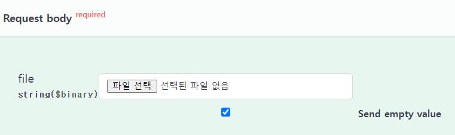
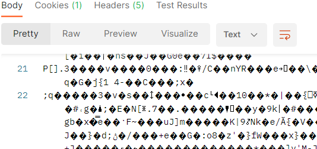

서버에 이미지를 저장할 때, 두 가지 방법을 사용할 수 있다.

1) DB 자체에 이미지를 저장

2) 서버에 파일로 저장하고 DB에는 이미지의 정보만 저장

그러나 이미지 파일은 생각보다 무겁기 때문에, DB 서버에 무리를 주어 이미지를 불러오는 데에 시간이 오래 걸릴 수 있다. 

따라서 보통 2의 방법을 권장하는 거 같다.

불러올 때는 이미지 파일을 byte 배열에 담아서 반환한다

프론트에게 MultipartFile 형식으로 이미지 파일을 받아서 서버에 저장하고, 불러와보자 

!!파일을 다룰 때는 throws IOException을 추가해주어야 정상적으로 작동한다!!

## Image Class

```
@Getter
@NoArgsConstructor
public class Image {

    public String img_name;
    public String img_path;

    public Image(String name, String path) {
        this.img_name = name;
        this.img_path = path;
    }
}
```

Image Class를 만들어서 이미지 정보(파일 이름, 저장 경로)를 저장한다

만든 Image Class를 필드로 가지는 Member도 간단히 만들어주었다.

## Image Controller

#### \- Post: 이미지 저장

```
    @PostMapping(value = "img", consumes = MediaType.MULTIPART_FORM_DATA_VALUE)
    public ResponseEntity<Void> PostImage(@RequestBody @Valid MultipartFile file) throws IOException {
		
        // 리눅스 서버 안에서는 \\ 대신 /로 경로를 지정한다
        String file_path = System.getProperty("user.dir") + "\\img\\";
        // 파일 이름 저장
        String file_name = file.getOriginalFilename();
		
        // 빈 File 생성
        File dest = new File(file_path + file_name);
        // MultipartFile을 File로 붙여넣기
        file.transferTo(dest);
        
        // member에 Image 정보 저장
        Member member = new Member();
        member.setImage(new Image(file_name, file_path));
        memberService.save(member);

        return new ResponseEntity<>(HttpStatus.OK);
    }
```

**consumes = MediaType.MULTIPART\_FORM\_DATA\_VALUE**

\- 생략해도 잘 동작하지만 Swagger 등의 자동화된 API 문서를 생성할 때, 이 부분을 작성하지 않으면 Swagger가 Request를 json으로 받는다고 인식해버려서 원활한 테스트를 할 수 없다

명시해주면 아래 사진처럼 Request body를 file로 보낼 수 있다



#### \- Get: 이미지 출력

```
@GetMapping(value = "img/{member_id}", produces = MediaType.IMAGE_JPEG_VALUE)
public ResponseEntity<byte[]> GetImage(@PathVariable("member_id") Long id) throws IOException {
    Image image = memberService.findById(id).getImage();

    // 이미지를 InputStream에 읽어오기
    InputStream inputStream = new FileInputStream(image.img_path + image.img_name);
    // InputStream에 읽어 온 이미지를 byte 배열에 저장
    byte[] bytes = inputStream.readAllBytes();
    inputStream.close();

    return new ResponseEntity<byte[]>(bytes, HttpStatus.OK);
}
```

실제 프로젝트 코드에서는 파일 이름을 변수로 받았지만, 파일 경로+이름을 얻을 수 있다면 어떤 방법이든 상관없다

**produces = MediaType.IMAGE\_JPEG\_VALUE**

\- 단순 byte 배열인 response를 이미지로 인식하고 변환해서 반환해주는 역할

이걸 제외하고 작동시키면 아래와 같이 알 수 없는 문자만 반환된다



추가하면 정상적으로 이미지가 출력되는 것을 확인할 수 있다

