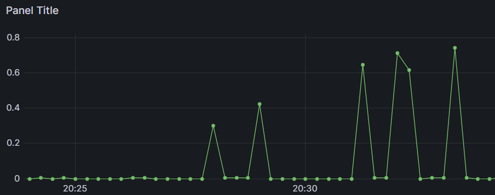
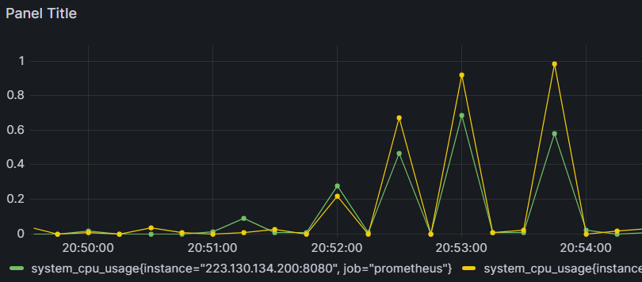
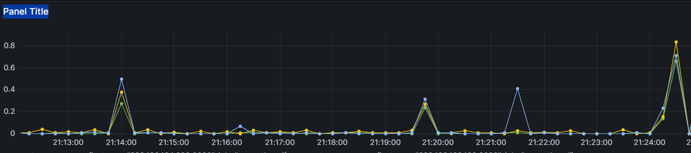
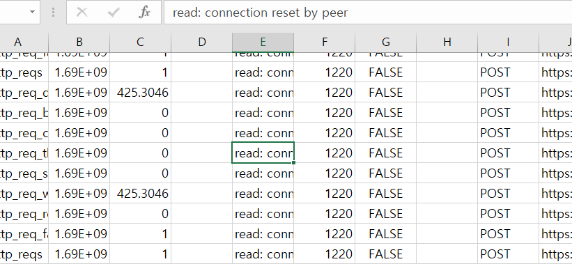

## 개요

[네이버 클라우드에서 LoadBalancing 적용하기](https://yelog.site/LB/)에서 로드 밸런싱을 적용하고 정상적으로 번갈아가며 뷰가 띄워지는 것을 확인했다

이제 k6를 활용해서 트래픽을 보내며 수치를 확인해보자!

**10s로 고정해서 전송**

## 1개의 서버

|vus|complete|손실률(%)|
|------|---|---|
|100|1000|0|
|200|2000|0|
|300|2852|4.9|
|400|3602|10|
|500|4671|6.6|
|600|4988|16.9|
|700|5172|26.1|
|800|5246|34.4|

손실률은 (vus*10)이 정상적인 전송량이라고 가정하고 계산하였다

정상적인 complete 갯수는 vus * 10개인데, vus가 늘수록 누락되는 complate의 수도 늘고 있다

vus가 800일 때는 k6도 끊기기 시작해서 vus를 늘리는 것을 멈추었다

## 2개의 서버

|vus|complete|손실률(%)|
|------|---|---|
|100|1000|0|
|300|3000|0|
|500|4907|1.9|
|700|6669|4.7|
|900|8304|7.7|

vus 1000명부터는 손실률이 90퍼를 넘어가서 따로 기록하지는 않았다.

그러나 서버가 1개일 때 한계까지 보낸 것에 비해 에러가 발생하지는 않았다

그라파나의 CPU 사용량 그래프를 보면 두 서버의 CPU가 동일한 모양을 띄고 있는 것을 볼 수 있다

그러나 정점에서 두 CPU의 사용량이 꽤 많이 차이나는 것 같다

## 3개의 서버

|vus|complete|손실률(%)|
|------|---|---|
|100|1000|0|
|400|4000|0|
|700|6829|2.4|
|900|8656|3.8|
|1100|4900|55.5|

이전 1개, 2개의 서버보다는 900까지의 손실률도 훨씬 줄었는데 1000을 넘는 순간부터 손해가 훨씬 커졌다

## 문제 발생

결과 csv를 확인해보니 connection reset by peer라는 에러가 발생하고 있었다

검색해보니 상대편(server)에 의해 연결이 강제로 종료되었을 경우 발생하는 오류라고 한다 = **서버의 차단**

>A connection attempt failed because the connected party did not properly respond after a period of time, or established connection failed because connected host has failed to respond

혹시 몰라서 클라우드 서비스말고 로컬에서 서버를 돌리고 k6로 트래픽을 보내봤으나 connection reset by peer 에러는 뜨지 않고 위와 같은 에러만 발생하였다

이는 해석해보니 연결 지연 문제임을 유추할 수 있었다

따라서 connection reset by peer은 클라우드 서비스에서 발생하는 에러인가..?

검색해도 더 자세한 자료가 없어서 네트워크에 대해 더 자세히 공부하고 다시 생각해보아야 할 거 같다

추측하면 서버 과부하로 인해 네트워크 상태가 좋지 않아서 서버 측에서 연결을 막아버린 것 같다

서버를 더 증설하거나, 서버를 업그레이드하면 해결할 수 있을 것 같다!
