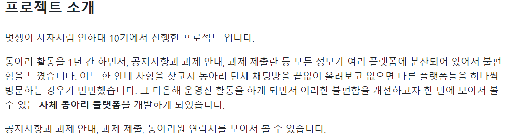
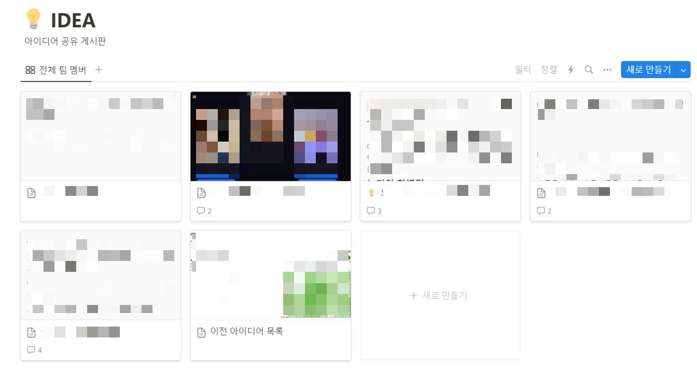
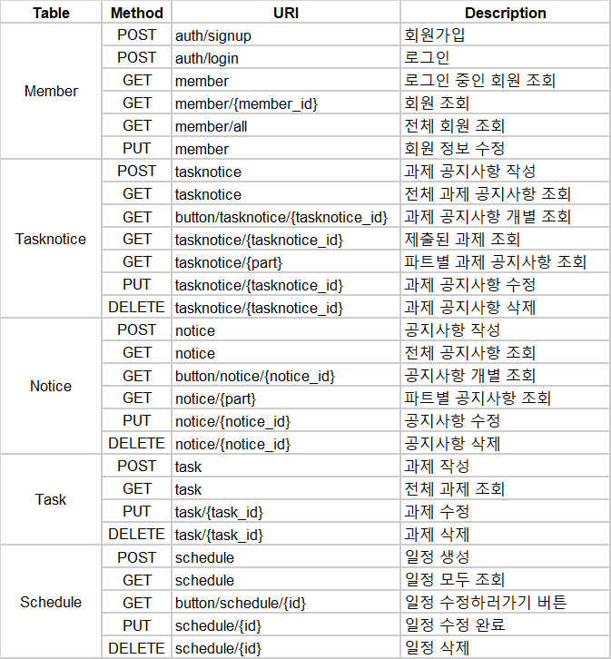
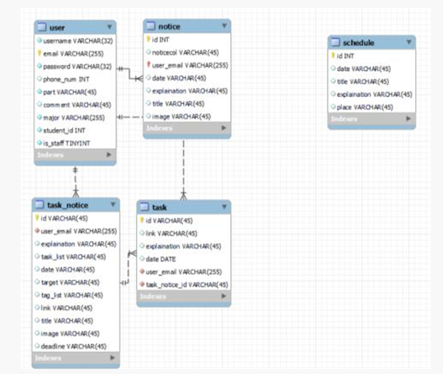
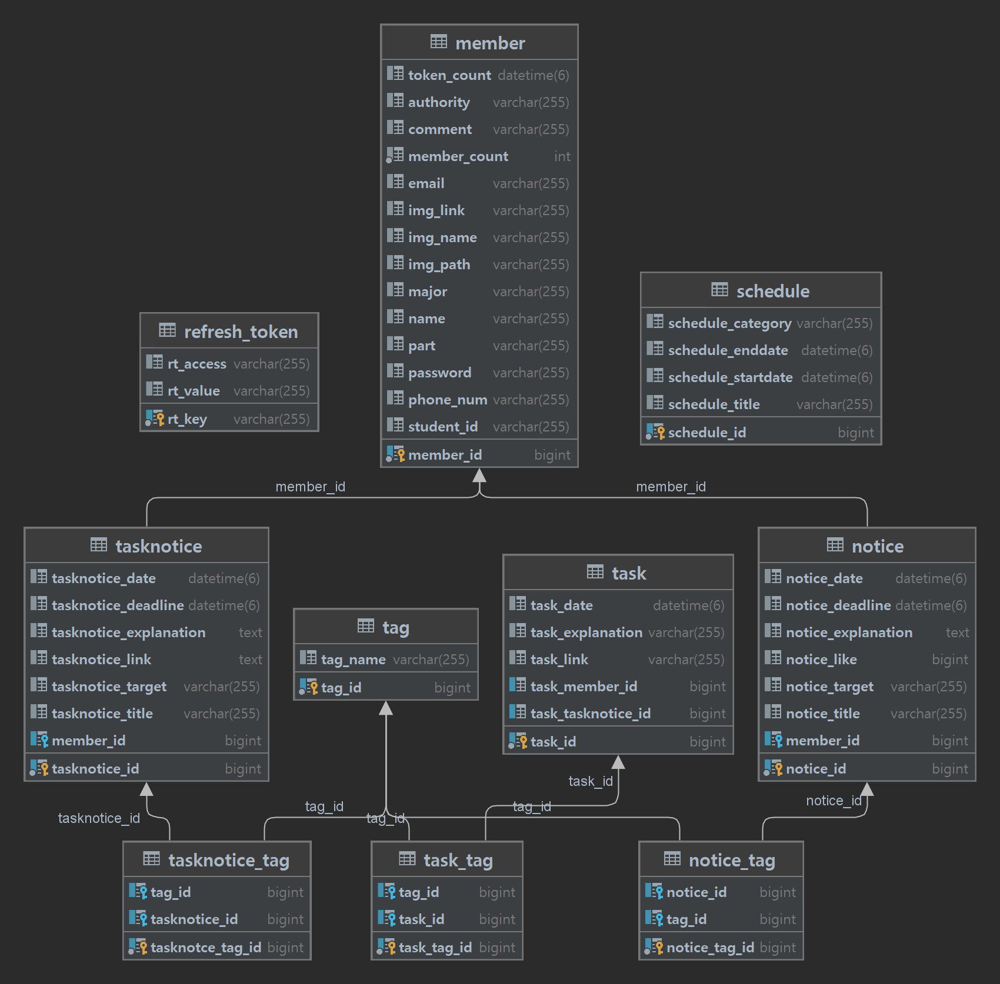
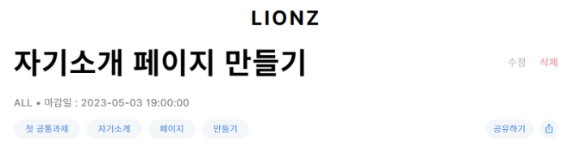
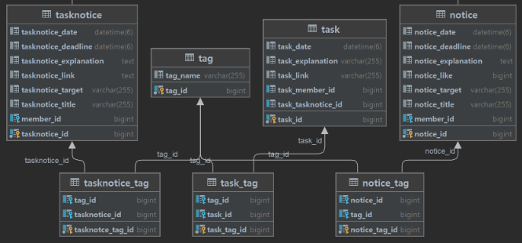
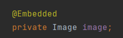
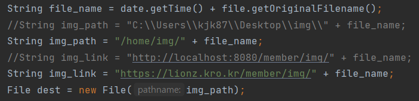
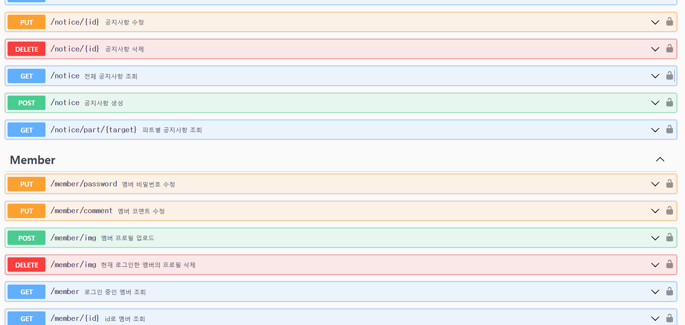

## 0. 개요



멋쟁이 사자처럼 11기 졸업 후 자연스레 동아리 관리 플랫폼 Lionz 프로젝트도 막을 내렸다.

나에게는 너무 큰 의미를 가지는 프로젝트이기 때문에 회고록을 써 프로젝트 과정과 당시의 배움을 기록해 보고자 한다!

## 💡 1. 아이디어 구상



주제 없이 기술 학습을 위해 모인 팀원들이었기 때문에 아이디어 구상에 꽤 오랜 시간이 걸렸다.

한달동안 매주 정기적으로 만나며 프로젝트 아이디어 회의를 했다. 

그 과정에서 여러 아이디어가 오갔고 확정된 상태에서 한번 엎어지기도 했다. 

결론적으로 **동아리 관리 플랫폼**이란 주제가 선정된 것은, 팀원 모두가 멋사 10기 아기사자이면서 11기 운영진이라서 우리가 느낀 불편함을 직접 개선해보고자 하는 마음이 들었기 때문인 것 같다.

## 📃 2. API 설계



회의를 통해 결정된 기능들을 토대로 API 명세서를 작성했고 이걸 참고하며 개발을 진행했다.

이때 조금 아쉬운 부분은 API 명세서를 프론트엔드와 회의를 통해 누락된 것은 없는지, 어떤 데이터를 주고 받을지 미리 꼼꼼하게 상의했다면 좋았을 거 같다.

연동 단계에서 API가 없다던가 보내주어야 하는 데이터가 부족하다던가 등등의 잡음이 많이 발생했기 때문에.. 🥺

프론트엔드와의 소통, 철저한 설계의 중요성을 경험을 통해 이해할 수 있었다..

## 💾 3. DB 설계





처음 설계는 사실 그냥 어느 요소가 필요할지 나열한 수준에 불과했다.

내가 **다대다 관계 구현**에 대한 이해가 부족했으나 다른 백엔드 팀원이 잘 알고 있어서 도움을 받아 학습 후 태그 기능을 구현했다.

데이터베이스 전공 수업을 듣기 전이라서 테이블 관계가 너무 헷갈리고 어려웠다. 특히 어느 테이블이 N이고 1인지 판단하는 것이 힘들었다 ㅠㅠ

## 💻 4. 구현

나와 다른 백엔드 팀원 둘 다 공부 의욕에 불타서 파트 분배를 안 했다.

같은 파트를 한번 각자 구현해보고, 코드 리뷰 후에 취합하여 구현을 완성했다.

물론 시간은 오래 걸렸지만 나와는 어떤 부분이 다른지 알아보는 재미도 있었고 이런 로직으로 구현할 수도 있구나 하고 배우는 점도 많았다.

아래부터는 구현할 때 많이 고민하고 학습한 과정이다.

### 로그인 기능

**SpringSecurity**와 **JWT 토큰**으로 구현했다.

둘 다 생소한 개념이라 정말 한참을 공부하고 여러 블로그도 따라해보고 시간이 오래 걸렸다.

대략 어느 흐름으로 작동하는지는 알겠지만.. 완전 내 지식이라는 느낌은 없어서 조만간 다시 공부해야 할 것 같다.

### 태그 기능



로그인 기능은 기술이 생소해서 제일 많이 공부했다면, 태그 기능은 구조와 로직을 제일 많이 고민한 기능이 아닐까 싶다.



우선 구조는 위의 사진 같이, tag 테이블을 하나 두고 게시글들과 매핑 테이블로 연결했다.

게시글 유형이 과제 공지사항(tasknotice), 과제(task), 공지사항(notice) 세 개라서 매핑 테이블이 세 개가 생겼는데 이게 너무 비효율적인 거 같아서 방법을 계속 고민해봤지만,, 현재는 이게 최선일 것 같다.

```
            List<String> tags = request.tags;
            if (tags != null) {
                for (String tag_name : tags) {
                    // 없는 태그면 Tag 생성하고 Notice_Tag 생성
                    if (tagService.findByName(tag_name) == null) {
                        Tag tag = new Tag();
                        tag.setName(tag_name);
                        tagService.save(tag);

                        Notice_Tag notice_tag = new Notice_Tag();
                        notice_tag.setNotice(noticeService.findById(id));
                        notice_tag.setTag(tag);
                        notice_tagService.save(notice_tag);

                    }
                    // 있는 태그면 Notice_Tag만 생성
                    else {
                        Notice_Tag notice_tag = new Notice_Tag();
                        notice_tag.setNotice(noticeService.findById(id));
                        notice_tag.setTag(tagService.findByName(tag_name));
                        notice_tagService.save(notice_tag);
                    }
                }
            }
```

묘하게 아쉬운 태그 중복 검증 로직이다.

위에 말했듯이 게시글 유형이 다 달라서 게시글을 생성할 때 검증하고 매핑 테이블을 추가하도록 구현했다.

근데 이 코드가 꽤나 길고 지저분해서 좀 더 깔끔하게 처리할 방법을 고민해야 할 것 같다.

태그 기능은 전체적으로 돌아가는 쓰레기를 만들었다는 느낌이 강하게 든다.

추후 리온즈 리팩토링을 진행할 때 제일 먼저 수정해야 할 부분이라고 생각한다..

그래도 태그를 다루면서 다대다 관계를 완전히 이해할 수 있었다.

### 프로필 이미지 저장

[[Spring] REST API로 이미지 주고 받기](https://yelog.site/img/)



포스팅처럼 Image 클래스로 사진 이름, 경로를 묶고 Member 도메인에서 임베디드 타입을 활용하였다.

처음엔 당연히 DB에 이미지 넣어야지! 했는데 이런저런 문제가 많이 발생하기도 했고 별로 권장되지 않는 방법이래서 방법을 바꿨다.



우분투 환경에서 이미지를 관리하고 경로를 설정하려니 익숙하지 않아서 오랜 시간이 걸렸다.

테스트는 윈도우 환경에서 하니까 계속 왔다갔다 하느라 많이 헷갈렸다 😥

그래도 덕분에 우분투를 잘 다룰 수 있게 되었고 '파일'에 대한 이해도도 높아진 거 같다!!

### Swagger (API 문서화)



이전에 Django로 진행한 첫 프로젝트에서는.. Swagger의 존재를 몰라서 직접 엑셀로 Request/Response를 작성하여 프론트에게 건네주었다.. ^^

일단 코드를 여러 명이 작성하기 때문에 내가 변경사항을 정확히 수정하는 것도 어려웠고 프론트가 직접 테스트 해볼 수가 없어서 여러 문제를 야기했었다. 그리고 작성하는 나도 너무 고통스러웠다..

문제의 그 프로젝트 이후 Swagger의 존재를 알게 되었고 리온즈 프로젝트에서 적용해 보았다.

나는 Swagger가 똑똑하게 자동으로 척척 해주는 건줄 알았는데 생각보다 개발자가 많은 부분을 수동으로 설정해야 했다.

그래도 API 문서가 있고 없고의 차이가 프론트와의 소통 측면에서 아주 크고 직접 겪어본 바가 있기 때문에 최대한 꼼꼼하고 정확하게 문서화를 진행했다..

```
        // SecuritySecheme명
        String jwtSchemeName = "jwtAuth";
        // API 요청헤더에 인증정보 포함
        SecurityRequirement securityRequirement = new SecurityRequirement().addList(jwtSchemeName);
        // SecuritySchemes 등록
        Components components = new Components()
                .addSecuritySchemes(jwtSchemeName, new SecurityScheme()
                        .name(jwtSchemeName)
                        .type(SecurityScheme.Type.HTTP) // HTTP 방식
                        .scheme("bearer")
                        .bearerFormat("JWT")); // 토큰 형식을 지정하는 임의의 문자(Optional)
```

Swagger에서 로그인 인증을 받을 수 있도록 설정해 준 코드다.

## ☁ 5. 배포

AWS 환경에서 프리티어를 사용해 진행했다.

자꾸 CPU 사용률이 100%에 가까워지고 서버가 터지는 문제가 있었다. 이 경우에는 ssh 접속도 안돼서 서버 재시작 후 다시 배포 과정을 진행해야 했다.

처음에는 배포 과정에 문제가 있는 건줄 알았는데 계속 터져서 찾아보니 프리티어의 램이 작아서 과부하가 온 거였다.

**Swap 메모리**를 생성하여 해결했다. 디스크 공간을 활용하여 메모리 공간을 늘리는 방법이라고 한다.

내가 원래 배포 과정을 정말 좋아해서 제일 어려웠지만 제일 기억에 남는다.

## ✨ 6. 후기

개요에서 말했듯 Lionz 프로젝트는 나에게 의미가 큰 프로젝트다.

해커톤을 위한 단기 프로젝트는 해봤지만 실제로 사용하기 위한 장기 프로젝트는 처음이었기 때문이다.

그뿐만 아니라 Spring도 처음 사용해 보았고, 거의 모든 기술을 처음 접하고 사용해 보았다. 심지어 MySQL도 처음 써봤다.

그래서 더 설렜던 거 같다. 백지에 가까운 상태에서 지식을 하나씩 채워가고 처음엔 이해 못했던 코드도 나중에 뒤돌아 보면 차근차근 이해 가는 그 과정이 너무 행복했다.

그렇게 즐겁게 개발한 결과물을 실제로 동아리 내에서 사용했기 때문에 더 나에게 깊은 의미를 가지게 됐다.

회고록 쓰면서 지난 개발 과정 기록들을 다시 보았는데 정말 무슨 힘으로 저렇게 개발만 했지? 싶다가도 그때 얼마나 즐거웠는지 생각하면 납득이 간다.

졸업 전에는 학업, 졸업 후에는 알바, 취준에 치여서 그 즐거움을 잊고 있었다. 사실 내가 개발자로 진로를 정한 이유기도 했는데..

앞으로는 천천히 Lionz 리팩토링과 적용해 보고 싶었던 기술(Redis, CI/CD 등등)도 적용해 보아야 겠다.