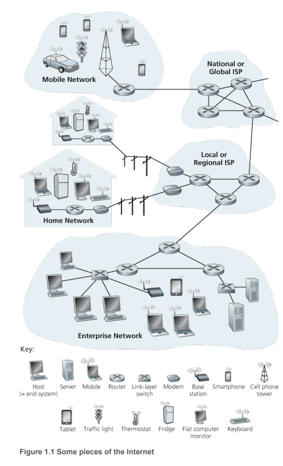
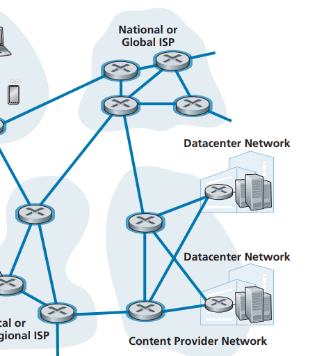
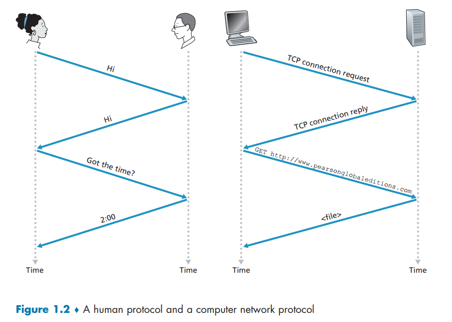
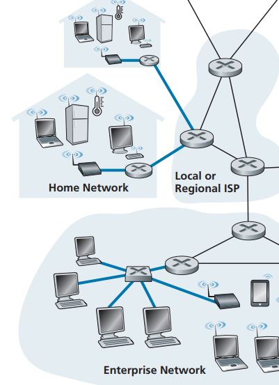
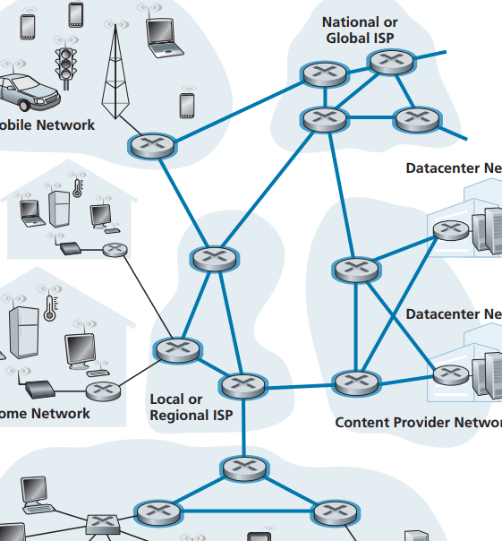
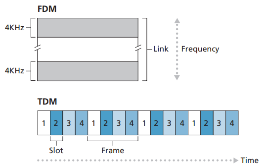
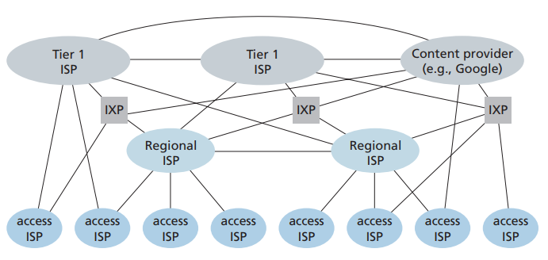
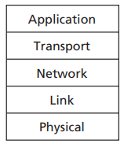
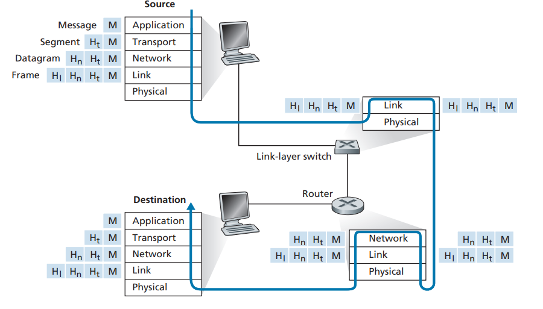
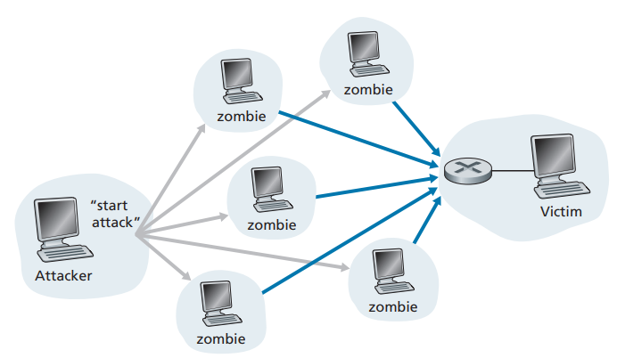

용어 정리하는 챕터 느낌.. 

용어가 많이 나오니까 잘 정리하면서 읽어보자

## 1.1 인터넷이란 무엇인가?
- 수십억 개의 컴퓨팅 장치를 연결하는 컴퓨터 네트워크다

### 1.1.1 구성요소로 본 인터넷

-  **종단 시스템**

= 호스트

네트워크에 연결된 컴퓨팅 장치

**통신 링크**와 **패킷 스위치**의 네트워크로 연결된다.

- **통신 링크**

다양한 물리 매체(케이블, 구리선 ..)로 구성

전송률(링크 대역폭, bps 단위)을 이용하여 데이터를 전송 

- **패킷 스위치**

**패킷**: 데이터를 세그먼트로 나누고, 각 세그먼트에 헤더를 붙여서 만들어진 정보 패키지

패킷 상태로 네트워크를 통해 전송되고, 목적지 종단 시스템에서 원래의 데이터로 다시 조립된다

**패킷 스위치**는 패킷을 받아서 최종 목적지 방향으로 전달하는 역할 수행

널리 사용되는 두 종류는 아래와 같다
1. **라우터**: 네트워크 코어에서 사용
2. **링크 계층 스위치**: 접속 네트워크에서 사용 

네트워크 상의 **경로**는 패킷이 송신 종단 시스템에서 수신 종단 시스템에 도달하는 동안 거쳐온 일련의 통신 링크와 패킷 스위치를 의미한다

- **ISP(Internet Service Provider)**

패킷 스위치와 통신 링크로 이루어진 네트워크

종단 시스템에게 네트워크 접속을 제공하고 CP(content provider)에게 인터넷 접속을 제공한다

### 1.1.2 서비스 측면에서 본 인터넷

- **분산 애플리케이션**

애플리케이션 내의 기능을 여러 개의 독립적인 부분으로 나누어서 처리

분산 애플리케이션 내에서는 많은 종단 시스템들이 데이터를 주고 받는다

**소켓 인터페이스**: 데이터를 주고 받을 때 송신 프로그램이 따라야 하는 규칙의 집합

### 1.1.3 프로토콜

둘 이상의 통신 개체 간에서 지켜야 하는 통신 규약으로, 교환되는 메세지 포맷&순서 등과 이벤트에 따른 행동을 정의한다

## 1.2 네트워크의 가장자리

**종단 시스템**: 인터넷의 가장 자리를 차지하고 있으며 데스크톱, 서버, 이동 컴퓨터 등이 포함되어 있다

종단 시스템 안에서도 **서버**와 **클라이언트**로 분류

### 1.2.1 접속 네트워크

종단 시스템을 다른 종단 시스템에 연결할 때, 경로 상 첫 번째 라우터(가장자리 라우터)에 연결하는 네트워크

- 가정 접속: DSL, 케이블, FTTH, 5G 고정 무선

- 기업(가정) 접속: 이더넷과 와이파이

- 광역 무선 접속: 3G, 4G, 5G 등

### 1.2.2 물리 매체

- **유도 매체**: 견고한 매체를 따라 파형을 유도 (광섬유 케이블, 꼬임쌍선, 동축케이블)

- **비유도 매체**: 대기와 야외 공간으로 파형 전파 (무선 랜, 디지털 위성 채널)

## 1.3 네트워크 코어

인터넷의 종단 시스템을 연결하는 패킷 스위치와 링크의 그물망

### 1.3.1 패킷 교환

- **저장 후 전달**

대부분의 패킷 스위치가 이용하는 방식

스위치가 출력 링크로 패킷의 첫 비트를 전송하기 전에, 전체 패킷을 받아야 함

- **큐잉 지연과 패킷 손실**

도착한 패킷이 출력 링크로 전송되어야 하는데 그 링크가 다른 패킷을 전송하고 있으면 출력 버퍼에서 대기해야 한다 -> 출력 버퍼에서 **큐잉 지연** 발생

이 때, 출력 버퍼가 이미 가득 차 있으면 **패킷 손실** 발생 (도착한 패킷이나 큐에서 대기 중인 패킷을 폐기)

- **포워딩 테이블과 라우팅 프로토콜**

모든 종단 시스템은 IP 주소를 가지고 있고, 패킷의 헤더에는 목적지의 IP 주소 포함

라우터는 목적지 IP 주소를 라우터의 출력 링크로 매핑하는 **포워딩 테이블**을 사용해서 올바른 출력 링크를 찾는다

**라우팅 프로토콜**으로 자동으로 포워딩 테이블 설정 가능

### 1.3.2 회선 교환

데이터를 이동시키는 방식 중 하나 (나머지 하나는 패킷 교환임)

보장된 전송률로 데이터 전송

- 주파수 분할 다중화(FDM): 연결된 링크의 주파수 스펙트럼 공유
- 시분할 다중화(TDM): 시간을 일정 주기의 프레임으로 구분하고 각 프레임을 고정된 수의 시간 슬롯으로 분할 -> 연결시 모든 프레임에 하나의 시간 슬롯 할당

### 패킷 교환 vs 회선 교환

패킷 교환의 장점

1. 전송 용량의 공유에서 효율적
2. 더 간단하고 효율적이며, 구현 비용이 작다

패킷 교환의 단점: 가변적이고 예측할 수 없는 지연 때문에 실시간 서비스에는 적합하지 않다

패킷 교환은 요구할 때만 링크의 사용을 할당하고 회선 교환은 요구와 관계없이 미리 링크의 사용을 할당한다

요즘은 대부분 패킷 교환으로 전환하는 추세

### 1.3.3 네트워크의 네트워크

접속 ISP들이 서로 연결되기 시작하면서 네트워크의 네트워크 탄생

접속 ISP를 직접 다른 ISP와 연결하는 것은 비용이 크기 때문에 ISP를 계층 별로 나누어서 연결

**네트워크 구조 3 (다중계층구조)** : 접속 ISP -> 지방 ISP -> 국가 ISP -> 1계층 ISP

**네트워크 구조 4** : 구조 3 + PoP, 멀티홈, IXP, **피어링**

**네트워크 구조 5** : 구조 4 + 콘텐츠 제공자 네트워크 (CPN)

## 1.4 패킷 교환 네트워크에서의 지연, 손실과 처리율

### 1.4.1 패킷 교환 네트워크에서의 지연 개요

- 처리 지연: 패킷 헤더를 조사하고 그 패킷을 어디로 보낼지 결정하는 시간
- 큐잉 지연: 패킷이 출력 큐에 저장되어 대기하는 시간
- 전송 지연: 패킷의 모든 비트를 링크로 전송하는 데 소요되는 시간(라우터가 패킷을 내보내는 데 필요한 시간)
- 전파 지연: 링크의 처음부터 라우터까지의 전파에 필요한 시간(비트가 한 라우터에서 다음 라우터로 전파되는 데 걸리는 시간)

전송 지연은 패킷 길이와 링크 전송률의 함수, 전파 지연은 두 라우터 사이의 거리에 대한 함수

### 1.4.2 큐잉 지연과 패킷 손실

한 라우터에서의 지연

큐잉 지연의 통계 측정(평균, 분산 등)을 이용

큐잉 지연의 강도는 패킷이 주기적으로 도착하는지, 몰려서 도착하는지에 영향을 받는다

**트래픽 강도**: La/R 큐잉 지연의 정도를 측정하는 데 중요! 1에 가까울 수록 패킷이 몰려서 도착하고 지연이 심하다는 의미

##### L은 패킷의 평균 비트수, a는 패킷이 큐에 도착하는 평균율, R은 전송률

### 1.4.3 종단 간 지연

출발지에서 목적지까지의, 종단 간의 지연

- Traceroute: 경로 상의 라우터 주소와 왕복 시간을 측정할 수 있는 프로그램

### 1.4.4 컴퓨터 네트워크에서의 처리율

종단 간 처리율(throughput)이란 게 있다.. 성능 수단이다 어쩌구

## 1.5 프로토콜 계층과 서비스 모델

### 1.5.1 계층구조

- **Application 계층**

네트워크 애플리케이션과 애플리케이션 계층 프로토콜(HTTP, SMTP, FTP)이 있는 계층

여러 종단 시스템에 분산되어 있어서 종단 간에 정보 패킷을 교환할 때 사용

정보 패킷을 **메세지**라고 표현

- **Transport 계층**

클라이언트와 서버 간에 애플리케이션 계층 메세지를 전송하는 서비스 제공

트랜스포트 프로토콜
- TCP: 연결지향형, 메세지 전달 보장 및 흐름 제어 포함
- UDP: 비연결형

패킷을 **세그먼트**라고 표현

- **Network 계층**

한 호스트에서 다른 호스트로 **데이터그램**(패킷)을 라우팅하는 책임

1. IP 프로토콜: IP 데이터그램의 필드와 각 필드에서 종단 시스템과 라우터의 동작을 정의
2. 라우팅 프로토콜: 출발지와 목적지 사이에서 데이터그램이 이동하는 경로를 결정

위의 두 프로토콜이 포함되어 있다

- **Link 계층**

네트워크 계층에서 받은 데이터그램을 경로 상의 다음 노드에게 전송

전체 패킷을 한 네트워크 요소에서 이웃 네트워크 요소로 이동하는 역할

패킷을 **프레임**이라고 표현

- **Physical 계층**

프레임 내부의 각 비트를 한 노드에서 다음 노드로 이동

### 1.5.2 캡슐화

전 계층에서 받은 패킷을 캡슐화 -> 추가 정보 붙이기

봉투를 받아서 더 큰 봉투에 넣는 과정

## 1.6 공격받는 네트워크

- **DoS**

1. 취약성 공격: 공격받기 쉬운 애플리케이션이나 운영체제에 교묘한 메세지 전송
2. 대역폭 플러딩: 목표 호스트에 수많은 패킷을 보내서 정당한 패킷이 도달하지 못함
3. 연결 플러딩: 호스트에 비정상적인 TCP 연결을 설정해서 호스트가 가짜 연결을 처리하느라 정상적인 연결을 받지 못함

하나의 소스에서 DoS 공격이 이루어지면 차단해서 쉽게 막을 수 있으나, **분산 DoS(DDoS)** 공격은 여러 소스(숙주)에서 공격이 들어오기 때문에 막기가 쉽지 않다

- **패킷 스니퍼**

지나가는 모든 패킷의 사본을 기록하는 수신자

다른 액션을 취하지 않기 때문에 탐지하기 어렵다 -> 패킷에 암호화를 포함하자

- **IP 스푸핑**

가짜 출발지 주소를 가진 패킷을 전송

메세지가 실제로 와야 할 곳으로부터 온 것인지 확인해야 한다

