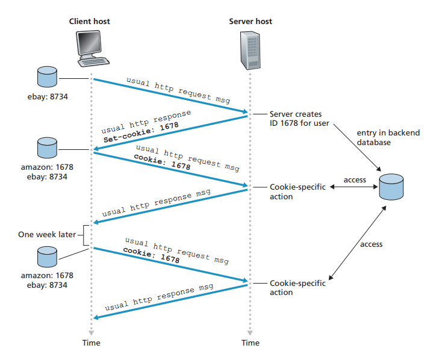
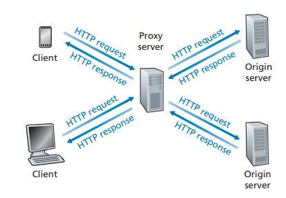
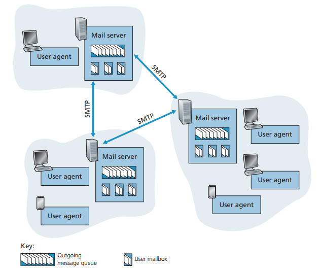
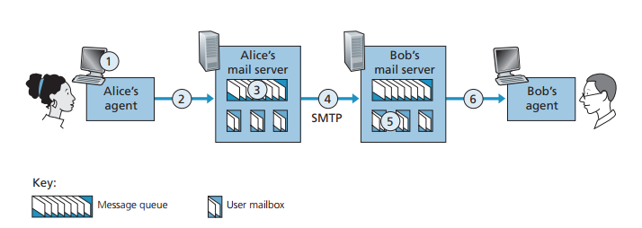
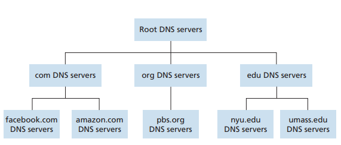
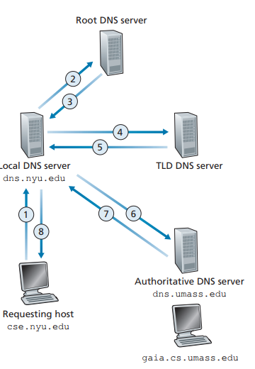
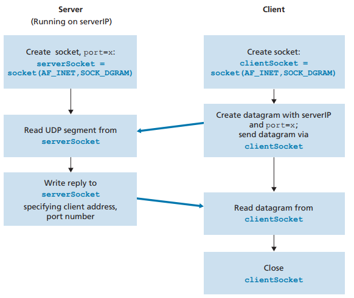
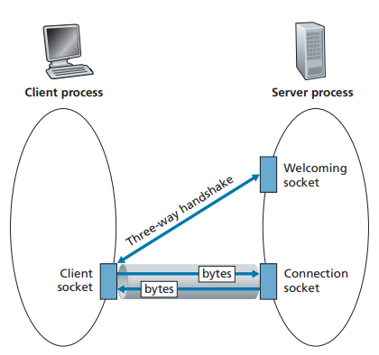
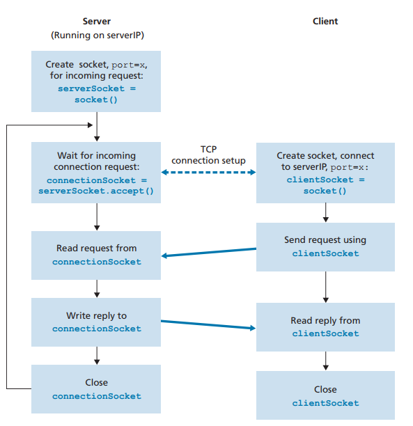

## 2.1 네트워크 애플리케이션의 원리

네트워크 애플리케이션 개발의 핵심은 여러 종단 시스템에서 실행되는 소프트웨어를 작성하는 것이다


### 2.1.1 네트워크 애플리케이션 구조

1. **클라이언트-서버 구조**: 웹 서버가 클라이언트 호스트로부터 객체를 요청받으면 웹 서버는 요청된 객체를 클라이언트 호스트로 보내면서 응답

    클라이언트 간에 직접적인 통신이 없다

    서버가 항상 동작 중이기 때문에 언제든지 클라이언트가 서버에 연결할 수 있다

    트래픽이 너무 많으면 서버가 요청에 신속하게 대응하지 못할 수 있으므로 **데이터 센터**가 자주 사용된다

2. **P2P 구조**: 피어(peer)라는 호스트쌍이 직접 통신

    **자가 확장성**: 각 피어들은 파일을 또 다른 피어들에게 분배함으로써 서비스 능력 추가

    항상 켜져 있는 서버에 의존도가 낮기 때문에 비용이 효율적이나 보안, 성능, 신뢰성 면에서 문제가 있다

### 2.1.2 프로세스 간 통신

- **프로세스와 컴퓨터 네트워크 사이의 인터페이스**

**프로세스**: 종단 시스템에서 실행되는 프로그램


프로세스는 **소켓**을 통해서 네트워크로 메세지를 주고 받는다

**소켓**은 호스트의 애플리케이션 계층과 트랜스포트 계층 간의 인터페이스라고 할 수 있다

소켓을 출입구로 비유하여서 이해할 수 있다 -> 메세지를 주고 받을 때 거쳐야 하기 때문에

- **프로세스 주소 배정**

한 호스트가 패킷을 전송할 때 식별할 수 있는 주소를 동봉해서 보내야 한다

아래 두 정보가 주소로써 명시된다
1. 목적지 호스트의 **IP 주소**
2. 목적지 호스트 내의 수신 프로세스를 명시하는 식별자 (= **포트번호**)

### 2.1.3 애플리케이션이 이용 가능한 트랜스포트 서비스

트랜스포트 계층 프로토콜이 애플리케이션들에게 제공할 수 있는 서비스는 아래 네 개가 있다
1. **신뢰적 데이터 전송**: 프로토콜이 손실된 패킷을 감지하고 재전송해서 보장된 데이터 전송 서비스를 제공할 수 있다
2. **처리율**: 네트워크 경로를 따라 두 프로세스 간의 통신 세션에서 비트를 전달할 수 있는 비율

    트랜스포트 프로토콜에서는 명시된 속도에서 보장된 가용 처리율을 제공할 수 있다

    이 때, 처리율 요구사항을 갖는 애플리케이션을 **대역폭 민감 애플리케이션**이라 하고 특정한 요구사항을 가지지 않는 애플리케이션을 **탄력적 애플리케이션**이라고 한다 

3. **시간**: 시간 보장을 제공할 수 있다
4. **보안**: 하나 이상의 보안 서비스를 제공할 수 있다 (암호화 복호화 등등등등)

### 2.1.4 인터넷 전송 프로토콜이 제공하는 서비스

전송 프로토콜의 종류는 아래 두 개가 있다
1. **TCP**
- **연결지향형 서비스**: 두 프로세스가 통신하기 전에 핸드셰이킹 과정을 통해 클라이언트와 서버가 서로 전송 제어 정보를 교환 
- **신뢰적인 데이터 전송 서비스**: 모든 데이터를 오류 없이 올바른 순서로 전달
- **혼잡 제어**: 네트워크가 혼잡 상태면 프로세스 속도를 낮춘다

2. **UDP**: **비연결형**이므로 핸드셰이킹을 하지 않고, 신뢰성을 보장하지 않는다

    혼잡 제어 방식을 포함하지 않기 때문에 데이터를 원하는 속도로 전송이 가능하다

### 2.1.5 애플리케이션 계층 프로토콜

서로 다른 종단 시스템에서 실행되는 애플리케이션의 프로세스가 서로 메세지를 보내는 방법을 정의

##### 교환 메세지 타입, 문법, 필드에 있는 정보의 의미, 언제 어떻게 메세지를 송수신할 것인지가 정의되어 있다

## 2.2 웹과 HTTP

웹은 **온디맨드 방식**이다 -> 사용자가 원할 때 원하는 것을 수신할 수 있다

### 2.2.1 HTTP 개요

웹의 애플리케이션 계층 프로토콜이며, 웹 클라이언트가 웹 서버에게 웹 페이지를 어떻게 요청하는지, 서버는 클라이언트에게 어떻게 전송하는지를 정의한다

**TCP**를 전송 프로토콜로 사용하기 때문에 HTTP는 패킷 손실 및 복구에 관여하지 않는다

HTTP는 클라이언트에 대한 정보를 유지하지 않는 **비상태 프로토콜**이라고 한다

### 2.2.2 비지속 연결과 지속 연결

클라이언트와 서버가 연결되어 통신이 이루어지는 동안, 애플리케이션의 요구가 주기적으로 혹은 간헐적으로 만들어질 수 있다

1. **비지속 연결**: 위와 같은 상황에서 각 요구/응답 쌍이 **분리된 TCP 연결**을 통해 보내진다

- 각 요청 객체에 대해 새로운 연결이 설정되고 유지되기 때문에 웹 서버에 부담을 줄 수 있다
- 2 RTT(패킷이 클라이언트-서버를 왕복하는 시간)를 필요로 한다

2. **지속 연결**: 모든 요구/응답 쌍이 **같은 TCP 연결**으로 보내진다

지속 연결이 HTTP의 디폴트 설정이다

### 2.2.3 HTTP 메세지 포맷

#### 요청 메세지
```
// 요청 라인: method URL HTTP버전
GET /somedir/page.html HTTP/1.1
// 헤더 라인
Host: www.someschool.edu
Connection: close // 비지속 연결
User-agent: Mozilla/5.0 // 브라우저 타입
Accept-language: fr // 프랑스어 버전
```

#### 응답 메세지

```
// 상태 라인
HTTP/1.1 200 OK
// 헤더 라인
Connection: close
Date: Tue, 18 Aug 2015 15:11:03 GMT
Server: APACHE/2.2.3 (CentOS)
Last-Modified: Tue, 18 Aug 2015 15:11:03 GMT
Content-Length: 6821
Content-Type: text/html

// 개체 몸체
(이하 데이터)
```

### 2.2.4 사용자와 서버 간의 상호작용: 쿠키



HTTP 서버는 상태를 유지하지 않기 때문에 사용자를 식별할 수 없다

그러나 식별해야만 할 때를 위해 쿠키를 사용한다

서버에서 유저의 유일한 식별 번호를 만들고, 백엔드 데이터베이스 안에 이 식별 번호로 인덱싱할 수 있는 엔트리를 생성한 후 HTTP 응답에 Set-Cookie 헤더를 포함하여 전송한다

HTTP 응답을 받은 브라우저는 Set-Cookie 헤더와 식별 번호를 브라우저의 쿠키 파일에 저장하고, 다음 HTTP 요청을 보낼 때마다 꺼내서 함께 전송한다

서버는 요청에 포함된 식별 번호로 유저를 구분할 수 있다

따라서 서버 측에서는 유저의 이름이나 비밀번호를 알 필요없이 식별 번호만으로 유저를 구분할 수 있게 된다

### 2.2.5 웹 캐싱



프록시 서버라고도 한다

자체의 저장 디스크에 최근 호출된 객체의 사본을 저장하고 보존한다

브라우저 요청은 웹 캐시에 가장 먼저 보내지고, 자신에게 저장되어 있는 객체면 웹 캐시가 객체를 전송한다

**장점**
- 클라이언트의 요구에 대한 응답 시간을 줄일 수 있다
- 한 기관에서 인터넷으로 접속하는 링크상의 웹 트래픽을 대폭으로 줄일 수 있다 -> 기관의 비용을 줄일 수 있음

**단점**
캐시 내부에 있는 객체의 복사본이 최신 버전이 아닐 수 있다는 단점이 있다

HTTP에서는 **조건부 GET**이라는 방식으로 갱신되었는지 확인하는 방식을 가지고 있다

**If-Modified-Since** 헤더 라인을 포함하고 있으면 조건부 GET 메세지다

### 2.2.6 HTTP/2

하나의 TCP 연결상에서 멀티플렉싱 요청/응답 지연 시간을 줄이는 것이 주요 목표

**HOL 블로킹**
- HTML/1.1의 문제: 지속적인 TCP 연결을 허용하기 때문에 하나의 TCP 연결상에서 웹 페이지를 전송
- 비디오 클립은 병목 링크를 통과하는 데 긴 시간이 걸리고, 이를 처리하는 동안 작은 객체들은 비디오 클립의 뒤에서 기다린다
- 비디오 클립이 작은 객체들을 **블로킹**하게 됨

HTTP/2에서는 여러 개의 병렬 TCP 연결을 열어서 HOL 블로킹을 해결하고 지연을 줄였다

**HTTP/2 프레이밍**
- HOL 블로킹 문제를 해결하기 위해, 각 메세지를 여러 개의 프레임으로 나눈다
- 첫 번째 비디오 클립 프레임 -> 소형 객체 -> 두 번째 비디오 클립 프레임 -> .. 이런 순서로 객체를 전송
- 각 프레임은 바이너리로 인코딩 되어서 파싱하기 효율적이고, 더 작은 프레임 크기를 갖고, 에러에 강건한 장점을 가진다

**메세지 우선순위화 및 서버 푸싱**

개발자가 의존도 등에 따라 요청들의 상대적 순위를 조정할 수 있다

또, HTTP/2는 서버로 하여금 특정 클라이언트의 요청에 대해 여러 개의 응답을 보낼 수 있게 한다 -> 요청 없이 추가적인 객체를 푸시 가능

## 2.3 인터넷 전자메일



송신자가 메세지 작성을 완료하면, 그 메세지는 메일 서버의 출력 메세지 큐에 들어간다

수신자가 메세지를 읽을 때 메일 서버에 있는 메일 박스에서 메세지를 가져온다

이 때, 메일 서버와 송수신자 사이에 사용자 에이전트가 존재한다

### 2.3.1 SMTP

송신자의 메일 서버로부터 수신자의 메일 서버로 전송하는 데 사용되는, 인터넷 전자메일을 위한 애플리케이션 계층 프로토콜이다

메일을 보낼 때는 SMTP의 클라이언트로 동작하고 메일을 받을 때는 SMTP의 서버로 동작한다



메일을 보내는 과정은 아래와 같다
1. 앨리스가 메세지를 작성하고 사용자 에이전트에게 메세지를 보내라고 명령한다
2. 앨리스의 사용자 에이전트는 메세지를 앨리스의 메일 서버에게 보내고, 그곳의 메세지 큐에 놓여진다
3. 앨리스의 메일 서버에서 동작하는 SMTP의 클라이언트 측이 메세지 큐에 있는 메세지를 보고 밥의 메일 서버에서 동작하는 SMTP의 서버에게 TCP 연결을 설정한다
4. SMTP 핸드셰이킹 이후 SMTP 클라이언트는 앨리스의 메세지를 TCP 연결로 보낸다
5. 밥의 메일 서버에서 SMTP 서버가 메세지를 수신하고 밥의 메일 박스에 그 메세지를 놓는다

SMTP는 두 메일 서버 간의 거리가 아무리 멀어도 두 서버 사이에서 **직접 연결**한다

밥의 메일 서버가 닫혀있어도 중간 서버에 저장하지 않고 앨리스의 메일 서버에 남아서 새로운 시도를 기다린다

### 2.3.2 메일 메세지 포맷

송신자가 우편을 보낼 때 우편봉투에 넣는 것처럼, 전자 메일도 메일을 보내면 헤더에 주변 정보를 작성하여 동봉한다

### 2.3.3 메일 접속 프로토콜

보통 메일 서버는 유저 각각의 로컬 호스트에 존재하는 것이 아니라 공유 메일 서버를 이용한다

위의 메일을 보내는 과정에서, 메세지는 1. 앨리스의 메일 서버로 2. 밥의 메일 서버로 두 번 전송된다

바로 밥의 메일 서버로 전송하면 될텐데 왜 두 차례를 걸쳐야 할까?

-> 밥의 메일 서버가 동작하지 않으면 반복해서 재전송을 시도하기 위해서

이 때 밥은 자신의 메일 서버에 도착한 메세지를 **메일 접근 프로토콜**을 사용해서 열어볼 수 있다

## 2.4 DNS: 인터넷의 디렉터리 서비스

**호스트 이름**은 호스트의 식별자 중 하나다

다른 식별자로는 IP 주소가 있다

### 2.4.1 DNS가 제공하는 서비스

DNS는 분산 데이터베이스며 애플리케이션 계층 프로토콜이다

1. 브라우저가 URL로부터 호스트 이름을 추출하고 DNS의 클라이언트 측에 넘긴다
2. DNS 클라이언트가 DNS 서버로 호스트 이름을 포함하는 질의를 넘긴다
3. DNS 클라이언트는 호스트 이름에 대한 IP 주소를 가진 응답을 받는다
4. 브라우저가 DNS 클라이언트에게 IP 주소를 받으면, 해당 IP 주소와 그 주소의 80번 포트에 위치한 HTTP 서버 프로세스로 TCP 연결을 초기화한다


아래와 같은 역할을 한다
- 주요 임무는 호스트 이름을 IP 주소로 변환하는 것
- **호스트 에일리싱**: 별칭 호스트 이름을 정식 호스트 이름으로 변환
- **메일 서버 에일리어싱**
- **부하 분산**: 여러 서버에 분산되어 있는 사이트의 주소 집합을 가지고 있다


### 2.4.2 DNS 동작 원리 개요

단일 DNS 서버의 단점은
- **서버의 고장**: 하나의 네임 서버가 고장 나면 전체 인터넷이 작동하지 않는다
- **트래픽양**: 단일 DNS 서버가 모든 DNS 질의를 처리
- **먼 거리의 중앙 집중 데이터베이스**: 단일 서버가 뉴욕에 있다면 먼 거리로부터 오는 질의는 지연된다
- **유지관리**: 모든 인터넷 호스트에 대한 레코드를 유지해야 한다 -> 잦은 갱신

따라서 단일 DNS 서버는 확장성이 전혀 없기 때문에, 분산 DNS 서버가 셜계된다



**분산 계층 데이터베이스**

DNS는 많은 서버를 계층 형태로 구성하여 분산시켰다

DNS 서버에는 아래 세 유형이 있다
1. 루트 DNS 서버: TLD 서버의 IP 주소들을 제공한다
2. TLD(최상위 레벨 도메인) 서버: com, org와 같은 상위 레벨 도메인과 kr, uk같은 국가의 상위 레벨 도메인에 대한 서버가 있으며 책임 DNS 서버에 대한 IP 주소를 제공한다
3. Authoritative(책임) 서버: 호스트 이름을 IP 주소로 매핑하는 공개적인 DNS 레코드를 가지고 있는 서버, 기관은 이 책임 서버를 구현하거나 일부 서비스 제공자의 책임 서버에 비용을 지불하고 레코드를 등록한다



또 다른 중요한 형태로 **로컬 DNS 서버**가 있다

호스트가 ISP에 연결될 때, 그 ISP는 로컬 DNS 서버로부터 IP 주소를 호스트에게 제공한다

위의 그림의 예시에서 TLD 서버는 호스트 이름에 대한 책임 서버를 알고 로컬 DNS 서버에서 전해줬다

그러나 TLD 서버는 보통 직접적으로 책임 서버를 알지는 않고 책임 DNS를 아는 중간 DNS 서버를 알고 있다

**DNS 캐싱**

DNS는 지연 성능 향상 및 DNS 메세지 수를 줄이기 위해 캐싱을 사용한다

### 2.4.3 DNS 레코드와 메세지

DNS 분산 데이터베이스를 구현한 DNS 서버들은 **자원 레코드**를 저장한다

(Name, Value, Type, TTL) 이런 형식의 튜플로 되어 있다

- Type = A면 Name은 호스트 이름이고 Value는 IP 주소
- Type = NS면 Name은 도메인이고 Value는 도메인 내부 호스트의 IP 주소를 얻을 수 있는 책임 DNS 서버의 호스트 이름
- Type = CNAME이면 Name은 정식 호스트 이름이고 Value는 별칭 호스트 이름
- Type = MX면 Name은 메일 서버의 정식 호스트 이름이고 Value는 별칭 호스트 이름

## 2.5 P2P 파일 분배

앞에서 클라이언트-서버 구조를 다루었고 이번에는 P2P 구조를 다룬다

P2P 구조는 피어가 소비자이자 재분배자 역할을 하기 때문에 자가 확장성을 갖는다

대표적인 P2P 프로토콜로 **비트토렌트**가 있다

토렌트에 참여하는 피어들은 서로 같은 크기의 청크를 다운로드하고, 다운로드와 동시에 다른 피어들에게 업로드한다

이것이 가능한 원리는, 피어가 가입할 때 참여하고 있는 피어 집합에서 임의로 피어들의 부분집합을 선택하여 속한 피어들의 IP 주소에 TCP 연결을 설정한다

주기적으로 연결이 성공한 이웃 피어들에게 그들이 갖고 있는 청크 목록을 요구한다

## 2.6 비디오 스트리밍과 콘텐츠 분배 네트워크

### 2.6.1 인터넷 비디오

비디오 매체는 비트 전송률이 높다

하이엔드 동영상의 경우 트래픽과 스토리지 용량이 많이 필요하다

스트리밍 비디오의 성능 척도는 평균 종단 간 처리량이다

비디오는 압축이 가능하다는 특성을 사용하여 여러 버전의 품질로 만들 수 있다

### 2.6.2 HTTP 스트리밍 및 DASH

사용자가 HTTP 내에서 비디오 시청을 원하면 클라이언트는 서버에게 TCP 연결을 신청하고 해당 HTTP GET 요청을 발생시킨다

그러면 서버가 네트워크 프로토콜 및 트래픽 조건이 허용되는 대로 HTTP 응답 메세지 내에서 비디오 파일을 전송한다

HTTP 스트리밍은 모든 클라이언트가 가용 대역폭과 관계없이 똑같이 인코딩된 비디오를 전송받는다는 문제점이 있어서 **DASH**가 개발되었다

DASH에서의 비디오는 여러 버전의 품질로 인코딩이 가능하다

DASH를 사용하는 HTTP 서버는 비트율에 따라 각 버전의 URL을 제공하는 manifest file을 가지고 있다

### 2.6.3 콘텐츠 분배 네트워크 CDN

유튜브 같은 인터넷 비디오 회사에서 스트리밍 서비스를 제공하는 가장 단순한 방법은 하나의 거대한 데이터 센터를 구축하고 모든 비디오 자료를 저장한 뒤에 사용자에게 비디오를 직접 전송하는 것이다

그러나 이러한 방식은 여러 문제점이 있기 때문에 **CDN**을 이용한다

CDN은 다수의 지점에 분산된 서버들을 운영하며 비디오를 포함한 여러 웹 콘텐츠 데이터의 복사본을 저장한다

사용자는 최선의 서비스를 제공할 수 있는 지점의 CDN 서버로 연결된다

CDN은 콘텐츠 제공자가 소유한 private CDN일 수도 있으며 제 3자가 운영하는 third-party CDN일 수도 있다

클러스터에 대해 PULL 방식을 사용하여 만약 유저가 지정 CDN 서버에 없는 비디오를 요청하면 해당 비디오를 다른 서버에서 전송받아서 서비스한다

**동작 방식**
- 사용자가 URL을 지정해 특정 비디오의 재생을 요청하면 CDN이 그 요청을 가로채서 처리한다
- 그 시점에서 클라이언트에게 가장 적당한 CDN 클러스터를 선택하고, 클라이언트의 요청을 해당 클러스터의 서버에 요청한다

### 2.6.4 사례연구: 넷플릭스, 유튜브

**넷플릭스**
- 아마존 클라우드와 자체 CDN 인프라가 있다
- 아마존 클라우드에서는 웹 사이트에서 일어나는 모든 동작을 처리하며 그 외에 콘텐츠 수집, 콘텐츠 처리, CDN으로의 버전 업로드 등의 작업을 한다

**유튜브**
- 자체 private CDN을 사용하며 거대한 데이터 센터에 직접 동영상을 배포한다
- HTTP 스트리밍을 채용하고 있다
- 적응적 스트리밍인 DASH와 달리 사용자가 스스로 버전을 선택할 수 있다
- HTTP byte-range 헤더를 이용해 선인출 데이터 이후에 추가로 전송되는 데이터의 흐름을 제한한다

## 2.7 소켓 프로그래밍: 네트워크 애플리케이션 생성

클라이언트와 서버 프로세스는 소켓으로부터 읽고 쓰면서 서로 통신한다

네트워크 애플리케이션을 생성할 때 개발자의 주 업무는 클라이언트와 서버 프로그램 모두에 대한 코드를 작성하는 것이다

클라이언트-서버 애플리케이션은 RFC에 정의된 표준 프로토콜을 구현하는 **개방형** 애플리케이션과, 독자적인 방식을 채택하는 애플리케이션 두 종류가 있다

### 2.7.1 UDP를 이용한 소켓 프로그래밍



### 2.7.2 TCP 소켓 프로그래밍



UDP와 다르게 연결 전에 핸드셰이킹 과정이 있다

핸드셰이킹 과정이 끝나면 서버는 해당 클라이언트에게 지정되는 새로운 소켓을 생성한다



클라이언트는 새로운 소켓(환영 소켓)과 데이터를 주고 받는다


