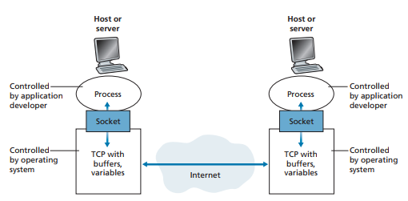

## 2.1 네트워크 애플리케이션의 원리

네트워크 애플리케이션 개발의 핵심은 여러 종단 시스템에서 실행되는 소프트웨어를 작성하는 것이다

### 2.1.1 네트워크 애플리케이션 구조

1. **클라이언트-서버 구조**: 웹 서버가 클라이언트 호스트로부터 객체를 요청받으면 웹 서버는 요청된 객체를 클라이언트 호스트로 보내면서 응답

    클라이언트 간에 직접적인 통신이 없다

    서버가 항상 동작 중이기 때문에 언제든지 클라이언트가 서버에 연결할 수 있다

    트래픽이 너무 많으면 서버가 요청에 신속하게 대응하지 못할 수 있으므로 **데이터 센터**가 자주 사용된다

2. **P2P 구조**: 피어(peer)라는 호스트쌍이 직접 통신

    **자가 확장성**: 각 피어들은 파일을 또 다른 피어들에게 분배함으로써 서비스 능력 추가

    항상 켜져 있는 서버에 의존도가 낮기 때문에 비용이 효율적이나 보안, 성능, 신뢰성 면에서 문제가 있다

### 2.1.2 프로세스 간 통신

- **프로세스와 컴퓨터 네트워크 사이의 인터페이스**

**프로세스**: 종단 시스템에서 실행되는 프로그램



프로세스는 **소켓**을 통해서 네트워크로 메세지를 주고 받는다

**소켓**은 호스트의 애플리케이션 계층과 트랜스포트 계층 간의 인터페이스라고 할 수 있다

소켓을 출입구로 비유하여서 이해할 수 있다 -> 메세지를 주고 받을 때 거쳐야 하기 때문에

- **프로세스 주소 배정**

한 호스트가 패킷을 전송할 때 식별할 수 있는 주소를 동봉해서 보내야 한다

아래 두 정보가 주소로써 명시된다
1. 목적지 호스트의 **IP 주소**
2. 목적지 호스트 내의 수신 프로세스를 명시하는 식별자 (= **포트번호**)

### 2.1.3 애플리케이션이 이용 가능한 트랜스포트 서비스

트랜스포트 계층 프로토콜이 애플리케이션들에게 제공할 수 있는 서비스는 아래 네 개가 있다
1. **신뢰적 데이터 전송**: 프로토콜이 손실된 패킷을 감지하고 재전송해서 보장된 데이터 전송 서비스를 제공할 수 있다
2. **처리율**: 네트워크 경로를 따라 두 프로세스 간의 통신 세션에서 비트를 전달할 수 있는 비율

    트랜스포트 프로토콜에서는 명시된 속도에서 보장된 가용 처리율을 제공할 수 있다

    이 때, 처리율 요구사항을 갖는 애플리케이션을 **대역폭 민감 애플리케이션**이라 하고 특정한 요구사항을 가지지 않는 애플리케이션을 **탄력적 애플리케이션**이라고 한다 

3. **시간**: 시간 보장을 제공할 수 있다
4. **보안**: 하나 이상의 보안 서비스를 제공할 수 있다 (암호화 복호화 등등등등)

### 2.1.4 인터넷 전송 프로토콜이 제공하는 서비스

전송 프로토콜의 종류는 아래 두 개가 있다
1. **TCP**
- **연결지향형 서비스**: 두 프로세스가 통신하기 전에 핸드셰이킹 과정을 통해 클라이언트와 서버가 서로 전송 제어 정보를 교환 
- **신뢰적인 데이터 전송 서비스**: 모든 데이터를 오류 없이 올바른 순서로 전달
- **혼잡 제어**: 네트워크가 혼잡 상태면 프로세스 속도를 낮춘다

2. **UDP**: **비연결형**이므로 핸드셰이킹을 하지 않고, 신뢰성을 보장하지 않는다

    혼잡 제어 방식을 포함하지 않기 때문에 데이터를 원하는 속도로 전송이 가능하다

### 2.1.5 애플리케이션 계층 프로토콜

서로 다른 종단 시스템에서 실행되는 애플리케이션의 프로세스가 서로 메세지를 보내는 방법을 정의

##### 교환 메세지 타입, 문법, 필드에 있는 정보의 의미, 언제 어떻게 메세지를 송수신할 것인지가 정의되어 있다

## 2.2 웹과 HTTP

웹은 **온디맨드 방식**이다 -> 사용자가 원할 때 원하는 것을 수신할 수 있다

### 2.2.1 HTTP 개요

웹의 애플리케이션 계층 프로토콜이며, 웹 클라이언트가 웹 서버에게 웹 페이지를 어떻게 요청하는지, 서버는 클라이언트에게 어떻게 전송하는지를 정의한다

**TCP**를 전송 프로토콜로 사용하기 때문에 HTTP는 패킷 손실 및 복구에 관여하지 않는다

HTTP는 클라이언트에 대한 정보를 유지하지 않는 **비상태 프로토콜**이라고 한다

### 2.2.2 비지속 연결과 지속 연결

클라이언트와 서버가 연결되어 통신이 이루어지는 동안, 애플리케이션의 요구가 주기적으로 혹은 간헐적으로 만들어질 수 있다

1. **비지속 연결**: 위와 같은 상황에서 각 요구/응답 쌍이 **분리된 TCP 연결**을 통해 보내진다

- 각 요청 객체에 대해 새로운 연결이 설정되고 유지되기 때문에 웹 서버에 부담을 줄 수 있다
- 2 RTT(패킷이 클라이언트-서버를 왕복하는 시간)를 필요로 한다

2. **지속 연결**: 모든 요구/응답 쌍이 **같은 TCP 연결**으로 보내진다

지속 연결이 HTTP의 디폴트 설정이다

### 2.2.3 HTTP 메세지 포맷

#### 요청 메세지
```
// 요청 라인: method URL HTTP버전
GET /somedir/page.html HTTP/1.1
// 헤더 라인
Host: www.someschool.edu
Connection: close // 비지속 연결
User-agent: Mozilla/5.0 // 브라우저 타입
Accept-language: fr // 프랑스어 버전
```

#### 응답 메세지

```
// 상태 라인
HTTP/1.1 200 OK
// 헤더 라인
Connection: close
Date: Tue, 18 Aug 2015 15:11:03 GMT
Server: APACHE/2.2.3 (CentOS)
Last-Modified: Tue, 18 Aug 2015 15:11:03 GMT
Content-Length: 6821
Content-Type: text/html

// 개체 몸체
(이하 데이터)
```

### 2.2.4 사용자와 서버 간의 상호작용: 쿠키

HTTP 서버는 상태를 유지하지 않기 때문에 사용자를 식별할 수 없다

그러나 식별해야만 할 때를 위해 쿠키를 사용한다

서버에서 유저의 유일한 식별 번호를 만들고, 백엔드 데이터베이스 안에 이 식별 번호로 인덱싱할 수 있는 엔트리를 생성한 후 HTTP 응답에 Set-Cookie 헤더를 포함하여 전송한다

HTTP 응답을 받은 브라우저는 Set-Cookie 헤더와 식별 번호를 브라우저의 쿠키 파일에 저장하고, 다음 HTTP 요청을 보낼 때마다 꺼내서 함께 전송한다

서버는 요청에 포함된 식별 번호로 유저를 구분할 수 있다

따라서 서버 측에서는 유저의 이름이나 비밀번호를 알 필요없이 식별 번호만으로 유저를 구분할 수 있게 된다

### 2.2.5 웹 캐싱

프록시 서버라고도 한다

자체의 저장 디스크에 최근 호출된 객체의 사본을 저장하고 보존한다

브라우저 요청은 웹 캐시에 가장 먼저 보내지고, 자신에게 저장되어 있는 객체면 웹 캐시가 객체를 전송한다

**장점**
- 클라이언트의 요구에 대한 응답 시간을 줄일 수 있다
- 한 기관에서 인터넷으로 접속하는 링크상의 웹 트래픽을 대폭으로 줄일 수 있다 -> 기관의 비용을 줄일 수 있음

**단점**
캐시 내부에 있는 객체의 복사본이 최신 버전이 아닐 수 있다는 단점이 있다

HTTP에서는 **조건부 GET**이라는 방식으로 갱신되었는지 확인하는 방식을 가지고 있다

**If-Modified-Since** 헤더 라인을 포함하고 있으면 조건부 GET 메세지다

### 2.2.6 HTTP/2

하나의 TCP 연결상에서 멀티플렉싱 요청/응답 지연 시간을 줄이는 것이 주요 목표

1.1은 지속적인 TCP 연결을 허용하


