## 3.1 트랜스포트 계층 서비스 및 개요

트랜스포트 계층 프로토콜은 각기 다른 호스트에서 동작하는 애플리케이션 프로세스 간의 논리적 통신을 제공한다

##### 논리적 통신: 애플리케이션의 시점에서 보면 호스트들이 직접 연결된 것처럼 보인다는 뜻

송신 측의 트랜스포트 계층은 애플리케이션 계층으로부터 수신한 메세지를 **세그먼트**로 변환해서 네트워크 계층으로 전달한다

-> 메세지를 작은 조각으로 분할하고, 각각의 조각에 트랜스포트 계층 헤더를 추가

수신 측의 트랜스포트 계층은 애플리케이션에서 세그먼트 내부의 데이터를 이용할 수 있도록 수신된 세그먼트를 처리한다

### 3.1.1 트랜스포트 계층과 네트워크 계층 사이의 관계

**트랜스포트 계층**은 각기 다른 호스트에서 동작하는 **프로세스들** 사이의 논리적 통신을 제공하고, **네트워크 계층**은 **호스트들** 사이의 논리적 통신을 제공한다

비유하면, 트랜스포트 계층은 우편물을 모아서 우편 서비스에 전달하거나 우편 서비스에서 우편물을 받아 전달하는 우체부이고 네트워크 계층은 우편 서비스 자체이다

##### 프로세스는 송수신자, 호스트는 집으로 비유된다

우편 송수신자 입장에서는 우체부가 우편 서비스로 비춰진다

트랜스포트 계층이 제공하는 서비스는 네트워크 계층이 제공하는 서비스에 따라 제한된다

### 3.1.2 인터넷 트랜스포트 계층의 개요

**TCP**와 **UDP**, 두 종류의 트랜스포트 계층 프로토콜이 있다

두 프로토콜은 호스트 대 호스트 전달을 프로세스 대 프로세스 전달로 확장하는 **트랜스포트 계층 다중화**(=**역다중화**)를 수행한다

또, 헤더에 오류 검출 필드를 포함해 **무결성 검사**를 제공한다

UDP는 이 두 가지 서비스만을 제공하지만 TCP는 추가적인 서비스를 제공한다

**신뢰적인 데이터 전송**: 데이터가 순서대로 정확하게 전달되도록 함

**혼잡 제어**: 혼잡한 네트워크 링크에서 각 TCP 연결이 링크의 대역폭을 공평하게 공유하여 통과하도록 함

## 3.2 다중화와 역다중화

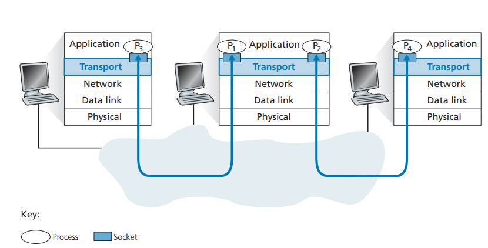

수신 측 호스트의 트랜스포트 계층은 데이터를 중간 매개자인 소켓에게 전달한다

##### 소켓: 네트워크에서 프로세스로, 프로세스로부터 네트워크로 데이터를 전달하는 출입구 역할

**역다중화**: 트랜스포트 계층 세그먼트의 데이터를 올바른 소켓으로 전달하는 작업(트랜스포트 -> 애플리케이션)

**다중화**: 소켓으로부터 데이터를 모으고, 이에 대한 세그먼트를 생성하기 위해 각 데이터에 헤더 정보로 캡슐화하고, 그 세그먼트를 네트워크 계층으로 전달하는 작업 (트랜스포트 -> 네트워크)

- **UDP의 비연결형 다중화와 역다중화**

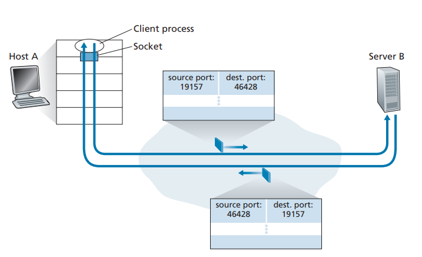

다중화에는 두 요구사항이 있다 

1. 소켓은 유일한 식별자를 가지고 2. 각 세그먼트는 세그먼트가 전달될 적절한 소켓을 가리키는 특별한 필드를 가진다

이 때 특별한 필드는 **출발지 포트 번호 필드**와 **목적지 포트 번호 필드**이다

호스트의 각 소켓은 포트 번호를 할당 받고, 세그먼트가 호스트에 도착하면 트랜스포트 계층은 세그먼트 안의 목적지 포트 번호를 검사하고 상응하는 소켓으로 세그먼트를 보낸다

소켓에 도착한 세그먼트는 해당되는 프로세스로 전달된다

- **TCP의 연결지향형 다중화와 역다중화**

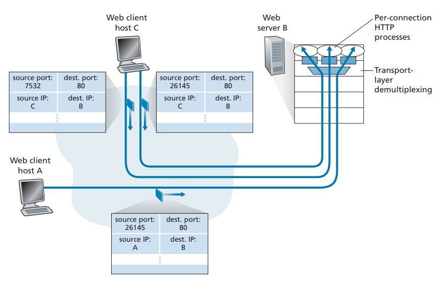

UDP 소켓과 TCP 소켓의 다른 점은, TCP 소켓은 4개 요소의 집합(출발지 IP 주소, 출발지 포트 번호, 목적지 IP 주소, 목적지 포트 번호)에 의해 식별된다는 것이다

역다중화할 때 이 4개 요소를 모두 사용한다

## 3.3 비연결형 트랜스포트: UDP

UDP는 트랜스포트 계층이 할 수 있는 최소 기능으로 동작한다 -> 다중화/역다중화, 오류 검사

UDP는 애플리케이션 프로세스로부터 메세지를 가져와서 다중화/역다중화 서비스에 대한 출발지 포트 번호 필드와 목적지 포트 번호 필드를 첨부하고, 다른 두 필드를 추가한 후에 최종 세그먼트를 네트워크 계층으로 넘겨준다

세그먼트가 수신 호스트에 도착하면 UDP는 세그먼트의 데이터를 해당하는 애플리케이션 프로세스로 전달하기 위해 목적지 포트 번호를 사용한다

UDP를 사용하는 전형적인 예시로, **DNS**가 있다

UDP의 장점은 아래와 같다
- **무슨 데이터를 언제 보낼지에 대해 애플리케이션 레벨에서 더 정교한 제어**: TCP는 혼잡 제어 매커니즘을 갖고 있기 때문에 송신자를 제한할 수 있지만 UDP는 그냥 즉시 네트워크 계층으로 세그먼트를 전달한다
- **연결 설정이 없음**: 핸드셰이크를 사용하는 TCP와 달리 UDP는 연결을 설정하기 위한 어떠한 지연도 없다
- **연결 상태가 없음**: TCP는 종단 시스템에서 연결 상태를 유지하지만 UDP는 연결 상태를 유지하지 않아서 좀 더 많은 액티브 클라이언트를 수용할 수 있다
- **작은 패킷 헤더 오버헤드**: TCP는 세그먼트마다 20바이트의 헤더 오버헤드를 갖지만 UDP는 단지 8바이트의 오버헤드를 갖는다

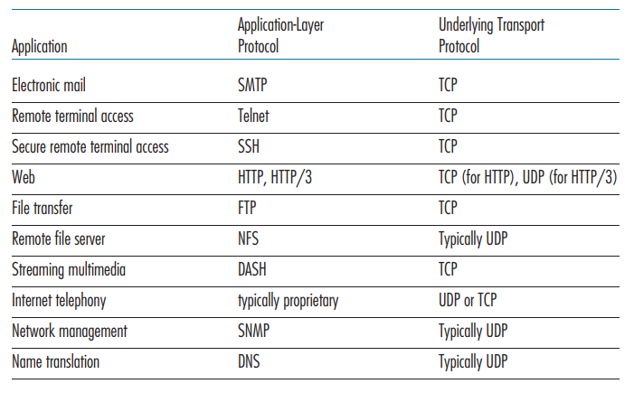

전자메일, 원격 터미널 접속, 웹 등은 신뢰적인 데이터 전송 서비스가 필요하므로 TCP를 이용하지만 그 외 많은 중요한 애플리케이션들이 TCP보다 UDP에서 동작한다

UDP는 혼잡 제어를 하지 않기 때문에, UDP 송신자와 수신자 간의 높은 손실률을 초래할 수도 있고 TCP 세션의 혼잡이 발생할 수 있다

### 3.3.1 UDP 세그먼트 구조

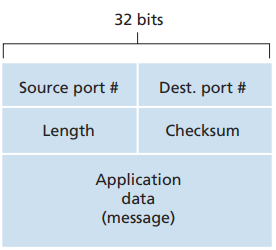

### 3.3.2 UDP 체크섬

오류 검출을 위한 필드이다

세그먼트가 이동할 때, 세그먼트 안의 비트에 대한 변경사항이 있는지 검사한다

세그먼트 안의 모든 16비트 워드의 합산에 대해 1의 보수를 수행하고 합산 과정에서 오버플로 발생시 윤회식 자리올림을 한다

## 3.4 신뢰적인 데이터 전송의 원리

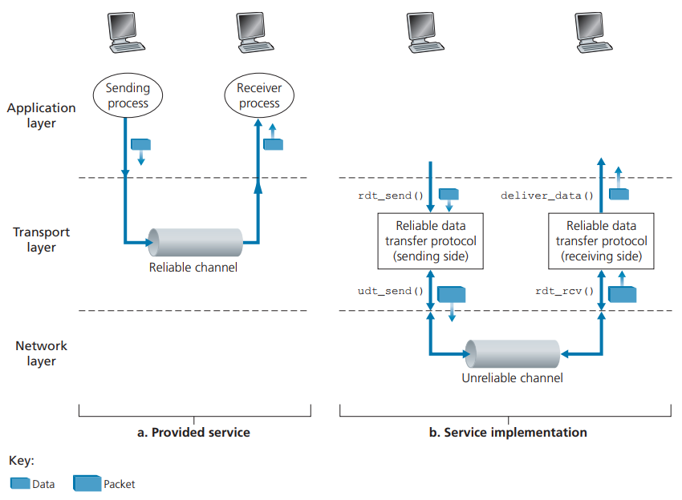

### 3.4.1 신뢰적인 데이터 전송 프로토콜의 구축

- **완벽하게 신뢰적인 채널상에서의 신뢰적인 데이터 전송: rdt1.0**

하위 채널이 완전히 신뢰적인 가장 간단한 경우

이러한 간단한 프로토콜에서는 데이터 단위와 패킷의 차이점이 없다

- **비트 오류가 있는 채널상의 신뢰적인 데이터 전송: rdt2.0**

패킷 안의 비트들이 하위 채널에서 손상되는 모델

오류 검출, 수신자 피드백, 재전송 세 가지 부가 프로토콜 기능이 요구된다

수신자 피드백의 예는 긍정 확인응답(ACK), 부정 확인응답(NAK)이 있다

이 때, 패킷 손상 여부를 알려주는 ACK/NAK이 손상된 경우에는 현재 데이터 패킷을 재전송한다

그리고 패킷이 중복 패킷인지 새로운 패킷인지 확인하기 위해 새로운 필드를 추가하고 **순서 번호**를 삽입하는 방식을 채택했다

- **비트 오류와 손실 있는 채널상에서의 신뢰적인 데이터 전송: rdt3.0**

**패킷 손실 검출**: 송신자가 패킷을 전송하고, 패킷 또는 수신자의 패킷에 대한 ACK이 손실되었다면 송신자는 수신자에게 어떠한 응답도 없을 것이다. 그러나 손실을 확신하기 위한 대기 시간이 너무 길기 때문에 **손실이 일어났다는 보장은 없지만 손실이 일어났을 만한 시간을 현명하게 선택하는** 방법이 채택되었다

### 3.4.2 파이프라이닝된 신뢰적인 데이터 전송 프로토콜

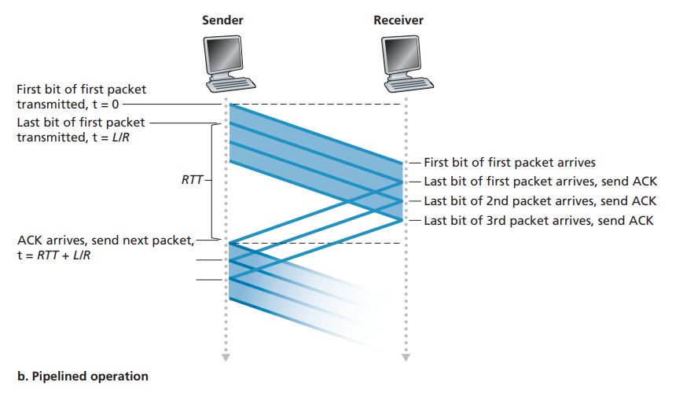

프로토콜 rdt3.0은 기능적으로는 정확하지만 **전송 후 대기** 프로토콜이기 때문에 형편없는 송신자 이용률을 가지게 된다

이러한 성능 문제를 해결하기 위해, 송신자에게 확인 응답을 기다리지 않고 여러 패킷을 전송하도록 허용하는 방법이 있다

이 기술을 **파이프라이닝**이라고 부른다

이를 위해서는 순서 번호의 범위가 커져야 하고 패킷 하나 이상을 버퍼링해야 한다

파이프라인 오류 회복의 두 가지 접근 방법으로는 **GBN(Go-Back-N, N부터 반복)**과 **SR(Selective Repeat, 선택적 반복)** 등이 있다

### 3.4.3 GBN

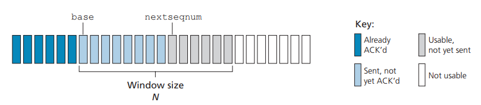

- [0, base-1]에서 순서 번호는 이미 전송되고 확인응답이 된 패킷
- [base, nextseqnum-1]는 송신은 되었지만 아직 확인응답되지 않은 패킷
- [nextseqnum, base+N-1]은 상위 계층으로부터 데이터가 도착하면 바로 전송될 수 있는 패킷

base+N 이상의 순서 번호는 파이프라인에서 확인응답이 안 된 패킷의 확인응답이 도착할 때까지 사용될 수 없다

프로토콜이 동작할 때, 크기가 N인 윈도가 순서 번호 공간에서 오른쪽으로 이동된다

따라서 N을 윈도 크기라고 부르며 GBN 프로토콜은 **슬라이딩 윈도 프로토콜**이라고 부른다

성공적인 ACK이 수신되면 윈도는 앞으로 이동하고 송신자는 새로운 패킷을 전송한다

### 3.4.4 SR

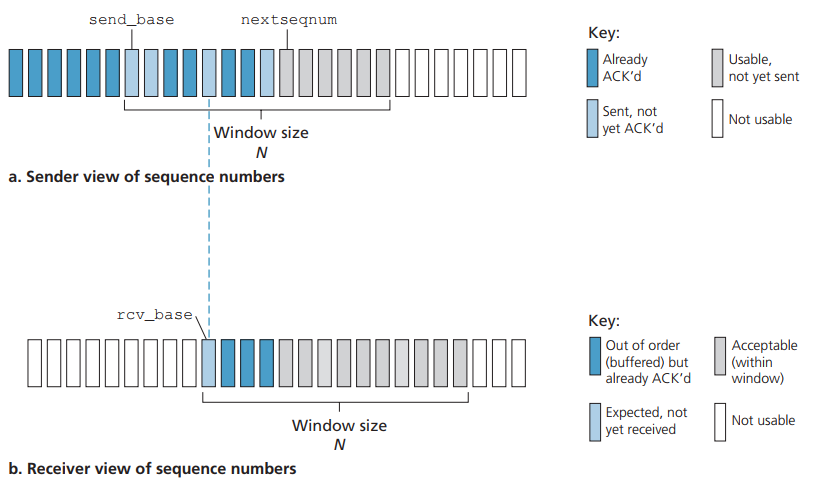

GBN은 많은 패킷을 불필요하게 전송하는 경우가 발생한다

선택적 반복 SR 프로토콜은 수신자에서 오류가 발생한 패킷을 수신했다고 의심되는 패킷만을 송신자가 재전송해 불필요한 재전송을 피한다

SR 수신자는 패킷의 순서와는 무관하게 손상 없이 수신된 패킷에 대한 확인응답을 한다

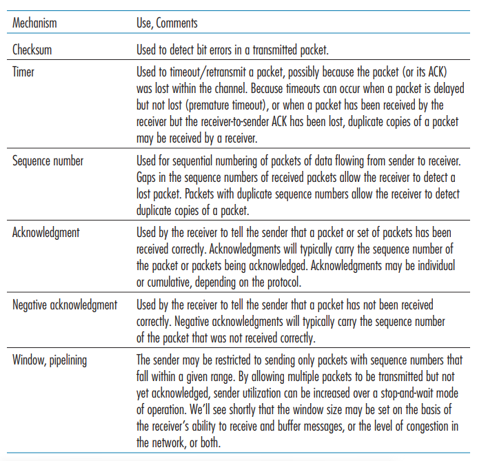

## 3.5 연결지향형 트랜스포트: TCP

### 3.5.1 TCP 연결

**연결지향형**: 프로세스가 다른 프로세스로 데이터를 전송하기 전에 **핸드셰이크** 과정을 거쳐야 함

**전이중 서비스**: 호스트 A의 프로세스와 호스트 B의 프로세스 사이에 TCP 연결이 있다면, 데이터는 B에서 A로 흐르는 동시에 A에서 B로 흐를 수 있다

**점대점**: 항상 단일 송신자와 단일 수신자 사이의 점대점이다 -> 단일 송신 동작으로 한 송신자가 여러 수신자에게 데이터를 전송하는 멀티캐스팅은 불가능하다

연결을 초기화하려는 프로세스를 **클라이언트 프로세스**, 다른 프로세스를 **서버 프로세스**라고 부른다

클라이언트가 첫 번째 TCP 세그먼트를 보내고, 서버가 응답으로 두 번째 TCP 세그먼트를 보내고 마지막으로 클라이언트가 세 번째 TCP 세그먼트를 보내서 연결을 설정한다 (**세 방향 핸드셰이크**)

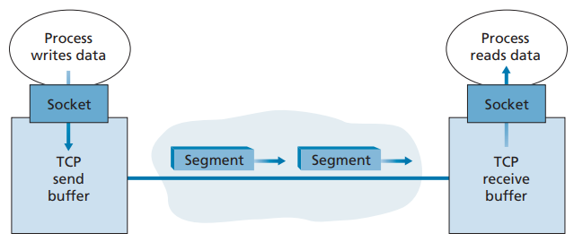

클라이언트 프로세스는 소켓을 통해 데이터의 스트림을 전달하고, TCP는 연결의 **송신 버퍼**로 데이터를 보낸다

**MSS(최대 세그먼트 크기)**로 세그먼트에 담을 수 있는 최대 데이터 양이 제한된다

**MTU(최대 전송 단위)**는 로컬 송신 호스트에 의해 전송될 수 있는 가장 큰 링크 계층 프레임의 길이이다

MSS는 우선 MTU에 의해 결정된 후 TCP 세그먼트와 TCP/IP 헤더 길이가 단일 링크 계층 프레임에 딱 맞도록 정해진다

**TCP 세그먼트**: TCP 헤더와 클라이언트 데이터를 짝지어 구성한다

### 3.5.2 TCP 세그먼트 구조

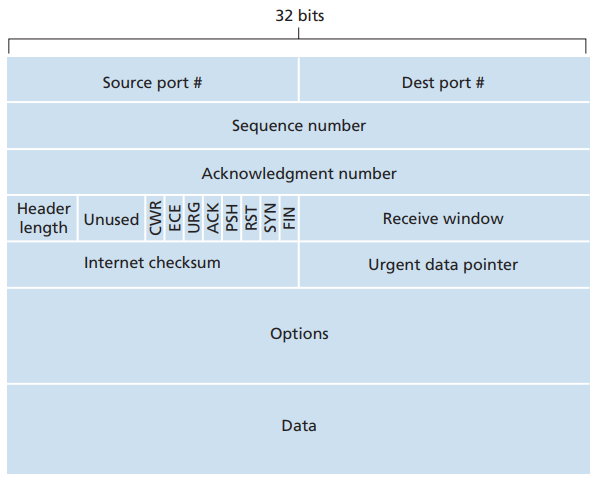

- **Sequence number(순서 번호 필드)** && **Acknowledgment number(확인응답 번호 필드)**: 신뢰적인 데이터 전송 서비스 구현에서 사용

- **Receive window(수신 윈도)**: 흐름 제어에 사용 -> 수신자가 받아들이려는 바이트의 크기를 나타낸다

- **Header length field(헤더 길이 필드)**: TCP 옵션 필드 때문에 가변적인 길이가 될 수 있다

- **Option field(옵션 필드)**: MSS를 협상하거나 윈도 확장 요소로 이용

- **Flag field(플래그 필드)**: ACK, RST, SYN, FIN, PSH, URG 등

**순서 번호와 확인응답 번호**

세그먼트의 순서 번호는 세그먼트에 있는 첫 번째 바이트의 바이트 스트림 번호다

