## 3.1 트랜스포트 계층 서비스 및 개요

트랜스포트 계층 프로토콜은 각기 다른 호스트에서 동작하는 애플리케이션 프로세스 간의 논리적 통신을 제공한다

##### 논리적 통신: 애플리케이션의 시점에서 보면 호스트들이 직접 연결된 것처럼 보인다는 뜻

송신 측의 트랜스포트 계층은 애플리케이션 계층으로부터 수신한 메세지를 **세그먼트**로 변환해서 네트워크 계층으로 전달한다

-> 메세지를 작은 조각으로 분할하고, 각각의 조각에 트랜스포트 계층 헤더를 추가

수신 측의 트랜스포트 계층은 애플리케이션에서 세그먼트 내부의 데이터를 이용할 수 있도록 수신된 세그먼트를 처리한다

### 3.1.1 트랜스포트 계층과 네트워크 계층 사이의 관계


**트랜스포트 계층**은 각기 다른 호스트에서 동작하는 **프로세스들** 사이의 논리적 통신을 제공하고, **네트워크 계층**은 **호스트들** 사이의 논리적 통신을 제공한다

비유하면, 트랜스포트 계층은 우편물을 모아서 우편 서비스에 전달하거나 우편 서비스에서 우편물을 받아 전달하는 우체부이고 네트워크 계층은 우편 서비스 자체이다

##### 프로세스는 송수신자, 호스트는 집으로 비유된다

우편 송수신자 입장에서는 우체부가 우편 서비스로 비춰진다

트랜스포트 계층이 제공하는 서비스는 네트워크 계층이 제공하는 서비스에 따라 제한된다

### 3.1.2 인터넷 트랜스포트 계층의 개요

**TCP**와 **UDP**, 두 종류의 트랜스포트 계층 프로토콜이 있다

두 프로토콜은 호스트 대 호스트 전달을 프로세스 대 프로세스 전달로 확장하는 **트랜스포트 계층 다중화**(=**역다중화**)를 수행한다

또, 헤더에 오류 검출 필드를 포함해 **무결성 검사**를 제공한다

UDP는 이 두 가지 서비스만을 제공하지만 TCP는 추가적인 서비스를 제공한다

**신뢰적인 데이터 전송**: 데이터가 순서대로 정확하게 전달되도록 함

**혼잡 제어**: 혼잡한 네트워크 링크에서 각 TCP 연결이 링크의 대역폭을 공평하게 공유하여 통과하도록 함

## 3.2 다중화와 역다중화


수신 측 호스트의 트랜스포트 계층은 데이터를 중간 매개자인 소켓에게 전달한다

##### 소켓: 네트워크에서 프로세스로, 프로세스로부터 네트워크로 데이터를 전달하는 출입구 역할

**역다중화**: 트랜스포트 계층 세그먼트의 데이터를 올바른 소켓으로 전달하는 작업(트랜스포트 -> 애플리케이션)

**다중화**: 소켓으로부터 데이터를 모으고, 이에 대한 세그먼트를 생성하기 위해 각 데이터에 헤더 정보로 캡슐화하고, 그 세그먼트를 네트워크 계층으로 전달하는 작업 (트랜스포트 -> 네트워크)

- **UDP의 비연결형 다중화와 역다중화**


다중화에는 두 요구사항이 있다 

1. 소켓은 유일한 식별자를 가지고 2. 각 세그먼트는 세그먼트가 전달될 적절한 소켓을 가리키는 특별한 필드를 가진다

이 때 특별한 필드는 **출발지 포트 번호 필드**와 **목적지 포트 번호 필드**이다

호스트의 각 소켓은 포트 번호를 할당 받고, 세그먼트가 호스트에 도착하면 트랜스포트 계층은 세그먼트 안의 목적지 포트 번호를 검사하고 상응하는 소켓으로 세그먼트를 보낸다

소켓에 도착한 세그먼트는 해당되는 프로세스로 전달된다

- **TCP의 연결지향형 다중화와 역다중화**


UDP 소켓과 TCP 소켓의 다른 점은, TCP 소켓은 4개 요소의 집합(출발지 IP 주소, 출발지 포트 번호, 목적지 IP 주소, 목적지 포트 번호)에 의해 식별된다는 것이다

역다중화할 때 이 4개 요소를 모두 사용한다

## 3.3 비연결형 트랜스포트: UDP

UDP는 트랜스포트 계층이 할 수 있는 최소 기능으로 동작한다 -> 다중화/역다중화, 오류 검사

UDP는 애플리케이션 프로세스로부터 메세지를 가져와서 다중화/역다중화 서비스에 대한 출발지 포트 번호 필드와 목적지 포트 번호 필드를 첨부하고, 다른 두 필드를 추가한 후에 최종 세그먼트를 네트워크 계층으로 넘겨준다

세그먼트가 수신 호스트에 도착하면 UDP는 세그먼트의 데이터를 해당하는 애플리케이션 프로세스로 전달하기 위해 목적지 포트 번호를 사용한다

UDP를 사용하는 전형적인 예시로, **DNS**가 있다

UDP의 장점은 아래와 같다
- **무슨 데이터를 언제 보낼지에 대해 애플리케이션 레벨에서 더 정교한 제어**: TCP는 혼잡 제어 매커니즘을 갖고 있기 때문에 송신자를 제한할 수 있지만 UDP는 그냥 즉시 네트워크 계층으로 세그먼트를 전달한다
- **연결 설정이 없음**: 핸드셰이크를 사용하는 TCP와 달리 UDP는 연결을 설정하기 위한 어떠한 지연도 없다
- **연결 상태가 없음**: TCP는 종단 시스템에서 연결 상태를 유지하지만 UDP는 연결 상태를 유지하지 않아서 좀 더 많은 액티브 클라이언트를 수용할 수 있다
- **작은 패킷 헤더 오버헤드**: TCP는 세그먼트마다 20바이트의 헤더 오버헤드를 갖지만 UDP는 단지 8바이트의 오버헤드를 갖는다


전자메일, 원격 터미널 접속, 웹 등은 신뢰적인 데이터 전송 서비스가 필요하므로 TCP를 이용하지만 그 외 많은 중요한 애플리케이션들이 TCP보다 UDP에서 동작한다

UDP는 혼잡 제어를 하지 않기 때문에, UDP 송신자와 수신자 간의 높은 손실률을 초래할 수도 있고 TCP 세션의 혼잡이 발생할 수 있다

### 3.3.1 UDP 세그먼트 구조


### 3.3.2 UDP 체크섬

오류 검출을 위한 필드이다

세그먼트가 이동할 때, 세그먼트 안의 비트에 대한 변경사항이 있는지 검사한다

세그먼트 안의 모든 16비트 워드의 합산에 대해 1의 보수를 수행하고 합산 과정에서 오버플로 발생시 윤회식 자리올림을 한다

## 3.4 신뢰적인 데이터 전송의 원리


### 3.4.1 신뢰적인 데이터 전송 프로토콜의 구축

- **완벽하게 신뢰적인 채널상에서의 신뢰적인 데이터 전송: rdt1.0**

하위 채널이 완전히 신뢰적인 가장 간단한 경우

이러한 간단한 프로토콜에서는 데이터 단위와 패킷의 차이점이 없다

- **비트 오류가 있는 채널상의 신뢰적인 데이터 전송: rdt2.0**

패킷 안의 비트들이 하위 채널에서 손상되는 모델

오류 검출, 수신자 피드백, 재전송 세 가지 부가 프로토콜 기능이 요구된다

수신자 피드백의 예는 긍정 확인응답(ACK), 부정 확인응답(NAK)이 있다

이 때, 패킷 손상 여부를 알려주는 ACK/NAK이 손상된 경우에는 현재 데이터 패킷을 재전송한다

그리고 패킷이 중복 패킷인지 새로운 패킷인지 확인하기 위해 새로운 필드를 추가하고 **순서 번호**를 삽입하는 방식을 채택했다

- **비트 오류와 손실 있는 채널상에서의 신뢰적인 데이터 전송: rdt3.0**

**패킷 손실 검출**: 송신자가 패킷을 전송하고, 패킷 또는 수신자의 패킷에 대한 ACK이 손실되었다면 송신자는 수신자에게 어떠한 응답도 없을 것이다. 그러나 손실을 확신하기 위한 대기 시간이 너무 길기 때문에 **손실이 일어났다는 보장은 없지만 손실이 일어났을 만한 시간을 현명하게 선택하는** 방법이 채택되었다

### 3.4.2 파이프라이닝된 신뢰적인 데이터 전송 프로토콜


프로토콜 rdt3.0은 기능적으로는 정확하지만 **전송 후 대기** 프로토콜이기 때문에 형편없는 송신자 이용률을 가지게 된다

이러한 성능 문제를 해결하기 위해, 송신자에게 확인 응답을 기다리지 않고 여러 패킷을 전송하도록 허용하는 방법이 있다

이 기술을 **파이프라이닝**이라고 부른다

이를 위해서는 순서 번호의 범위가 커져야 하고 패킷 하나 이상을 버퍼링해야 한다

파이프라인 오류 회복의 두 가지 접근 방법으로는 **GBN(Go-Back-N, N부터 반복)**과 **SR(Selective Repeat, 선택적 반복)** 등이 있다

### 3.4.3 GBN


- [0, base-1]에서 순서 번호는 이미 전송되고 확인응답이 된 패킷
- [base, nextseqnum-1]는 송신은 되었지만 아직 확인응답되지 않은 패킷
- [nextseqnum, base+N-1]은 상위 계층으로부터 데이터가 도착하면 바로 전송될 수 있는 패킷

base+N 이상의 순서 번호는 파이프라인에서 확인응답이 안 된 패킷의 확인응답이 도착할 때까지 사용될 수 없다

프로토콜이 동작할 때, 크기가 N인 윈도가 순서 번호 공간에서 오른쪽으로 이동된다

따라서 N을 윈도 크기라고 부르며 GBN 프로토콜은 **슬라이딩 윈도 프로토콜**이라고 부른다

성공적인 ACK이 수신되면 윈도는 앞으로 이동하고 송신자는 새로운 패킷을 전송한다

### 3.4.4 SR


GBN은 많은 패킷을 불필요하게 전송하는 경우가 발생한다

선택적 반복 SR 프로토콜은 수신자에서 오류가 발생한 패킷을 수신했다고 의심되는 패킷만을 송신자가 재전송해 불필요한 재전송을 피한다

SR 수신자는 패킷의 순서와는 무관하게 손상 없이 수신된 패킷에 대한 확인응답을 한다


## 3.5 연결지향형 트랜스포트: TCP

### 3.5.1 TCP 연결

**연결지향형**: 프로세스가 다른 프로세스로 데이터를 전송하기 전에 **핸드셰이크** 과정을 거쳐야 함

**전이중 서비스**: 호스트 A의 프로세스와 호스트 B의 프로세스 사이에 TCP 연결이 있다면, 데이터는 B에서 A로 흐르는 동시에 A에서 B로 흐를 수 있다

**점대점**: 항상 단일 송신자와 단일 수신자 사이의 점대점이다 -> 단일 송신 동작으로 한 송신자가 여러 수신자에게 데이터를 전송하는 멀티캐스팅은 불가능하다

연결을 초기화하려는 프로세스를 **클라이언트 프로세스**, 다른 프로세스를 **서버 프로세스**라고 부른다

클라이언트가 첫 번째 TCP 세그먼트를 보내고, 서버가 응답으로 두 번째 TCP 세그먼트를 보내고 마지막으로 클라이언트가 세 번째 TCP 세그먼트를 보내서 연결을 설정한다 (**세 방향 핸드셰이크**)


클라이언트 프로세스는 소켓을 통해 데이터의 스트림을 전달하고, TCP는 연결의 **송신 버퍼**로 데이터를 보낸다

**MSS(최대 세그먼트 크기)**로 세그먼트에 담을 수 있는 최대 데이터 양이 제한된다

**MTU(최대 전송 단위)**는 로컬 송신 호스트에 의해 전송될 수 있는 가장 큰 링크 계층 프레임의 길이이다

MSS는 우선 MTU에 의해 결정된 후 TCP 세그먼트와 TCP/IP 헤더 길이가 단일 링크 계층 프레임에 딱 맞도록 정해진다

**TCP 세그먼트**: TCP 헤더와 클라이언트 데이터를 짝지어 구성한다

### 3.5.2 TCP 세그먼트 구조


- **Sequence number(순서 번호 필드)** && **Acknowledgment number(확인응답 번호 필드)**: 신뢰적인 데이터 전송 서비스 구현에서 사용

- **Receive window(수신 윈도)**: 흐름 제어에 사용 -> 수신자가 받아들이려는 바이트의 크기를 나타낸다

- **Header length field(헤더 길이 필드)**: TCP 옵션 필드 때문에 가변적인 길이가 될 수 있다

- **Option field(옵션 필드)**: MSS를 협상하거나 윈도 확장 요소로 이용

- **Flag field(플래그 필드)**: ACK, RST, SYN, FIN, PSH, URG 등

**순서 번호와 확인응답 번호**

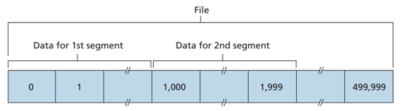

**세그먼트의 순서 번호**는 세그먼트에 있는 첫 번째 바이트의 바이트 스트림 번호다

위의 그림에서 첫 번째 세그먼트의 순서 번호는 0, 두 번째 세그먼트의 순서 번호는 1000으로 할당된다

**세그먼트의 확인응답 번호**는 상대로부터 기대하는 다음 바이트의 순서 번호이다

### 3.5.3 왕복 시간(RTT) 예측과 타임아웃

rdt 프로토콜처럼 TCP는 손상 세그먼트를 발견하기 위해 타임아웃/재전송 매커니즘을 사용한다

타임아웃을 적절하게 설정하지 않으면 불필요한 재전송이 발생할 것이다

- **왕복 시간(RTT) 예측**

##### SampleRTT는 측정된 RTT 값이고, EstimatedRTT는 SampleRTT의 가중평균이다

```EstimatedRTT = (1 - a) * EstimatedRTT + a * SampleRTT```

권장되는 a의 값은 0.125이다

EstiatedRTT는 예전 샘플보다 최근 샘플에 높은 가중치(**지수적 가중 이동 평균(EWMA)**)를 준다

##### DevRTT로 RTT의 변화율을 측정할 수 있다

```DevRTT = (1 - b) * DevRTT + b * | SampleRTT - EstimatedRTT |```

b의 권장값은 0.25다

- **재전송 타임아웃 주기의 설정과 관리**

```TimeoutInterval = EstimatedRTT + 4 * DevRTT```

SampleRTT 값에 많은 변동이 있을 때는 여윳값(4 * DevRTT)이 커야 하며, 변동이 작을 때는 작아야 한다 -> RTT의 변화율을 측정한 DevRTT 활용

**타임아웃이 발생할 때** TimeoutInterval의 값을 두 배로 한다

**재전송한 세그먼트의 SampleRTT는 계산하지 않는다**

### 3.5.4 신뢰적인 데이터 전송

TCP의 신뢰적인 데이터 전송은, 프로세스가 자신의 수신 버퍼로부터 읽은 데이터 스트림이 **손상되지 않았으며** **손실이나 중복이 없다는 것**과 **순서가 유지된다는 것**을 보장한다

호스트 A가 B에게 큰 파일을 전송하고 있다고 가정해보자

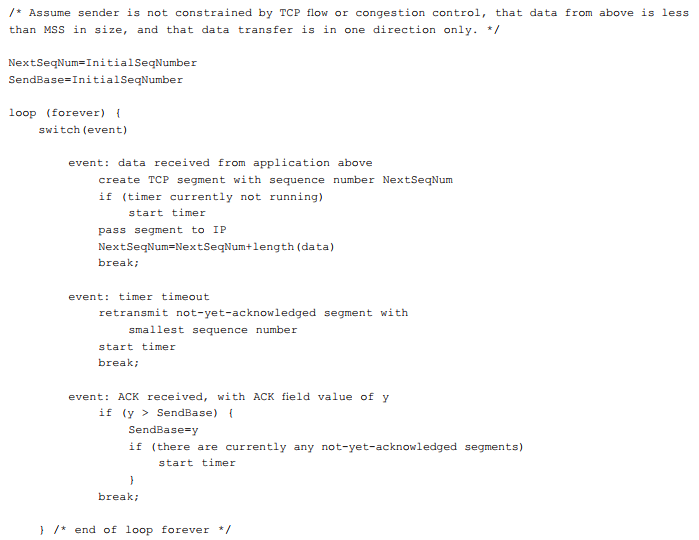

애플리케이션으로부터 수신된 데이터, 타이머 타임아웃, ACK 수신 세 가지 주요 이벤트가 있다

1. 상위 애플리케이션으로부터 수신된 데이터

TCP는 애플리케이션으로부터 데이터를 받고, 세그먼트로 이 데이터를 캡슐화하고, IP에게 이 세그먼트를 넘긴다

이 때 타이머가 이미 다른 세그먼트에 대해 실행 중이 아니라면, IP로 세그먼트를 넘길 때 타이머를 시작한다

2. 타임아웃

타임아웃을 일으킨 세그먼트를 재전송하고 TCP의 타이머를 다시 시작한다

3. 수신자로부터 ACK 수신

TCP 변수인 SendBase와 ACK 값인 y를 비교한다

이 때, SendBase는 수신 확인응답이 확인되지 않은 가장 오래된 바이트의 순서 번호이다

y > SendBase이면 SendBase를 y로 갱신한다

- **몇 가지 흥미로운 시나리오**

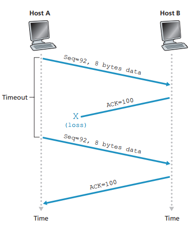

**B로부터 A로의 ACK 손실**

타임아웃이 일어나고 A는 같은 세그먼트를 재전송한다

이런 경우에 B가 재전송 세그먼트를 수신했을 때 세그먼트가 포함하고 있는 순서 번호로부터 이미 수신된 데이터임을 알고 재전송된 세그먼트의 바이트를 버린다

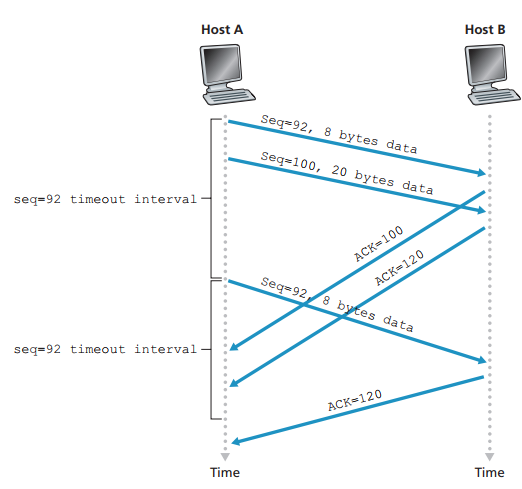

**세그먼트 100이 재전송되지 않는 경우**

두 세그먼트를 연속해서 송수신했으나 확인응답이 타임아웃 이후에 A에게 도착했다

위 그림과 같은 경우에는 Seq가 100인 세그먼트는 재전송되지 않는다

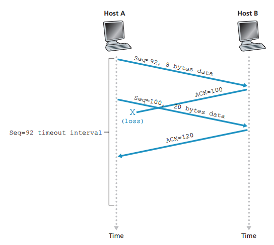

**누적 확인응답은 첫 번째 세그먼트의 재전송을 방지한다**

마찬가지로 두 세그먼트를 연속해서 송수신했고 첫 번째 확인응답이 분실된 경우이다

그러나 첫 번째 세그먼트의 타임아웃 이전에 두 번째 세그먼트의 확인 응답이 도착하면 A는 B가 119바이트까지 모든 데이터를 수신했음을 알고 어느 것도 재전송하지 않는다

- **타임아웃 주기의 두 배로 설정**

타이머의 종료 후 타임아웃 주기의 길이에 대한 것

타임아웃이 발생할 때마다 TCP는 아직 확인응답이 안 된 가장 작은 순서 번호를 가진 세그먼트를 재전송한다

이 때, 타임아웃의 주기는 이전 값의 두 배로 설정한다

타이머 만료 후 TimeoutInterval이 0.75일 때, 새로운 종료 소요 시간을 1.5초로 설정한다

1.5초가 지나 타이머가 또 만료되면 새로운 종료 소요 시간을 3.0초로 설정해 재전송한다

- **빠른 재전송**

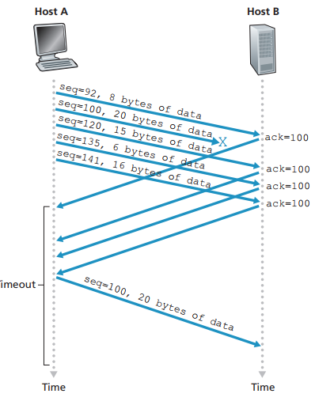

재전송의 문제점은 타임아웃 주기가 때때로 비교적 길어서 종단 간의 지연을 증가시킨다는 점이다

**중복 ACK**(송신자가 이전에 이미 받은 확인응답에 대한 재확인응답 세그먼트 ACK)으로 타임아웃 이전에 패킷 손실을 발견할 수 있다

TCP가 같은 데이터에 대해 3개의 중복 확인응답을 수신하면 패킷 분실을 인지하고 세그먼트의 타이머가 만료되기 이전에 손실 세그먼트를 재전송한다

위의 그림을 보면 **타이머가 만료되기 전에** 재전송된 것을 확인할 수 있다

- **GBN vs SR**

TCP는 **GBN과 SR 프로토콜의 혼합으로 분류해야 한다**

TCP가 SendBase와 NextSeqNum을 유지하는 것은 GBN과 유사하지만, 패킷 분실시 연속적인 패킷을 모두 재전송하는 GBN과 세그먼트 하나만을 재전송하는 TCP는 차이가 있다

또, TCP가 순서에 맞는 세그먼트에 대해 누적 확인응답을 하기 보다는 순서가 틀린 세그먼트에 대해 선택적으로 확인응답을 하기 때문에 SR과의 유사점도 존재한다

### 3.5.5 흐름 제어

수신하는 애플리케이션이 데이터를 읽는 속도가 비교적 느리다면 송신자가 점점 더 많은 데이터를 빠르게 전송해 연결의 수신 버퍼에 오버플로가 발생할 것이다

이를 방지하기 위해 속도를 일치시키는 **흐름 제어 서비스**를 제공한다

송신자가 **수신 윈도**라는 변수를 유지하여 흐름 제어를 제공한다

호스트 A가 B에게 파일을 전송할 때, B는 연결에 대해 수신 버퍼를 할당한다

그리고 버퍼로부터 데이터를 읽으며 버퍼로부터 읽힌 데이터 스트림의 마지막 바이트 번호(LastByteRead)와 수신 버퍼에 저장된 데이터 스트림의 마지막 바이트 번호(LastByteRcvd)를 변수로 정의한다

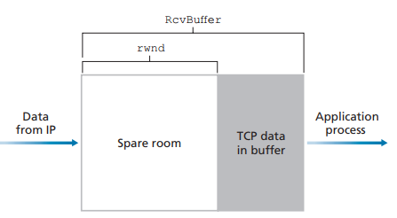

```rwnd(수신 윈도) = RcvBuffer - [LastByteRcvd - LastByteRead]```

호스트 B는 A에게 전송하는 모든 세그먼트의 윈도 필드에 현재 rwnd 값을 설정해서 여유 공간의 크기를 A에게 알려준다

```LastByteSent - LastByAcked < rwnd```

이 때 호스트 A는 LastByteSent와 LastByteAcked를 변수로 정의하고, 이 두 변수의 차이가 전송 확인응답이 안된 데이터의 양이다

rwnd의 값보다 작은 확인응답 안 된 데이터 양을 유지해서 수신 버퍼에 오버플로가 발생하지 
않는다는 것을 확신한다

만약 수신 버퍼가 가득 차서 B가 rwnd = 0으로 세그먼트를 보내면, 이후 버퍼에 공간이 생기더라도 A는 차단되어서 새로운 데이터를 보낼 수 없다

이러한 문제를 해결하기 위해 호스트 A는, B에게 rwnd = 0 세그먼트를 받은 이후에 1바이트 데이터로 세그먼트를 계속해서 전송한다

그러한 세그먼트에 대해 B는 계속 해서 응답할 것이며 버퍼가 비워지면 0이 아닌 rwnd 값을 보낼 것이다

### 3.5.6 TCP 연결 관리

**세 방향 핸드셰이크**

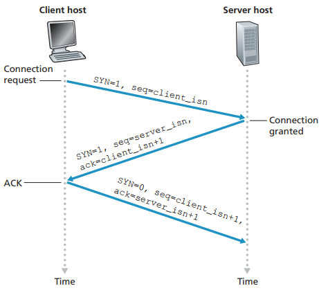

1. 클라이언트 측 TCP가 서버 TCP에게 데이터가 포함되지 않은 SYN 세그먼트를 송신한다. 이 세그먼트 순서 번호 필드에는 임의로 선택된 최초의 순서 번호가 포함되어 있다
2. SYN 세그먼트를 받은 서버 TCP는 연결에 TCP 버퍼와 변수를 할당한다. 그리고 클라이언트 TCP에게 연결 승인을 알리는 SYNACK 세그먼트를 송신한다. 이 세그먼트에도 마찬가지로 최초의 순서 번호를 임의로 선택하여 포함한다
3. SYNACK 세그먼트를 수신한 클라이언트는 연결에 버퍼와 변수를 할당한 후 마지막으로 서버에 연결 승인 세그먼트를 송신한다. 이 때 세그먼트에 데이터를 포함할 수 있다

**연결 종료**

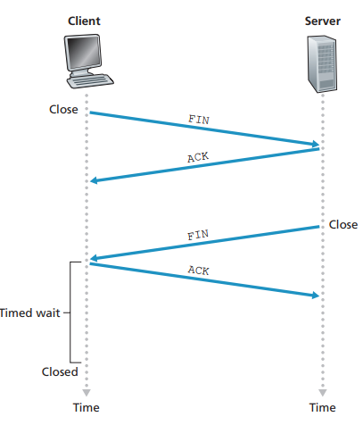

클라이언트가 연결 종료를 결정했을 때, 서버에게 FIN 세그먼트를 전송한다

서버가 이 세그먼트를 수신하면, 확인응답 세그먼트를 보내고 마찬가지로 클라이언트에 FIN 세그먼트를 전송한다

마지막으로 클라이언트가 서버에게 확인응답 세그먼트를 송신하고 연결이 종료된다

**TCP 상태 전이 순서**

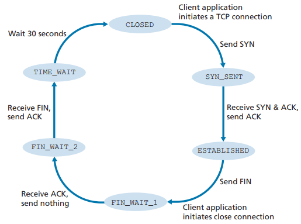
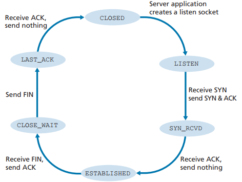

## 3.6 혼잡 제어의 원리

### 3.6.1 혼잡의 원인과 비용

1. 패킷 도착률이 링크 용량에 근접함에 따라 큐잉 지연이 커진다
2. 송신자는 버퍼 오버플로 때문에 버려진 패킷을 재전송해야 하고, 지연으로 인한 송신자의 재전송은 링크 대역폭을 사용하는 원인이 된다
3. 패킷을 버릴 때 버려지는 지점까지 패킷을 전송하는 데 사용된 전송 용량은 낭비된 것이다

### 3.6.2 혼잡 제어에 대한 접근법

- **종단 간의 혼잡 제어**

네트워크 계층은 혼잡 제어에 어떠한 직접적인 지원도 제공하지 않는다

혼잡의 존재는 관찰된 네트워크 동작에 기초하여 종단 시스템이 추측해야 한다

TCP 세그먼트 손실은 네트워크 혼잡의 발생 표시로 간주하고 TCP는 그에 따라 윈도 크기를 줄인다

또한, 증가하는 왕복 지연값을 네트워크 혼잡 지표로 사용할 수 있다

- **네트워크 지원 혼잡 제어**

라우터들은 네트워크 안에서 혼잡 상태와 관련하여 직접적인 피드백을 제공한다

라우터는 자신이 출력 링크에 제공할 수 있는 전송률을 송신자에게 명확히 알릴 수 있게 해준다

인터넷 기본 버전 TCP/IP는 종단 간 접근 방식을 채택했으나, 최근에는 네트워크 혼잡 제어를 선택적으로 구현할 수 있다

## 3.7 TCP 혼잡 제어

### 3.7.1 전통적인 TCP의 혼잡 제어

네트워크 혼잡에 따라 연결에 트래픽을 보내는 전송률을 각 송신자가 제한하도록 한다

TCP 송신자가 혼잡이 없음을 감지하면 송신자가 송신율을 높이고, 감지하면 송신율을 줄인다

- **TCP 송신자가 전송률을 제한하는 방식**

송신 측 TCP 혼잡 제어 매커니즘은 추가적인 변수인 **혼잡 윈도(cwnd)**를 추적한다

```LastByteSent - LastByteAcked <= min{cwnd, rwnd}```

송신하는 쪽에서 확인응답이 안 된 데이터의 양은 cwnd와 rwnd의 최솟값을 초과하지 않는다

이 제약은 확인응답이 안 된 데이터 크기를 제한하고 송신자의 송신 속도를 간접적으로 제한한다

- **TCP 송신자가 혼잡 존재 여부를 감지하는 방법**

타임아웃 또는 3개의 중복된 ACK이 발생했을 때, TCP 송신자 측에 손실 이벤트가 발생한다

과도한 혼잡이 발생하면 경로에 있는 라우터 버퍼들이 오버플로 되고, 그 결과 데이터그램이 버려진다

버려진 데이터그램은 송신 측에 손실 이벤트를 발생시키고 송신자는 경로상의 혼잡이 발생했음을 감지한다

- **TCP 송신자가 혼잡 감지 후 송신율을 변화시키는 방법**

1. 손실된 세그먼트는 혼잡을 의미하며, TCP 전송률은 이에 따라 한 세그먼트를 손실했을 때 줄여야 한다
2. 이전에 확인응답되지 않은 세그먼트에 대해 ACK이 도착하면 송신자의 전송률은 증가할 수 있다
3. 대역폭 탐색 -> 혼잡이 발생하는 시점까지 전송률을 증가시키고, 그 시점 이후부터는 줄인 후 다시 혼잡이 발생했는지 알아보기 위해 탐색을 시작한다

이러한 개념을 바탕으로 **TCP 혼잡 제어 알고리즘**을 고려할 수 있다

이 알고리즘은 **슬로 스타트**, **혼잡 회피**, **빠른 회복** 세 가지 구성요소를 가진다

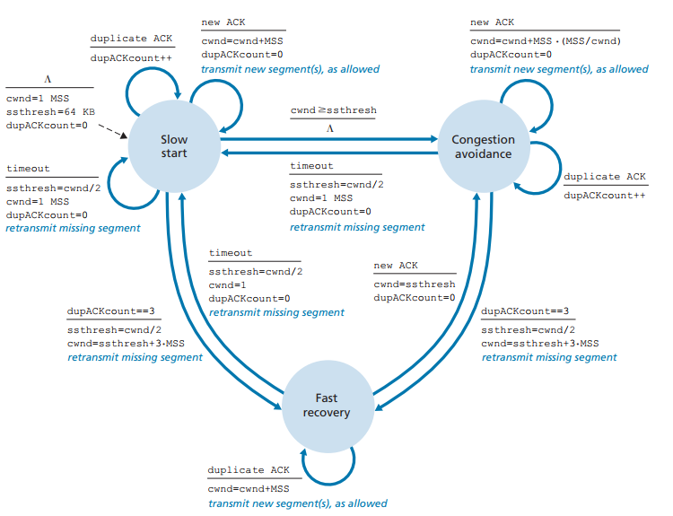

1. **슬로 스타트**

TCP 연결이 시작될 때, cwnd는 1로 초기화되고 전송 세그먼트가 확인 응답을 받을 때마다 1 MSS씩 증가한다 (1->2->4)

이 슬로 스타트는 혼잡이 발생한 경우, cwnd 값을 1로 초기화하고 ssthresh(slow start threshold)를 혼잡이 검출된 시점에서의 cwnd 값의 반으로 정한다

cwnd 값이 ssthresh에 도달하면 슬로 스타트는 종료되고 혼잡 회피 모드로 전환한다

2. **혼잡 회피**

RTT마다 cwnd 값을 두 배로 하지 않고 RTT마다 하나의 MSS 만큼 cwnd 값을 증가시킨다

타임아웃이 발생한 경우, 슬로 스타트와 똑같이 cwnd = 1 MSS, ssthresh = cwnd/2로 초기화한다

그러나 3개의 중복된 ACK으로 혼잡이 감지된 경우에는 cwnd /= 2, ssthresh = cwnd/2로 초기화한다

3. **빠른 회복**

cwnd 값을 손실된 세그먼트에 대해 수신된 모든 중복된 ACK에 대해 1 MSS 만큼 증가시킨다

TCP의 구성요소로 권고사항이지만 필수로 구현되는 요소는 아니다

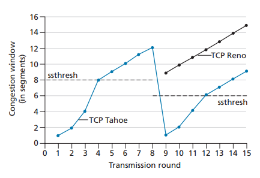

TCP 혼잡 제어는 **가법적 증가, 승법적 감소**의 혼잡 제어 형식이다

### 3.7.2 네트워크 지원 명시적 혼잡 알림과 지연 기반 혼잡 제어

TCP 송신자는 네트워크에서 명시적인 혼잡 표시를 수신하지 않는 대신, 관찰된 패킷 손실을 통해 혼잡을 추론한다

- **명시적 혼잡 알림**

네트워크 지원 혼잡 제어의 한 형태이다

수신 호스트의 TCP가 수신 데이터그램을 통해 ECN 혼잡 알림 표시를 수신하면, 수신 호스트의 TCP는 ECE 비트를 설정하여 송신 호스트의 TCP에 혼잡 표시를 알린다

혼잡해지는 라우터는 그 라우터에서 버퍼가 가득 차서 패킷들이 삭제되기 전에, 송신자에게 혼잡 시작을 알리는 혼잡 알림 비트를 설정할 수 있다

따라서 패킷 손실 이전에 더 일찍 전송 속도를 줄일 수 있어 패킷 손실 및 재전송을 피할 수 있다

- **지연 기반 혼잡 제어**

패킷 손실이 발생하기 전에 혼잡 시작을 사전에 감지하는 것이다

TCP 송신자가 파이프를 가득 채우되, 그 이상으로 채우지 않도록 해야 한다

### 3.7.3 공평성

더 작은 RTT를 갖는 세션은 대역폭이 더 빠르게 비워져서 가용한 대역폭을 점유할 수 있어서 큰 RTT를 갖는 연결보다 더 높은 처리율을 갖는다


