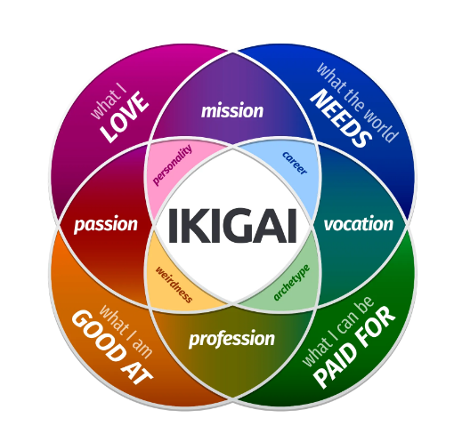

[옥토버 아카데미 공식 페이지](https://october-academy.oopy.io/)

제목은 옥토버 아카데미의 슬로건을 빌려왔습니다!

## 옥토버 아카데미에 지원한 이유

옥토버 아카데미 첫 활동 때, 파트너님들이 아무런 정보가 없는 옥토버 아카데미에 지원을 한 것 자체가 대단한 것이라는 언급을 하셨었다. 사실 나도 지원할 때 1기라는 점의 위험성 때문에 많이 고민한 것 같다. 많이 바쁜 시기인데 괜한 곳에 시간 투자를 하는 것이 아닐까 싶은 마음이 컸다.

그럼에도 지원한 이유는 옥토버 아카데미 소개 페이지의 **이 프로그램을 왜 진행하나요?** 부분을 꽤 인상 깊게 읽었기 때문이다. 마침 당시에 자소서 작성을 도전했다가 도저히 쓸 말이 없어서 포기한 경험이 있었는데 이 글이 참 깊게 와닿았다.

>아이러니하게도 자소서 글쓰기보다 더 어려웠던 것이 있었습니다. 자소서 문항에 답변해야 하는데 문제는 제가 스스로 저를 모른다는 점이 가장 큰 난관이었습니다. 어떻게든 자소서라는 멋들어진 요리를 만들어 내야만 하는데 제게 어떤 재료가 있는지도 몰랐어요. 막막한 마음에 암담한 심정이었습니다.

나는 왜 내가 자소서 쓸 때 막막한건지 인지조차 못하고 있었는데 이 글을 읽고서야 내가 나를 몰라서 그렇다는 것을 깨닫게 되었다. 내가 나를 모르기 때문에 강점과 약점도 모르고, 왜 이 분야를 선택했는지도 '그냥 끌려서'로만 대답할 수 있었다. 따라서 지금 나에게는 백엔드 공부나 전공 공부보다 **자기발견**의 우선 순위가 더 높다고 생각했다. 

도박이라는 생각이 들기도 했지만 지원 페이지에서 파트너 님들의 진심이 너무나도 잘 보였고 그 짧은 글들에서 벌써 많은 것들을 배웠기 때문에 옥토버 활동을 하면 어떤 것을 더 배울 수 있을지 설레는 마음으로 지원을 결심했다.

## 활동을 진행하면서 느낀 점

### 이키가이 테스트

1주차에는 간단한 자기소개와 옥토버 아카데미에 대한 설명을 들었고, 이후 **이키가이 테스트**를 한 후에 그 결과를 보고 글을 쓰는 활동을 했다. 

이키가이 테스트란 사진처럼 내가 잘하는 것, 내가 좋아하는 것, 세상이 필요로 하는 것, 내가 돈을 벌 수 있는 것에 대한 다이어그램을 확인할 수 있는 테스트다. 각 교점마다도 유의미한 의미가 있기 때문에 스스로에 대한 많은 정보를 알아볼 수 있었다.

**추후 과제 링크 추가 예정**

### Clifton Strengths 검사

https://www.gallup.com/home.aspx

Clifton Strengths 검사는 34가지 테마의 강점들 중에서 내가 가지고 있는 상위 5개 테마의 강점들을 알아볼 수 있는 검사다. 검사 후에는 5개의 테마마다 상세한 설명이 적혀있는 보고서를 확인할 수 있는데, 그 설명이 고른 선택지에 따라 다르게 나온다고 한다.

나 같은 경우에는 보고서가 정말 큰 도움이 됐다. 내 이러한 면이 강점이라고?! 라는 생각도 했고 이미 알고 있던 강점에 대해서도 좀 더 알 수 있게 되어서 정말 좋은 경험이었다.

**추후 과제 링크 추가 예정**

### 1:2 코칭

위의 두 검사들과 파트너 님들이 활동 기간동안 지켜본 나의 모습을 기반으로 코칭 시간을 가졌다. 개인적으로 옥토버 아카데미 활동 중에 제일 큰 도움이 된 시간이었다.

코칭 받고 싶은 주제는 사전에 폼을 작성해서 정할 수 있는데, 나는 사실 무슨 주제를 할지 잘 모르겠어서 아무 말이나 적었다. (ㅎㅎ..... 죄송합니다) 그럼에도 파트너 님들이 잘 이끌어 주셔서 정말 편안하고 즐거운 분위기에서 유의미한 것들을 많이 배워갈 수 있었다. 개인적인 고민을 상담 받았는데 확실히 나보다 경험이 많고 코칭과 관련된 과정을 수료하신 분들이셔서 정말 큰 힘이 되는 조언을 많이 들었다.
강점과 연관 지어서 코칭해 주시기 때문에 더 자세하고 나에게 맞는 이야기들을 많이 들을 수 있었던 거 같다. 정말 오랫동안 스트레스 받던 부분을 너무나도 명쾌하게 해소해 주셔서 나한테 정말 큰 영향을 준 활동이었다.

마지막에 나한테 꿈이 뭐냐고 질문하셨는데 그게 너무 인상 깊다. 정말 흔한 질문임에도 한번도 생각해 본 적이 없고 막상 생각해 보려니까 놀랍도록 머리가 하얘졌다. 꿈이라기 보단 단기적인 목표만 있었고 전체적인 삶을 관통하는 꿈에 대해서는 잘 모르겠다.. 오랜 시간 고민해보아야 할 거 같다. 

사실 이렇게 정해진 코칭 시간 외에도, 뒷풀이 같은 개인적인 자리에서도 많은 코칭이 이루어진 거 같다. 의도하신 거 같지는 않지만..! 그래서 그런지 옥토버 아카데미에서 이루어지는 모든 활동이 뜻 깊다고 생각하게 된 거 같다. 

### 커리어토크

활동 시간 외에 파트너 님들이 따로 시간을 내어 특정 주제에 대해 이야기 해보는 시간을 가질 수 있었다. 내가 생각해보지 않은 주제에 대해 고민해보고 다른 사람들의 의견을 들을 수 있는 소중한 기회였다. 세 번의 커리어토크가 있었는데 사실 나는 아쉽게도 한 번만 참석했다.. 위에서 말했듯이 정말 많이 바쁜 시기였기 때문에 ㅠㅠ 그럼에도 그 한 번의 경험에서 많은 것을 배울 수 있었다.

#### 이외에도 참가자 본인의 의지만 있다면 더 다양한 활동에서 많은 것을 얻어갈 수 있다. 활동 후에 이루어지는 뒷풀이에서도 많은 얘기를 나누었다 ! 파트너 님들도 참가자들에게 지원을 아끼지 않기 때문에 나도 도합 120%의 효율로 한 달 활동을 마무리할 수 있었다.

## 무엇을 얻었는가?

#### 새로운 관점을 고려하는 능력이 생겼다.

첫 번째로, **다른 사람**을 이해할 수 있는 새로운 관점을 얻었다. 다른 참가자 분들과 각자의 특징에 대해 공유하는 시간을 가질 수 있었기 때문에, 나와는 다른, 이러한 사람들도 있구나에 대해 인지하고 더 이해할 수 있게 되었다. 강점 검사 활동 때 다른 분들의 Top5 강점을 보고 정말 많이 느낀 거 같다. 추후 협업을 진행할 때 옥토버 아카데미에서의 활동을 다시 되돌아 볼 거 같다는 생각이 들었다.

두 번째로 **상황**에 대해 다르게 생각해볼 수 있는 힘을 얻은 거 같다. 다른 사람을 이해할 수 있게 된거랑 연관이 있는데, 다른 사람들이 특정 상황에 대해 어떠한 생각을 하는지 많이 들어볼 수 있었다. 근데 나와 똑같이 생각하는 사람이 없고 모두 다른 생각을 가지고 있었기 때문에 정말 신기하고 흥미로웠으며 내 생각이 틀에 갇혀 있었음을 깨닫게 되었다. 활동하는 동안 오.. 저렇게도 생각할 수 있구나 신기하다 라는 생각을 진짜 많이 한 거 같다.

마지막으로, **나**에 대해 내가 몰랐던 관점을 알게 되었다. 강점 결과를 봤을 때, 내가 정말 습관적으로 행했던 일들임에도 그것이 내 강점이라는 사실을 인지하지 못 하고 있었음에 대해 알게 되었다. 이외에도 파트너 님들에게 내가 모르던 나의 특징에 대해 정말 많이 들은 거 같다. 검사 결과에 나온 강점뿐만 아니라 다른 강점에 대해서도 많이 알 수 있었다. 긍정적인 에너지가 넘쳐서 다른 사람도 긍정적이게 만들고, 생각이 정말 건강하다는 두 얘기가 정말 기억에 남는다. 너무 내가 생각하는 나랑 정 반대라서.. 그리고 활동내내 귀여워 해주셔서 내색은 안했지만(했을지도..) 기분이 좋았다 ^^

#### 물론 자기발견에 대해서도 많이 생각해볼 수 있는 기회였고, 나에 대해 많이 배울 수 있었다.

일단 나는 메타인지에 대한 중요성을 몰랐으며 스스로에 대해 깊게 생각해 본 적이 없었다. 그러나 옥토버 아카데미 활동과 그에 따른 나의 변화를 보고 그 중요성을 직접 느끼게 되었다. 

본 후기글을 작성하면서 지원 이후 처음으로 옥토버 아카데미 소개글을 다시 읽어보았는데 또 새로운 의미로 다가오는 글이 있었다.

>커리어를 돌아보면 성공적인 취업과 안정적인 직장 생활을 하는 과정이라고 볼 수도 있겠네요. 그런데 세부적인 과정을 들여다보면 도처에 수많은 실패가 있었습니다. 이런 실패를 빠르게 극복할 수 있었던 회복탄력성이었던 것 같아요. 인생에서 어려운 순간에 맞닥뜨렸을 때 저의 회복탄력성은 모두 탄탄한 메타인지에서 도움을 받을 수 있었습니다.

위의 글을 읽고 나의 과제 내용 중에 비슷한 내용이 있어서 놀랐다. 절대 이 글을 인지하고 작성한 과제가 아님에도 불구하고, 아래와 같은 내용을 작성했었다.

>저는 옥토버 아카데미에 참여하기 전에는 스스로가 근거 없는 자신감으로 가득 차 있다고 생각했는데, 한 달간의 활동이 끝난 후에는 제가 저를 믿을 수 있는 근거를 정확히 알게 되었습니다.  
저는 늘 제 능력에 대한 확신이 있었음에도 그에 대한 근거는 정확히 알지 못했습니다. 그렇기 때문에 종종 정말 근거가 없는 허세인가 싶은 생각이 들었고 마음 한편에 한 번이라도 실수하면 밑도 끝도 없이 무너질 거 같다는 불안을 가지고 있었습니다.  
그러나 Clifton Strengths 검사와 코칭 이후로는 이런 불안을 어느 정도 덜 게 됐습니다. 제가 이 검사가 너무 인상 깊었다고 앞선 활동들에서 여러 번 언급했는데 아마 이 불안이 해소되면서 느낀 해방감 때문인 거 같습니다. 검사 보고서가 제 행동에 제가 납득할 수 있는 근거를 찾아 준 느낌이 들었습니다.  
지금은 제 능력을 온전히 신뢰할 수 있게 되었습니다. 이제는 제가 계획한 목표를 이루는 데 실패해도 제 강점들을 믿고 충분히 극복할 수 있을 거라고 생각합니다.

뭔가 옥토버 아카데미의 목표대로 잘 성장한 거 같아서 굉장히 기분이 좋다.
앞으로 살면서 큰 힘이 될 무기를 얻은 거 같다. 