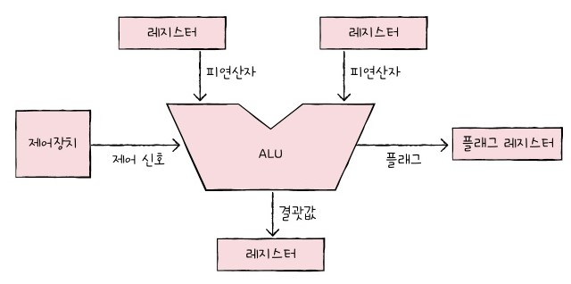
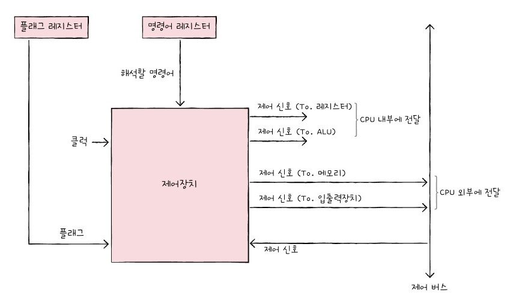
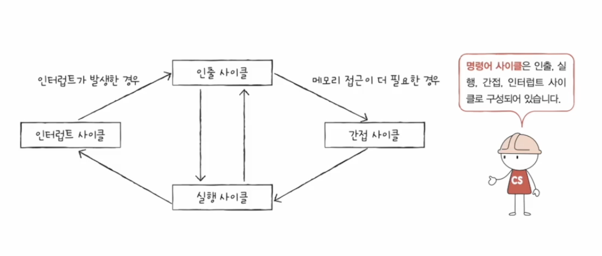

## ALU와 제어장치

### ALU

레지스터를 통해 **피연산자**와 제어장치로부터 **제어 신호**를 받고  연산 수행 후, 결괏값을 **레지스터**에 저장

ALU는 추가적으로 **플래그**를 내보낸다

**플래그**: 연산 결과에 대한 추가적인 상태 정보, 플래그 레지스터에 저장된다

|플래그 종류|의미|사용 예시|
|------|---|---|
|부호 플래그|연산 결과의 부호|1이면 음수, 0이면 양수|
|제로 플래그|연산 결과가 0인지 여부|1이면 연산 결과 == 0, 0이면 연산 결과 != 0|
|캐리 플래그|연산 결과 올림수나 빌림수 발생 여부|1이면 올림수나 빌림수 발생, 0이면 발생하지 않음|
|오버플로우 플래그|오버플로우 발생 여부|1이면 오버플로우 발생, 0이면 오버플로우 발생 X|
|인터럽트 플래그|인터럽트 가능 여부|1이면 인터럽트 가능, 0이면 인터럽트 불가능|
|슈퍼바이저 플래그|커널 모드로 실행 중인지 사용자 모드로 실행 중인지|1이면 커널 모드, 0이면 사용자 모드|

### 제어장치

제어 장치가 받아들이는 정보
1. **클럭 신호**: 컴퓨터의 시간 단위를 받음
2. **해석해야 할 명령어**: 명령어 레지스터로부터 명령어를 받아서 해석한 후, 제어 신호를 발생시켜 다른 부품들에게 수행할 일을 알림
3. **플래그**: 플래그 레지스터로부터 플래그를 받아서 명령어 해석에 참고
4. **제어 버스로부터 전달된 제어 신호**: 외부로부터 전달된 제어 신호를 받기도 함

제어 장치가 내보내는 정보
1. **CPU 내부로 제어 신호 전달**: 연산을 지시하기 위해 ALU로 보내거나, 레지스터 간 데이터 이동 및 명령어 해석을 위해 레지스터로 보내거나
2. **CPU 외부로 제어 신호 전달**: 메모리에 읽고 쓰기 위해 메모리로 보내거나, 입출력 장치에 읽고 쓰기 위해 입출력 장치로 보내거나

## 레지스터

### 반드시 알아야 할 레지스터

1. **프로그램 카운터(PC)**: 메모리에서 읽어 들일 명령어의 주소 저장
2. **명령어 레지스터(IR)**: 해석할 명령어(= 방금 메모리에서 읽어 들인 명령어)를 저장
3. **메모리 주소 레지스터(MAR)**: 메모리의 주소를 저장
4. **메모리 버퍼 레지스터(MBR)**: 메모리와 주고받을 값(데이터, 명령어)를 저장
5. **범용 레지스터**: 자유롭게 사용하는 레지스터
6. **플래그 레지스터**: 아까 그거

### 스택 주소 지정 방식

##### ch03 - 주소 지정 방식: 명령어 오퍼랜드에 저장된 유효 주소를 찾는 방법

특정 레지스터를 이용한 주소 지정 방식(1): 스택과 **스택 포인터**를 이용하는 방식

스택 포인터는 스택의 꼭대기, 스택에 마지막으로 저장한 값의 위치를 저장하는 레지스터

### 변위 주소 지정 방식

특정 레지스터를 이용한 주소 지정 방식(2): 오퍼랜드 필드 값과 특정 레지스터의 값을 더하여 유효 주소를 얻어내는 방식

이 방식을 사용하는 명령어는 연산 코드, 레지스터, 오퍼랜드로 이루어져 있다

어떤 레지스터를 더하는 지에 따라 두 개로 나누어 진다
1. **상대 주소 지정 방식**: **프로그램 카운터** 값을 더한다

실행할 명령어에서 오퍼랜드가 음수면 PC보다 이전 번지, 양수면 PC보다 이후 번지의 명령어를 실행

특정 주소의 코드를 실행할 때 사용

2. **베이스 레지스터 주소 지정 방식**: **베이스 레지스터**의 값을 더한다

베이스 레지스터는 기준 주소, 오퍼랜드는 기준 주소로부터 떨어진 거리의 역할

## 명령어 사이클과 인터럽트

### 명령어 사이클

프로그램 속 각각의 명령어가 반복되며 실행되는 주기

메모리에 저장된 명령어를 실행하는 사이클을 생각해보자

1. **인출 사이클**: 메모리에 있는 명령어를 CPU로 가지고 오는 단계

PC에 명령어의 주소를 저장하고.. MAR에 PC에 저장된 주소를 저장하고.. MBR에 명령어가 저장되고 등등등등의 과정

2. **실행 사이클**: CPU로 가져온 명령어를 실행하는 단계

제어장치가 명령어를 해석하고 제어 신호를 발생시키는 등등등등의 과정

3. **간접 사이클**: 메모리 접근을 한번 더 해야 하는 경우 실행되는 단계

### 인터럽트

CPU의 작업을 방해하는 신호

1. **동기 인터럽트(=예외)**: CPU에 의해 발생하는 인터럽트
2. **비동기 인터럽트(=하드웨어 인터럽트)**: 입출력장치에 의해 발생하는 인터럽트

하드웨어 인터럽트는 CPU의 효율을 위해 **알림**과 같은 역할을 한다 (입출력 작업 수행 중에 CPU가 작업 완료까지 멍 때리지 않고 다른 일을 수행할 수 있도록 ㅇㅇ)

**하드웨어 인터럽트 처리 순서**

1. 입출력장치가 CPU에 **인터럽트 요청 신호**를 보낸다 (지금 끼어들어도 되나요?)
2. CPU는 실행 사이클이 끝나고 인출 사이클 실행 전에 항상 인터럽트 여부를 확인
3. CPU가 인터럽트 여부를 확인하고, **인터럽트 플래그**(in 플래그 레지스터)를 확인
4. 인터럽트를 받아들일 수 있다면 지금까지의 작업 내용을 스택 영역에 백업
5. CPU는 **인터럽트 벡터**를 참조하여 **인터럽트 서비스 루틴(=인터럽트 핸들러)** 실행
6. 인터럽트 서비스 루틴이 끝나면 백업한 작업 복구하여 다시 실행

인터럽트 플래그를 불가능으로 설정해도 무시할 수 없는 인터럽트가 존재 (정전, 고장 등)

**인터럽트 벡터**: 인터럽트 서비스 루틴을 식별하고 시작 주소를 알 수 있다 -> 인터럽트를 보낸 대상이 함께 전달

최종적으로 이렇게 돌고 돈다

### 예외의 종류

1. **폴트(Fault)**: 예외 처리 후 예외가 발생한 명령어부터 실행 재개
-> 명령어 실행 중에 추가로 데이터가 필요한 경우에 폴트를 발생시켜 가져온다
2. **트랩(Trap)**: 예외 처리 후 예외가 발생한 명령어의 다음 명령어부터 실행 재개, 디버깅할 때 사용한다
3. **중단(Abort)**: 심각한 오류
4. **소프트웨어 인터럽트**: 시스템 호출 발생

