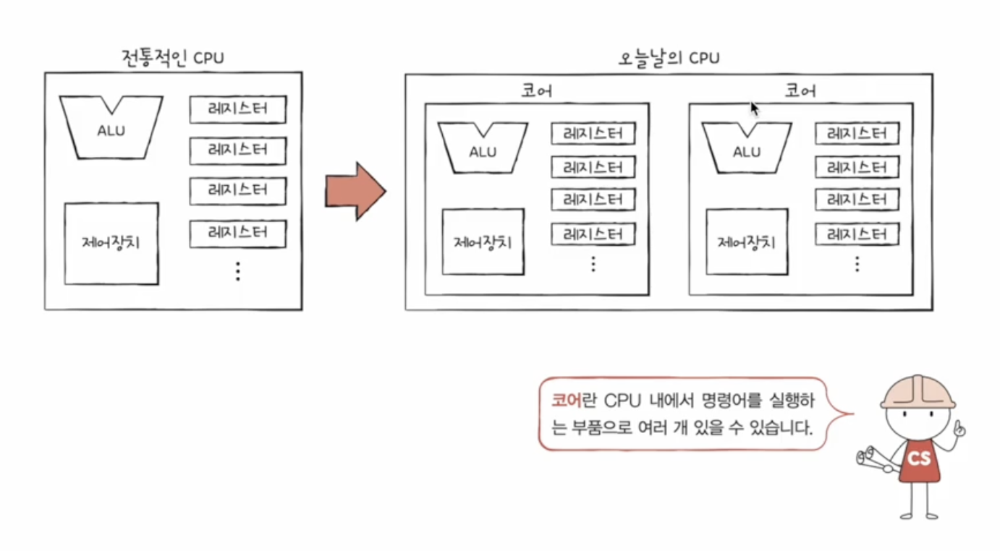
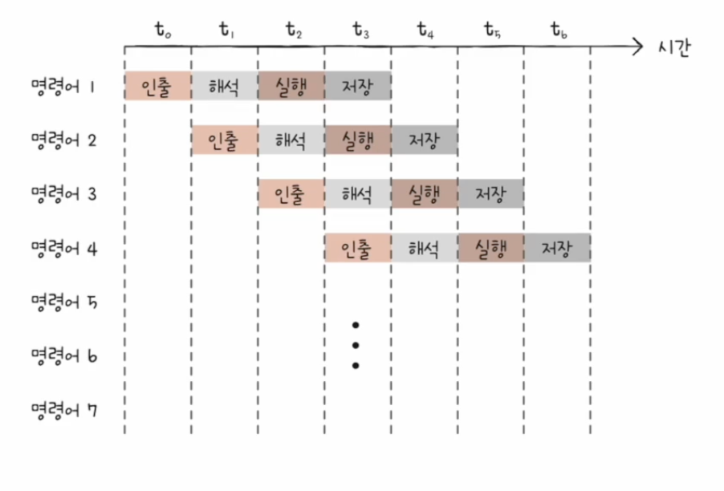

## 빠른 CPU를 위한 설계 기법

### 클럭

1. 컴퓨터 부품들은 **클럭 신호**에 맞춰 움직인다
2. CPU는 **명령어 사이클**이라는 정해진 흐름에 맞춰 명령어를 실행한다

클럭 속도가 높아지만 CPU는 명령어 사이클을 더 빠르게 반복할 것이고, 다른 부품들도 그에 맞춰 더 빠르게 작동할 것이다

따라서 클럭 속도가 높은 CPU는 일반적으로 성능이 좋고, 클럭 속도는 CPU 속도 단위로 간주되기도 한다

**클럭 속도**는 헤르츠 단위로 측정하며 1초에 클럭이 몇 번 반복되는지를 나타낸다

클럭 속도는 일정하지 않고 고성능을 요하는 순간에 순간적으로 클럭 속도를 높이고, 아닐 때는 낮추기도 한다

### 코어와 멀티코어

CPU의 성능을 높일 때, CPU의 코어와 스레드 수를 늘리는 방법이 있다

**코어**는 **명령어를 실행하는 부품**이다

코어를 여러 개 포함하고 있는 CPU를 **멀티코어 CPU** 또는 **멀티코어 프로세서**라고 부른다

CPU의 연산 속도는 꼭 코어 수에 비례하여 증가하지는 않고, 코어마다 처리할 명령어를 얼마나 적절하게 분배하느냐가 중요하다

### 스레드와 멀티스레드

**스레드**는 하드웨어적 스레드와 소프트웨어적 스레드가 있다
- **하드웨어적 스레드**: 하나의 코어가 동시에 처리하는 명령어 단위
- **소프트웨어적 스레드**: 하나의 프로그램에서 독립적으로 실행되는 단위

**멀티스레드 프로세서**

하나의 코어로 여러 명령어를 동시에 처리하는 CPU

실제로 설계할 때, 가장 큰 핵심은 명령어 처리를 위해 꼭 필요한 레지스터를 여러 개 가지고 있는 것이다

예를 들어 PC가 두 개 있으면 명령어 주소를 두 개 지정할 수 있고, 스택 포인터가 두 개 있으면 두 개의 스택을 관리할 수 있다

레지스터 세트가 하나인 CPU는 하나의 명령어를 처리하기 위한 정보들을 기억할 뿐이지만, 두 개인 CPU는 두 개의 명령어를 처리하기 위한 정보들을 기억할 수 있다

프로그램 입장에서는 스레드의 개수만큼 코어가 있는 것으로 보이기도 해서 하드웨어 프로세스를 **논리 프로세서**라고 부르기도 한다

## 명령어 병렬 처리 기법

명령어를 동시에 처리하여 CPU를 쉬지 않고 작동시키는 기법이다

### 명령어 파이프라인

명령어 처리 과정을 클럭 단위로 나누어서 보면 명령어 인출 -> 명령어 해석 -> 명령어 실헝 -> 결과 저장으로 나눌 수 있다

같은 단계가 겹치지만 않는다면 CPU는 각 단계를 동시에 실행할 수 있다

이처럼 명령어들을 **명령어 파이프라인**에 넣고 동시에 처리하는 기법을 **명령어 파이프라이닝**이라고 한다

명령어 파이프라이닝은 특정 상황에서 성능 향상에 실패할 수 있는데, 이를 **파이프라인 위험**이라고 부른다.

파이프라인 위험의 종류는 세 가지가 있다
1. **데이터 위험**: 명령어 간 데이터 의존성에 의해 발생한다. 어떤 명령어는 이전 명령어를 끝까지 실행해야 실행할 수 있다
2. **제어 위험**: 분기 등으로 인한 프로그램 카운터의 갑작스러운 변화에 의해 발생한다. 명령어 파이프라인에 미리 가지고 와서 처리 중이었던 명령어들이 쓸모가 없어지게 된다
3. **구조적 위험**: 서로 다른 명령어가 동시에 같은 CPU 부품을 사용하려고 할 때 발생한다

### 슈퍼스칼라

CPU 내부에 여러 개의 명령어 파이프라인을 포함한 구조

슈퍼스칼라 프로세스는 매 클럭 주기마다 동시에 여러 명령어를 인출하고, 실행할 수 있어야 한다

이론적으로 파이프라인 개수에 비례하여 프로그램 처리 속도가 빨라지지만 예상치 못한 문제가 있어 실제로는 반드시 그렇지는 않다

### 비순차적 명령어 처리

명령어들을 순차적으로 실행하지 않는 기법

순서를 바꿔 실행해도 무방한 명령어를 먼저 실행하여 명령어 파이프라인이 멈추는 것을 방지하는 기법

비순차적 명령어 처리가 가능한 CPU는 명령어들의 데이터 의존성 등을 판단할 수 있어야 한다

## CISC와 RISC

파이프라이닝, 슈퍼스칼라 기법을 효과적으로 사용하려면 명령어가 파이프라이닝 하기 쉽게 생겨야 한다

### 명령어 집합

CPU가 이해할 수 있는 명령어들의 모음을 **명령어 집합**, 또는 **명령어 집합 구조(ISA)**라고 한다

ISA가 다르면 CPU가 이해할 수 있는 명령어가 다르고, 명령어가 달라지면 어셈블리어도 달라진다

또, ISA가 다르면 CPU 하드웨어 설계에도 큰 영향을 미치게 된다

ISA는 **CPU의 언어임과 동시에 하드웨어가 소프트웨어를 어떻게 이해할지에 대한 약속**이라고 볼 수 있다

### CISC

복잡한 명령어 집합을 활용하는 컴퓨터를 의미한다

x86, x86-64가 대표적인 CISC 기반의 ISA이다

CISC는 복잡하고 다양한 수의 **가변 길이 명령어**를 활용한다

따라서 상대적으로 적은 수의 명령어로도 프로그램을 실행할 수 있고, 이는 메모리 공간을 활용할 수 있는 장점으로 이어진다

그러나 활용하는 명령어가 워낙 복잡하고 다양한 기능을 제공하기 때문에 명령어의 크기와 실행되기까지의 시간이 일정하지 않아서 파이프라인을 구현하는 데 걸림돌이 된다

### RISC

CISC의 한계로 인해 얻은 교훈은 아래와 같다
1. 빠른 처리를 위해 파이프라인을 활용하여야 하고, 이를 위해서는 **명령어 길이와 수행 시간이 짧고 규격화**되어 있어야 한다
2. 복잡한 기능을 지원하는 명령어보다는 **자주 쓰이는 기본적인 명령어를 작고 빠르게 만드는 것**이 중요하다

이를 참고하여 RISC가 개발되었다

RISC는 단순하고 적은 수의 **고정 길이 명령어**를 활용한다

메모리에 직접 접근하는 명령어를 **load, store** 두 개로 제한할 만큼 메모리 접근을 단순화, 최소화하였고 그 대신 레지스터를 적극적으로 활용한다

따라서 CISC보다 레지스터를 이용하는 연산이 많고, 일반적인 경우보다 범용 레지스터 개수도 많다

