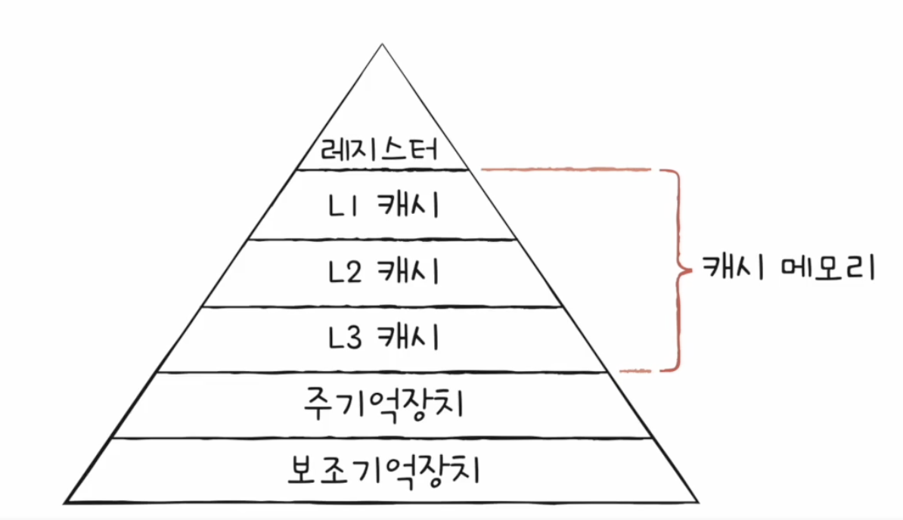

## RAM의 특징과 종류

RAM == 메모리

### RAM의 특징

RAM에는 실행할 프로그램의 명령어와 데이터가 저장된다

RAM은 전원을 끄면 저장된 내용이 사라지는 **휘발성 저장 장치**이다

반대로 전원을 꺼도 저장된 내용이 유지되는 비휘발성 저장 장치에는 HDD, SSD, CD-ROM, USB 등의 보조기억장치가 포함된다

일반적으로 휘발성 저장 장치에는 **실행할 대상**을 저장한다

### RAM의 용량과 성능

CPU가 실행하고 싶은 프로그램이 보조기억장치에 있다면 RAM으로 가져와야 하는데 RAM 용량이 적다면 보조기억장치에서 실행할 프로그램을 가져오는 일이 잦아 실행 시간이 길어진다

RAM 용량이 충분히 크다면 보조기억장치에서 많은 데이터를 미리 RAM에 저장해 시간을 절약할 수 있다

### RAM의 종류

- **DRAM**: 시간이 지나면 저장된 데이터가 점차 사라지는 RAM. 따라서 데이터 소멸을 막기 위해 일정 주기로 데이터를 다시 저장해야 한다. 소비 전력이 낮고 저렴하고 집적도가 높아 대용량으로 설계하기 용이하다는 장점으로 인해 일반적으로 DRAM을 사용한다
- **SRAM**: 저장된 데이터가 변하지 않기 때문에 시간이 지나도 저장된 데이터가 사라지지 않는다. 일반적으로 DRAM보다 속도도 빠르다. 그러나 DRAM보다 집적도가 낮고 소비 전력도 크고 가격도 비싸다
- **SDRAM**: 클럭 신호와 동기화된, 발전된 형태의 DRAM. 클럭에 맞춰 동작하며 클럭마다 CPU와 정보를 주고받을 수 있다
- **DDR SDRAM**: 최근 가장 흔히 사용되는 RAM. 대역폭을 넓혀 속도를 빠르게 만든 SDRAM. SDRAM이 한 클럭마다 한 번 CPU와 데이터를 주고받는다면 대역폭이 두 배인 DDR SDRAM은 한 클럭마다 두 번 CPU와 데이터를 주고받는다

## 메모리의 주소 공간

### 물리 주소와 논리 주소

주소에는 두 종류가 있다
- **물리 주소**: 정보가 실제로 저장된 하드웨어상의 주소
- **논리 주소**: CPU와 실행 중인 프로그램이 사용하는 주소로 실행 중인 프로그램 각각에게 부여된 0번지부터 시작하는 주소

프로그램마다 같은 논리 주소는 있을 수 있다

**메모리 관리 장치(MMU)**: CPU와 주소 버스 사이에 위치한, 논리 주소와 물리 주소 간의 변환을 수행하는 하드웨어

CPU가 발생시킨 논리 주소에 베이스 레지스터 값을 더하여 물리 주소로 변환한다

이 때, 베이스 레지스터에는 프로그램의 첫 물리 주소를 저장하고 논리 주소는 프로그램 시작점으로부터 떨어진 거리로 이해할 수 있다

### 메모리 보호 기법

**한계 레지스터**: 다른 프로그램의 영역을 침범할 수 있는 명령어 실행을 방지하고 다른 프로그램에게 영향을 받지 않도록 보호하는 것을 담당하는 레지스터

논리 주소의 최대 크기를 저장한다 -> 프로그램 물리 주소 범위는 (베이스 레지스터 값, 베이스 레지스터 값 + 한계 레지스터 값]

CPU는 명령어를 수행하며 메모리에 접근하기 전에 논리 주소가 한계 레지스터보다 작은지 항상 검사하고, 한계 레지스터보다 높은 논리 주소에 접근하려고 하면 인터럽트(트랩)을 발생시킨다

## 캐시 메모리

### 저장 장치 계층 구조

- CPU와 가까운 저장 장치는 빠르고, 멀리 있는 저장 장치는 느리다
- 속도가 빠른 저장 장치는 저장 용량이 작고, 가격이 비싸다

빠르고 용량도 큰 저장 장치는 성립하기가 어렵다

컴퓨타가 사용하는 저장 장치들을 CPU에 얼마나 가까운가를 기준으로 계층적으로 나타낸 것을 **저장 장치 계층 구조**라고 한다



### 캐시 메모리

CPU와 메모리 사이에 위치하고, 레지스터보다 용량이 크고 메모리보다 빠른 SRAM 기반의 저장 장치

CPU가 매번 메모리에 왔다갔다 하는 것은 시간이 오래 걸리므로 메모리에서 CPU가 사용할 일부 데이터를 미리 캐시 메모리로 가지고 와서 활용

컴퓨터 안에는 여러 개의 캐시 메모리가 존재하는데, 코어와 가장 가까운 순서대로 L1, L2, L3라고 지칭한다

CPU는 메모리 내의 데이터가 필요하면 L1 -> L2 -> L3 순서대로 데이터를 검색한다

멀티코어 프로세서의 경우에는 L1과 L2는 코어마다 고유한 캐시 메모리로 할당되고 L3는 여러 코어가 공유하는 형대로 사용된다

### 참조 지역성 원리

캐시 메모리는 CPU가 사용할 법한 대상을 예측하여 저장한다

이때 예측한 데이터가 실제로 CPU에서 활용될 경우를 **캐시 히트**라고 하고, 반대로 예측이 틀려서 메모리에 접근한 경우를 **캐시 미스**라고 한다

```캐시 적중률 = 캐시 히트 횟수 / (캐시 히트 횟수 + 캐시 미스 횟수)```

캐시 메모리는 **참조 지역성의 원리**에 따라 메모리로부터 가져올 데이터를 결정한다

1. **시간 지역성**: CPU는 최근에 접근했던 메모리 공간에 다시 접근하려는 경향이 있다
2. **공간 지역성**: CPU는 접근한 메모리 공간 근처를 접근하려는 경향이 있다


