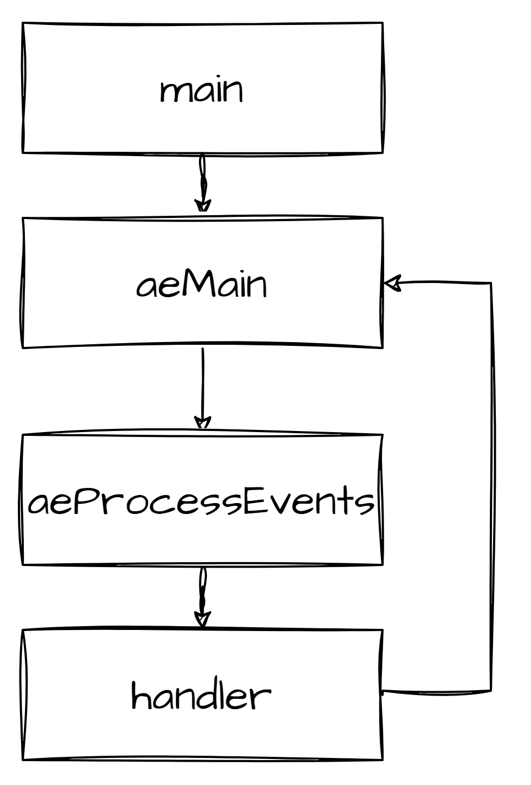
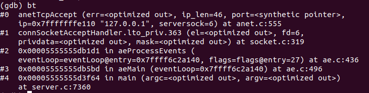
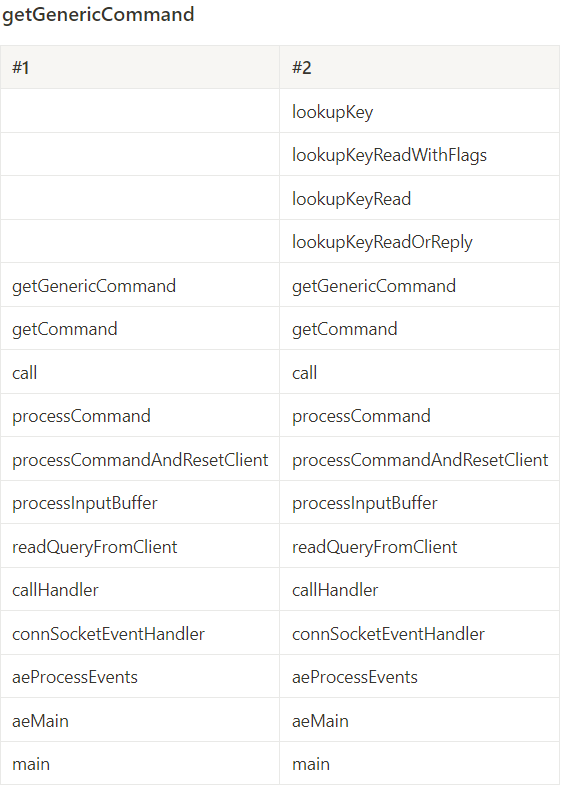
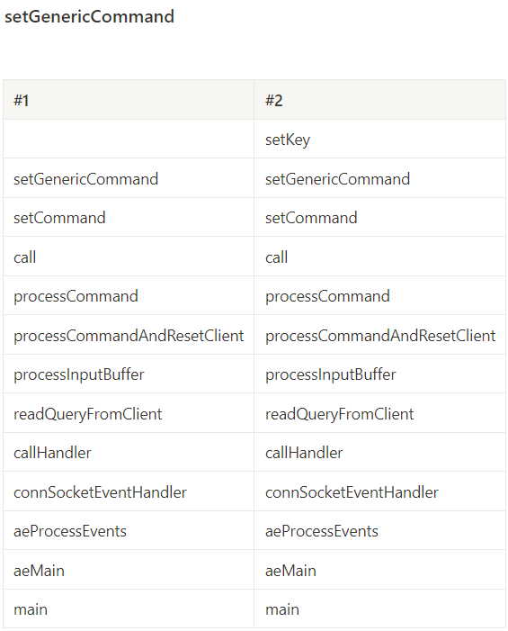
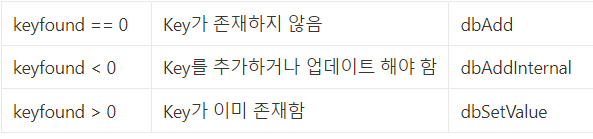
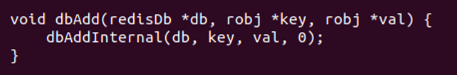

## 개요

본 활동은 ```시스템 프로그래밍```을 수강하면서 과제로 진행한 내용이다. 

과제의 목표는 ```디버깅```에 대해 학습하는 것이나, Redis 자체에 관심이 있었기 때문에 Redis의 구조에 대해서도 자세히 학습했다.

디버깅의 중요성에 대해서도 많은 공부가 되었다~! 

breakpoint 및 함수 스택을 확인할 수 있다는 점을 알게 되었고 실제 개발을 할 때도 디버깅을 적용할 수 있을 거 같다.

## Redis 구조

Redis는 NoSQL 데이터베이스로, 현재 많이 사용되는 관계형 데이터베이스와 달리 Key-Value 형식으로 데이터를 관리한다.

TCP/IP 기반 통신 방법으로 Server-Client 구조로 작동한다. 

Client가 GET/SET 등의 명령어를 Server에 전달하면 Server가 DB에 접근하여 작업을 수행하고, Client에게 결과를 출력하는 형식이다.

TCP/IP 기반이기 때문에, Server를 작동하면 listen 상태에 돌입하게 되고 이 때 Client가 Server에 Accept 요청을 보낼 수 있다.



큰 구조를 보면 Server는 이렇게 작동하고 있다.

aeMain에서는 while문으로, Client에게 종료 요청이 들어오기 전까지 aeProcessEvents를 반복해서 호출한다.

aeProcessEvents는 Client에게 요청이 들어온 것을 확인하고 요청이 들어오지 않았으면 빠르게 return하여 aeMain으로 돌아가고 요청이 들어왔으면 그에 맞는 handler를 호출한다.



handler의 예시로는 Accept 요청이 들어왔을 때는 ```connSocketAcceptHandler```, 



그 외 GET/SET 요청이 들어왔을 때는 ```connSocketEventHandler```를 호출하는 것을 확인할 수 있었다. 

## Redis 코드를 보고 느낀 점

어쩌면 Redis를 직접 사용할 때 이런 내부 코드는 크게 중요하지 않을 수 있다. 어차피 프레임워크에서 제공하는 라이브러리(JPA 등)를 사용하여 DB에 접근하기 때문이다.

하지만 정말 몰입해서 즐겁게 수행했고, 얻어 가는 것이 많은 활동이었다

가장 큰 수확으로 Redis 코드를 보고 **코드를 '잘' 작성하는 것**이 무엇인지 알게 되었다.

1. **함수명과 변수명을 직관적으로 작성**

이름만으로도 어떤 역할을 하는 함수인지, 함수에서 어떤 작업을 수행하고 있는지 알아보기가 정말 쉬웠다.

개발자의 작명 센스가 중요함은 익히 들어서 이미 알고 있었으나 이번 활동에서 왜 중요한 건지 직접 체감하게 되었다.

2. **함수 사용법** 

함수의 역할 분담을 매우 효율적으로 했다고 느껴졌다.

한 함수에서 여러 역할을 수행하지 않고, 딱 하나의 정해진 역할만 수행하도록 설계했다는 것이 크게 와닿았다.

대표적으로 SET 수행 과정을 살펴보겠다.



setGenericCommand에서는, 해당 Key가 DB에 있는지 검증하고 setKey_flags라는 변수에 결과를 저장한다. 그리고 setKey_flags를 파라미터에 담아서 setKey 함수를 호출한다.



setKey에서는 flag 값에 따라 keyfound 변수에 값을 설정하고 dbAdd, dbAddInternal, dbSetValue 함수를 호출한다.

이 때, dbAdd와 dbAddInternal 함수의 사용법이 눈에 띄었다.

우선, dbAddInternal 함수는 마지막에 int 형식의 update_if_existing 파라미터를 받는다.

setKey에서 keyfound < 0이라서 dbAddInternal을 호출할 때는 이 update_if_existing 값을 1로 설정한다.

그러나 keyfound == 0일 때는 dbAdd를 호출하는데, dbAdd의 역할은 그저 update_if_existing 값을 0으로 설정한 dbAddInternal을 호출하는 역할만을 한다.



dbAddInternal에서는 update_if_existing 변수 값에 따라 다른 역할을 수행한다.

왜 굳이 dbAdd라는 함수를 만들어서 dbAddInternal을 호출한 것인지 궁금증이 생겨서 고민해봤는데, 아직 아는 것이 적어서 정확히는 모르겠지만 중복 코드를 줄이고 역할을 정확히 분담하기 위함으로 추측하고 있다.

정말 반전으로 개발 중에 어쩌다보니 그렇게 된 것이거나 본래 dbAdd에 다른 역할이 있었다가 코드가 수정된 것일 수도 있겠지만 뭔가 뜻이 있을 것이라고 생각된다.

## 소감

교수님이 Debug에 대해 학습하라고 내주신 과제지 Redis 코드를 감상하라고 내주신게 아닐텐데.. 너무 흥미롭게 코드를 보게 됐다.

개발자의 가장 중요한 역량 중 하나인 '코드 잘 짜기'에 대해 좀 동기부여와 심층적인 이해가 완성된 느낌이다.

나처럼 완전 관계없는 사람이 봐도 이해가 잘 된다면, 협업할 때 팀원과는 더더더더더 공유가 쉽지 않을까..

그리고 Redis도 내 학습해야 할 것들 목록에 있는데 공부해보기 전에 간략하게 사용해봐서 좋은 경험이 된 거 같다.

진짜 개발자가 되기까지 학습할 게 너무나도 많아서 설레기도 하고 무섭기도 하다 ^_^


