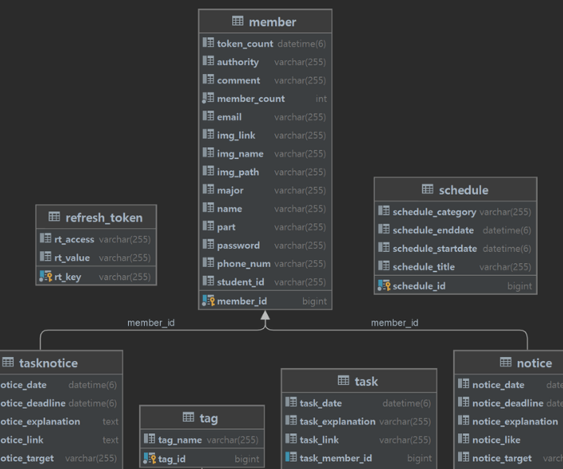
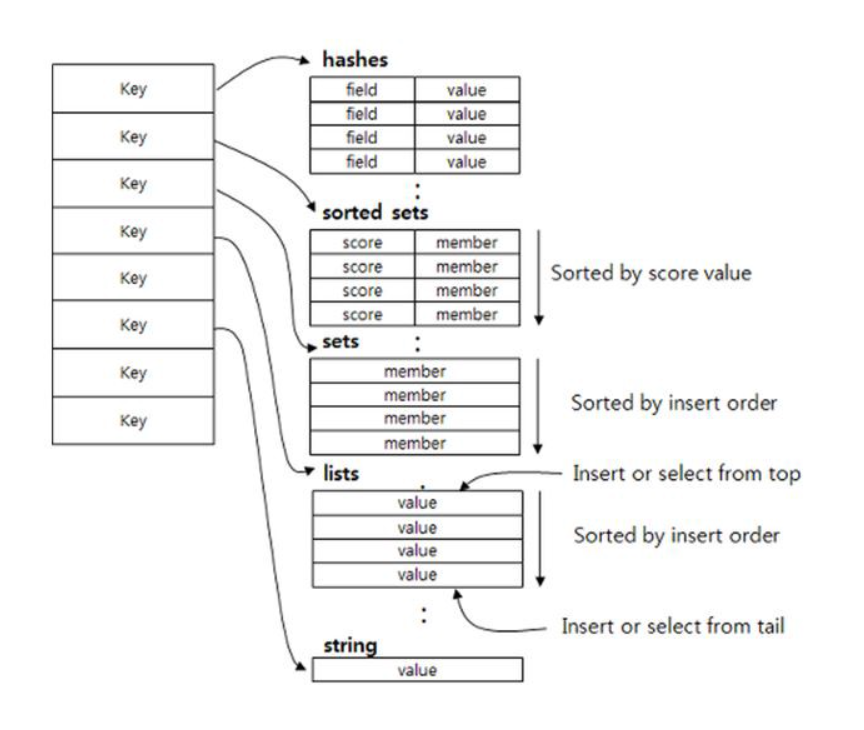
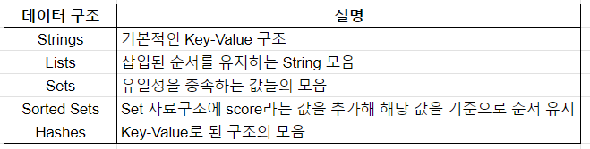
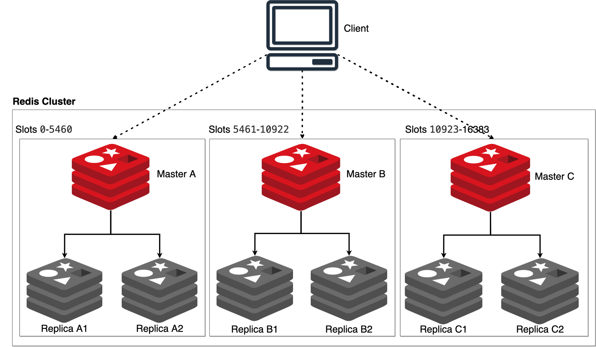

Redis Redis Redis.. Redis가 대체 뭘까?

프로젝트와 취준을 하면서 취업하려면 Redis와 CI/CD를 꼭 공부해야 한다! 라는 말을 자주 들었다. (신빙성은 검증되지 않았습니다)

해봐야지~ 해봐야지~ 하고.. [전공 수업에서 GDB를 이용해 Redis를 디버깅하는 경험](yelog.site/redistour/)을 통해 대략적인 작동 방식도 알았으나.. 정처기 공부를 하며 또 공부해 보았으나..

결정적으로 **무엇을 저장하는가?** 에 대해 고민하느라 미루었다.

모두가 공부해야 한다고 했음에도 내가 직접적으로 그 필요성을 체감하지 못해서 미루어 왔다.

그러나! Spring Security를 적용하고 RefreshToken을 관리할 때 Redis를 활용한다는 사실을 알게 되었다.

따라서 Redis를 적용하기 전에 Redis에 대해 알아보는 시간을 가지고자 한다.

## Redis

https://redis.io/

Redis는 오픈 소스 기반의 **In-Memory Key-Value 구조 비관계형 데이터 베이스 관리 시스템(NoSQL)** 이다.



기존의 관계형 데이터베이스 관리 시스템(DBMS)은 데이터를 테이블 형식으로 저장하고 테이블 간의 관계를 정의해서 구현한다.

```
{
  "brand": "brand name",
  "condition": "new | used | refurbished",
  "description": "description",
  "model": "model",
  "price": 0
}
```

그러나 Redis 기준 NoSQL 방식은 위 사진처럼, Key-Value 형식으로 데이터를 저장한다. 

관계를 정의하지 않기 때문에 **SQL 쿼리문을 지원하지 않는다**.

## 특징

### In-Memory

Redis 공식 문서에서도 Redis는 디스크가 아닌 **메모리 기반의 데이터 저장소**라고 명시되어 있다.

따라서 I/O 과정이 없기에 속도가 빠르고 장점이 있으나, 공간이 작다는 단점이 있다.

▶ 따라서 디스크 기반의 데이터 저장소를 두고, NoSQL은 자주 사용하는 데이터를 저장하는 별도의 **캐시 서버**로 사용할 수 있다. 

캐시 서버로 Redis를 채용하면, 데이터를 찾을 때 1차적으로 Redis 공간을 살펴보고 없으면 디스크의 데이터 공간을 찾게 된다.

### RDB & AOF

위의 특징처럼 메모리 기반이기에 휘발성의 특성을 가지고, 서버가 다운되면 데이터가 유실될 위험이 있다. 이런 단점을 극복하기 위해 Redis는 RDB와 AOF라는 기능을 제공해 영속성을 보장한다.

- **RDB**: 지정된 간격으로 특정 시점의 스냅샷을 수행해 메모리에 있는 내용을 디스크에 담아 영구적으로 저장한다.
- **AOF**: Redis의 모든 쓰기 작업을 log로 기록하고 다음 서버 시작 때 재생하여 원래의 데이터 세트를 복구한다.

RDB는 AOF에 비해 큰 데이터 세트를 빠르게 재시작할 수 있지만, 주기적으로 I/O를 해야함으로 더 많은 비용이 들 수 있다.

AOF는 I/O가 실행되지 않기 때문에 성능이 우수하지만 파일이 RDB 파일보다 크다.

RDB와 AOF를 동시에 사용함으로써 강력한 내구성을 보장할 수 있다.

장애를 복구할 때 어느 정도의 데이터 손실이 발생해도 되는 경우엔 RDB를, 모든 데이터가 보장되어야 할 경우는 AOF를 단독 사용한다.

### 데이터 구조





Redis는 이와 같은 자료구조를 제공한다. 자료구조마다 또 그에 맞는 명령어를 제공함으로써 편의성을 제공한다.

### Partitioning



Redis Cluster를 제공해 데이터를 분산 저장하여 고성능 확장성과 안정성을 확보할 수 있다. 

Master-Replica 구조로 1개의 Master가 N개의 Replica를 가지는 구조로 이루어져 있으며 Master가 다운되면 Replica 하나가 Master로 승격된다.

## 활용

실질적으로 무엇을 저장하는데 활용할까?

내가 제일 궁금했던 부분이며 위에서, **자주 사용하는 데이터를 저장하는 별도의 캐시 서버** 로 활용한다고 언급한 바가 있다.

우선 주로 **Refresh Token**을 저장한다. Refresh Token이란 JWT 토큰의 보안 솔루션으로 Access Key를 연장하는데 사용된다. Refesh Token은 유효기간이 길며 그 기한동안 수정되지 않기 때문에 Redis에 저장했을 때 효율이 좋다.

또, **Ranking**이나 **Count**를 저장하기도 한다. Ranking은 수시로 데이터를 조회하고 수정해야 하기 때문에 Sorted Set 자료구조를 사용해 Redis에 저장하기 좋다. Count는 예시로 조회수가 있으며 Ranking과 마찬가지로 자주 접근하기 때문에 Redis에 저장할 수 있다. 

## 참고

https://redis.io/docs/

https://aws.amazon.com/ko/compare/the-difference-between-relational-and-non-relational-databases/

https://aws.amazon.com/ko/elasticache/what-is-redis/


