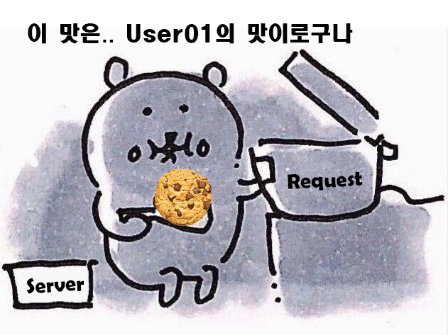
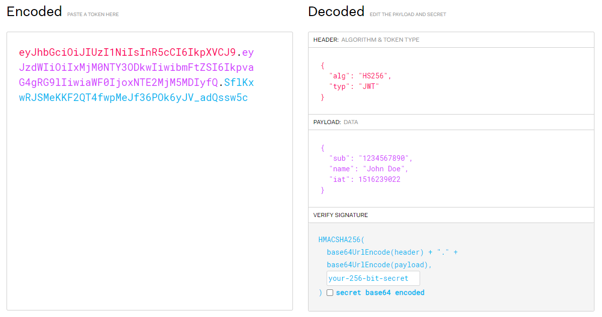

Session, Cookie, Token은 서버에서 요청을 보낸 유저를 식별하고 인증하는 과정에서 사용되는 용어다.

Session & Cookie 방식과 JWT Token 방식으로 구분되며, 각각의 동작과정과 장단점에 대해 알아보자!

## Session & Cookie

### 동작과정

](image-1.png)

1. **Client**가 ID/PWD를 포함해 Login 요청을 전송한다.
2. **Server**가 요청을 받아 유저를 인증하고 Session을 만들어 서버 메모리 공간에 저장하고, 이 Session을 식별할 Session ID를 발급한다.
3. **Server**는 Response Header에 Set-Cookie 속성을 이용하여 Session ID를 전송한다.
4. **Client**는 응답으로 받은 Session ID를 Cookie에 저장한다.

이러한 과정을 통해 Login이 진행된다. Server와 Client는 각각 Session ID를 기반으로 Session/Cookie를 저장하고 있는다.

그 후, 로그인이 필요한 서비스에서 유저를 검증하는 과정은 아래와 같다.

1. **Client**가 서버에 요청을 보낼 때 Cookie를 함께 전송한다.
2. **Server**는 요청을 받고 Cookie의 Session ID와 저장소의 Session ID를 비교하며 검증한다.

이렇게 Session과 Cookie는 Server와 Client가 각각의 저장 공간에 Session ID를 저장하고 주고 받으며 인증을 한다.

### 장단점

우선 장단점을 보기 전에 Session 인증 방식의 가장 큰 특징은 **서버 측에서 인증 정보를 보관하는 점**이라는 것을 알고 보자

**장점**
1. **보안**: 서버 측에서 정보를 관리하기 때문에 보안성이 높고, Session ID 자체에 유의미한 유저 정보가 없다.
2. **유저 관리**: 마찬가지로 서버에서 정보를 가지고 Session을 관리하기 때문에, 사용자의 상태 확인 및 강제 로그아웃 등의 조치를 취할 수 있다. 
또, 세션의 유지 혹은 만료 시간을 쉽게 설정할 수 있다.

**단점**
1. **비용**: 서버의 메모리에 Session 정보를 저장해야 하기 때문에 유저가 많을수록 메모리 공간에 대한 비용이 커진다.
2. **부하**: 요청마다 메모리에 접근해 Session 정보를 확인해야 하기 때문에 요청이 많아지면 서버에 부하가 있을 수 있다.
3. **동기화**: 다중 서버일 경우, 세션 정보의 동기화 과정에서 문제가 발생할 수 있다. 

## JWT Token

Session 로그인 방식과는 또 다른 로그인 방식으로, Session은 서버가 인증 정보를 가지고 있다면 JWT Token은 **클라이언트에서 인증 정보를 관리**한다.

JWT Token은 

### 동작과정

](image-2.png)

1. **Client**가 ID/PWD를 포함해 Login 요청을 전송한다.
2. **Server**가 요청을 받아 유저를 인증하고 JWT Token을 발급한다.
3. **Server**는 Response Header에 JWT Token을 포함하여 전송한다.
4. **Client**는 응답으로 받은 JWT Token을 저장한다.

Session 방식과 가장 큰 차이점은, Server에서는 Token을 발급만 할뿐 서버의 메모리에 저장하지 않는다!

이후의 요청에서는 아래와 같이 진행된다.

1. **Client**가 서버에 요청을 보낼 때 JWT Token을 함께 전송한다.
2. **Server**는 JWT Token의 유효성을 검증하고 Token 안의 정보를 확인해 유저를 식별한다.

이 과정에서, 과연 Server는 JWT Token을 **어떻게?!** 검증할까? Session처럼 비교하는 방식도 아닌데?

JWT Token의 내부를 보면 알 수 있다.

### JWT Token 구조

위 사진처럼, Header & Payload & Signiture로 구성되어 있고, 각 부분을 BASE64로 인코딩하여 Token으로 만드는 방식이다.

Payload 부분을 보면, 유저의 정보가 담겨있고 Signiture를 보면 Secret Key를 입력하게 된다.

이 Secret Key는 서버 측에서 안전하게 보관하게 된다.

따라서 유저의 JWT Token이 들어오면 Secret Key를 기반으로 디코딩하여 유저의 정보를 검증하는 것이다.

### 장단점

JWT Token은 **클라이언트가 토큰을 관리한다**는 점에 집중하여 장단점을 알아보자.

**장점**
1. **동기화**: 다중 서버일 경우, 어차피 클라이언트가 토큰을 보관하기 때문에 동기화에 신경 쓸 필요가 없다.
2. **확장성**: OAuth2처럼 인증을 다른 서드파티에게 위임할 수도 있고, 브라우저에게 의존하지 않기 때문에 모바일과 같은 다양한 환경에서 이점을 가진다.
3. **무상태성**: 서버가 클라이언트의 정보를 저장하고 기억하지 않기 때문에 Stateless하다. 예를 들어 결제 과정 도중에 서버에 장애가 발생하더라도 정보를 클라이언트가 가지고 있기 때문에 이후의 과정을 다른 서버에서 이어서 할 수 있다. 
4. **용량**: 토큰을 저장하기 위한 별도의 서버 저장소가 필요없다.

**단점**
1. **보안**: 클라이언트 측에 저장된 Token가 탈취 당한다면, 서버에서 대응할 수단이 없다. Stateless하기 때문에 강제 로그아웃 같은 조치를 취할 수 없다. 또, Payload에 유저 정보가 직접적으로 입력되어 있다.
2. **네트워크**: Token 크기가 커지면 네트워크에 부하가 발생할 수 있다.

## 마무리

Session & Cookie 방식이 전통적인 방식이지만, 최근에는 JWT 방식이 주로 사용되는 것 같다. 

각각의 장단점에 따라 어떤 방식을 사용할지 고민해보자~!

