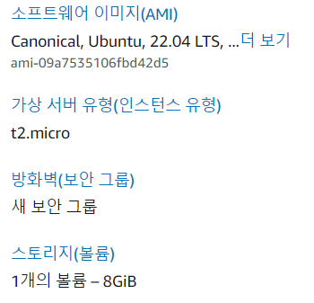
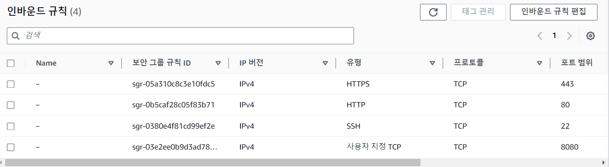
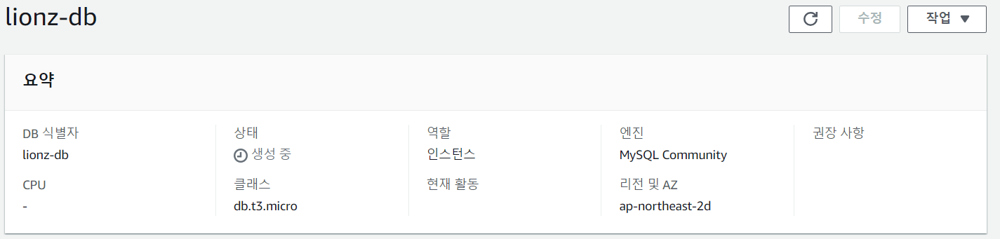
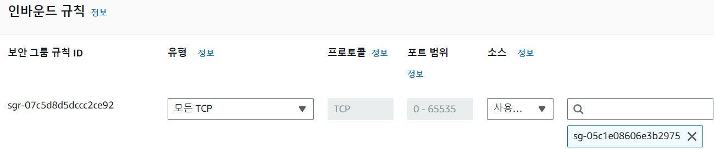
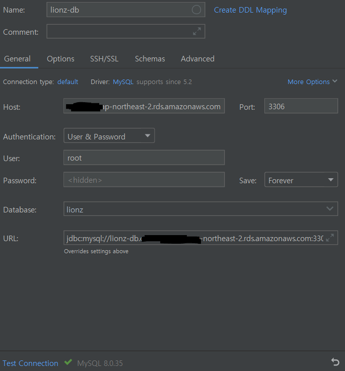
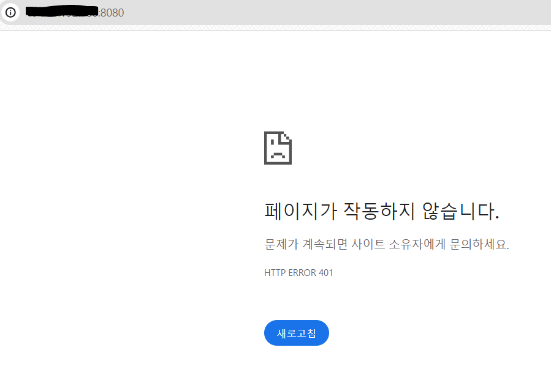

## 서버 생성



Ubuntu OS로 프리티어를 사용해 EC2 서버를 생성했다.

> EC2의 보안그룹 인바운드 규칙에 스프링이 사용하는 8080 포트를 열어야 한다.

**탄력적 IP**도 하나 생성해서 EC2와 연결했다. 탄력적 IP는 생성해놓고 연결을 안 하면 비용이 발생하니 바로 연결하자



MySQL 엔진의 RDS 서버도 생성했다. 비용 발생을 막기 위해 **스토리지 자동 조정**을 비활성화 해주자!!

그 외에 추가 구성에서 **초기 데이터베이스 이름**을 지정해주면 편하다.

> RDS의 보안그룹 인바인드 규칙에도 EC2의 보안그룹 IP를 추가해야 한다!!

## RDS 연동

우선 이전에 백업해놓은 데이터들을 복원하기 위해 DataGrip으로 RDS에 접속했다.



Host에는 엔드포인트, User와 Password에는 RDS를 생성할 때 설정한 것을 입력하면 된다. Database에는 초기 데이터베이스 이름!

위의 정보들을 입력하면 URL은 자동으로 작성된다.

> 💡 예전에 교내 와이파이로 접근할 때는 계속해서 Connection timed out 에러가 발생하며 연결에 실패했다. 아마 방화벽 설정이 일반 와이파이와 조금 달라서 그런듯 싶다 ㅜㅜ 

MySQL 워크벤치로 접속할 때도 똑같이 입력하면 된다.

> 🚨 이전에는 퍼블릭 액세스를 활성화해서 위처럼 로컬에서 DataGrip, MySQL Workbench 등으로 접근할 수 있었지만, 2024년부터 정책이 바뀌어서 퍼블릭 액세스를 활성화하면 비용이 나간다.
<br> 정확히는 하나의 퍼블릭 IP만 프리티어로 제공되는데 RDS에 퍼블릭 액세스를 활성화하면 EC2, RDS 두 개의 서버에 퍼블릭 IP가 생성되어서 비용이 나간다고 한다.
<br> 퍼블릭 액세스를 비활성화하고 EC2에 원격 접속하여 MySQL 설치 후 커맨드라인으로 DB에 접속하도록 하자.
<br> **mysql -u \<유저이름> -p -h \<엔드포인트>**

```
spring:
  datasource:
    driver-class-name: com.mysql.cj.jdbc.Driver
    url: jdbc:mysql://[엔드포인트]:3306/[데이터베이스 이름]
    username: root
    password: password
```

spring 프로젝트의 application 파일에서도 이렇게 입력해주면 RDS를 연동할 수 있다!

## ssh 접속

```
ssh -i [pem 이름] ubuntu@[탄력적 IP] 
```

pem 파일이 있는 경로로 들어가 위 명령어를 입력하면 서버에 접속할 수 있다.

```
// apt 패키지 목록 업데이트 & 업그레이드
sudo apt update && suto apt upgrade

// Java 설치
sudo apt install openjdk-17-jdk
```

## 빌드 & 실행

Spring 배포에는 두 가지 방법이 있다.

1. **Github**를 이용해서 배포하기

로컬의 Spring 프로젝트를 깃허브에 올린 후, EC2에서 클론 받아 빌드하는 방법이다.

본래 이 방법으로 진행했으나..

application은 git ignore에 등록되어 있어 클론 받아도 불러와지지 않아 EC2 내에서 다시 작성하기가 번거로웠다.

그 외에도 아래 Docker로 배포하기 포스팅 서론에서 작성했듯, 같은 과정을 계속 반복하는게 비효율적이라고 느껴졌다.

일회성이 아닌 계속 수정될 프로젝트라면 Docker로 배포하는 것을 추천한다.

방법은 검색하면 많이 나오니 패스!!

2. **Docker**를 이용해서 배포하기

```
// Docker 설치
sudo apt-get install apt-transport-https ca-certificates curl gnupg-agent software-properties-common
curl -fsSL https://download.docker.com/linux/ubuntu/gpg | sudo apt-key add -
sudo add-apt-repository "deb [arch=amd64] https://download.docker.com/linux/ubuntu $(lsb_release -cs) stable"
sudo apt-get update
sudo apt-get install docker-ce docker-ce-cli containerd.io
```

이 경우에는 위의 명령어를 하나씩 입력하며 도커를 설치한다.

이후에는 [Docker로 Spring Boot 배포하기](https://yelog.site/jar/) 포스팅 참고


여기까지 배포에 성공했다면 [퍼블릭 IP]:8080으로 접속했을 때 서버가 가동됐음을 확인할 수 있다.

우리 프로젝트에서는 권한 설정 때문에 401이 발생하는 것이 맞는 결과다. 보통은 Whitelabel Error Page가 나오면 성공한 것

실패했을시 ```docker logs [컨테이너명]``` 으로 로그를 확인할 수 있다.


