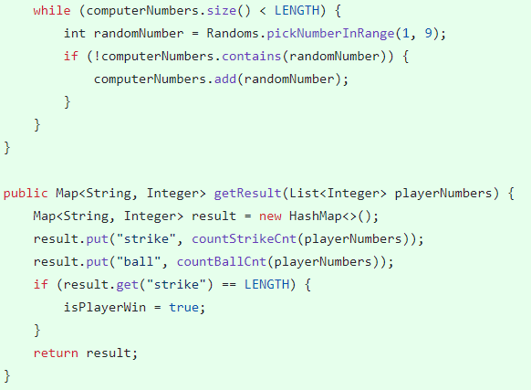
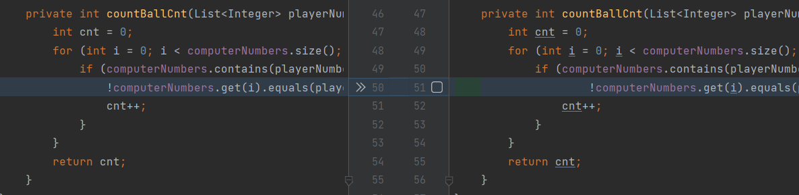
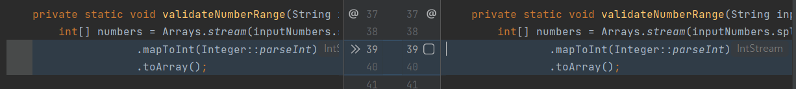

## 서론

우아한 테크코스 프리코스를 시작하고 첫 주차를 진행해보니, 나는 이제까지 정말 돌아가기만 하는 코드를 작성하고 있었다는 생각이 들었다. 최근에 개발자를 비하를 할 때 흔히 사용하는 '코더'라는 단어가 나를 지칭하는 거였나? 싶을 정도로 많은 반성을 했다.

내 코드를 구현할 때 신경 쓴 부분은, 우선 **알아보기 쉽게** 작성하는 것이었다. 내부 코드는 물론 구조를 나눌 때도 어떤 폴더에 어떤 파일이 있을지 누구나 예상하기 쉽게 나누고자 노력했다. 

그러나 공통 피드백을 읽어 본 후에 정말 많이 부족했음을 알게 되었다. 따라서 2주차 구현을 늦게 시작하더라도 피드백을 꼼꼼하게 보고 나의 1주차 코드에 적용해 보며 공부를 먼저 해야겠다는 생각이 들었다.

이러한 활동을 선행함으로써 2주차 구현을 좀 더 효율적으로, 완성도있게 작성할 수 있기를 기대한다.

## 공통 피드백

(공통 피드백 전문이 아니고 생략한 부분 존재)

### 1. 축약하지 않는다.

>누구나 실은 클래스, 메서드, 또는 변수의 이름을 줄이려는 유혹에 곧잘 빠지곤 한다. 그런 유혹을 뿌리쳐라. 축약은 혼란을 야기하며, 더 큰 문제를 숨기는 경향이 있다. **클래스와 메서드 이름을 한 두 단어로 유지하려고 노력하고 문맥을 중복하는 이름을 자제하자.** 클래스 이름이 Order라면 shipOrder라고 메서드 이름을 지을 필요가 없다. 짧게 ship()이라고 하면 클라이언트에서는 order.ship()라고 호출하며, 간결한 호출의 표현이 된다. <br>- 객체 지향 생활 체조 원칙 5: 줄여쓰지 않는다 (축약 금지)

- Computer 클래스에서 ```createComputerNumbers```를 ```createNumbers```로 수정
- Player 클래스에서 ```setPlayerNumbers```를 ```setNumbers```로 수정

### 2. 공백도 코딩 컨벤션이다

>if, for, while문 사이의 공백도 코딩 컨벤션이다.

사실 내가 회고록을 써야겠다고 다짐하게 된 피드백이다.



JAVA 컨벤션을 읽고 생각이 너무 깊어진 나머지, 공백 라인을 가능한 적게 사용해야 한다고 생각이 흘러가 코드에서 공백 라인을 거의 제거했다. 

너무 나만의 해석에 의존한 거 같아서 부끄럽다.. 내 코드가 너무 부끄러우면서도 1주차 피드백을 통해 배우게 되어 정말 다행이라는 생각이 든다.

피드백 밑의 문항처럼 **문맥을 분리하는 곳**에 적절히 활용해서 2주차 코드를 작성해 보아야 겠다.

### 3. IDE의 코드 자동 정렬 기능을 활용한다

> IDE의 코드 자동 정렬 기능을 사용하면 더 깔끔한 코드를 볼 수 있다.<br>
IntelliJ IDEA: ⌥⌘L, Ctrl+Alt+L<br>
Eclipse: ⇧⌘F, Ctrl+Shift+F




내 모든 소스 파일에서 적용해봤는데, 거의 **줄바꿈**에서 수정이 많이 되었다. 한 줄이 너무 길어져서 줄을 바꿀 때의 들여쓰기 원칙을 잘못 지키고 있었다. 

2주차 때는 주기적으로 자동 정렬 기능을 사용하며 내가 작성한 코드를 점검하는 습관을 들여야겠다.

### 4. Java에서 제공하는 API를 적극 활용한다

>함수(메서드)를 직접 구현하기 전에 Java API에서 제공하는 기능인지 검색을 먼저 해본다.
Java API에서 제공하지 않을 경우 직접 구현한다.
예를 들어 사용자를 출력할 때 사용자가 2명 이상이면 쉼표(,) 기준으로 출력을 위한 문자열은 다음과 같이 구현 가능하다.

사실 Java보다는 C++에 좀 더 익숙해서 Java에서도 C++과 유사한 기능을 제공하는 API 위주로 사용하고 있었던 거 같다. 이에 대해서는 많이 찾아보고 많이 공부해야 할 거 같다. JAVA의 정석 책을 시간날 때마다 많이 읽어보아야 할 거 같다.

## 스스로 피드백

**1. 함수 별로 테스트를 작성하자**

2주차 미션 안내 메일에서, 2주차의 목적은 함수를 분리하고 각 함수 별로 테스트를 작성하는 것에 익숙해지는 것이라고 언급됐다. 

1주차 미션에서는 주어진 테스트 두 개를 제외하고는 추가적으로 테스트 케이스를 작성하지 않았는데, 2주차에서는 함수 및 기능을 구현한 후 바로바로 테스트를 작성하는 습관을 들여야 겠다고 다짐했다.

**2. 프리코스의 흐름을 따라가자**

나는 소감문에서 객체지향과 구조에 대해 더 공부하겠다는 각오를 드러냈다. 그러나 제출한지 이틀만에 이를 조금 철회해야겠다.

1주차가 끝나고 2주차가 시작되며 프리코스의 흐름이 어느정도 보이기 시작했다. 2주차의 **추가된 요구 사항**을 읽어보고 프리코스의 학습 절차가 있음을 인지했다.

사실 개발에 대한 학습 주제는 정말 방대하고 프리코스 진행 중에 이를 모두 학습하여 적용하는 것은 매우 어려운 일이다. 실제로 나도 지금 1주차 소감문을 읽어보면 내가 뭘 공부해야 할지 모르겠고 방황하고 있다는 것이 너무나도 크게 느껴져서 약간 수줍다.

따라서 주어지는 공통 피드백과 추가된 요구 사항에 맞추어 공부하면 체계적인 순서대로 학습이 가능할 것이라는 생각이 들었다. 프리코스에서 아직 요구도 안 한 객체지향과 구조는 그만 파고들고 지금까지 학습한 내용을 유지하고 새로운 요구사항을 우선적으로 학습하는 것을 목표로 해야겠다.

기본 요구 사항 및 1주차 피드백에서 강조한 **코드 가독성**, 2주차에서 강조하는 **함수 분리**, **테스트 작성**에 집중해서 자동차 경주를 구현해야겠다!

## 더 공부해봐야 할 주제

2주차 구현을 시작하기 전에 더 공부할 주제를 정리해보았다.

1. **객체 지향 생활 체조 원칙**: 당장 위에서 객체지향을 그만 파고 들겠다고 다짐했지만.. 공통 피드백에서 발췌한 부분이 너무 인상 깊어서 나머지 원칙이 너무 궁금하다. 빠르게 공부해 보아야 겠다.

2. **Collection 학습**: 공통 피드백에서 배열보다는 Collection을 사용하라는 문항이 있었다. 그러나 부끄럽지만 Collection이 무엇인지도 몰라서 방금 찾아보았다. 책에서 Collection 부분만이라도 정독하고 구현을 시작해보아야 할 거 같다.

3. **언어별 테스트 도구 학습**: 적용은 2주차 구현을 진행하면서 해보겠지만 한번도 접해보지 않은 도구이기 때문에 그 전에 어느정도 기초를 학습해 보아야 겠다. 